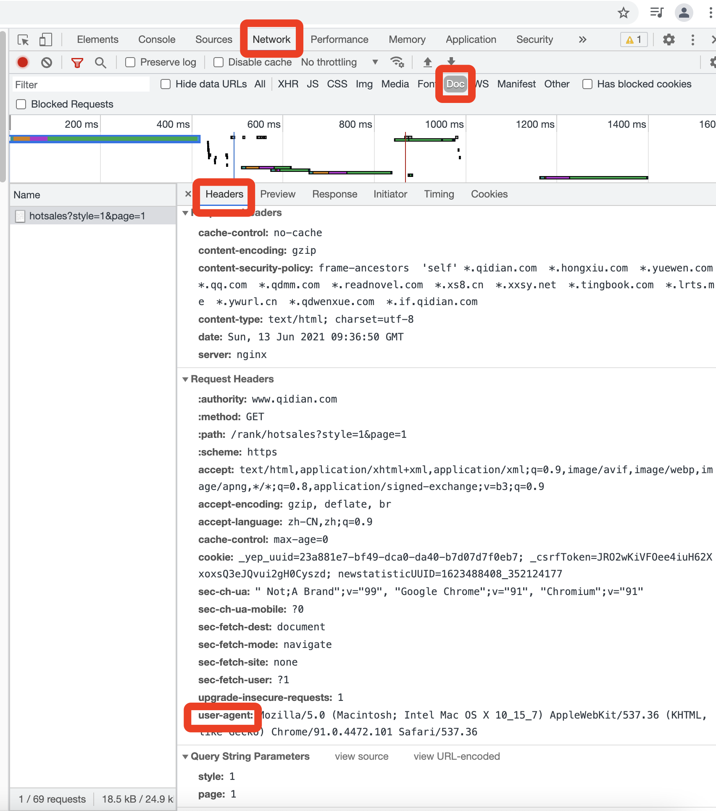

# 爬虫基础

## 伪装浏览器

### 确定user-agent

### 代码

#coding:utf-8

	from scrapy.spiders import Spider
	from protego import Protego
	from scrapy import Request
	
	class HotSalesSpider(Spider):
	    name = "hot" #爬虫名称
	    headers = {"User-Agent":"Mozilla/5.0 (Macintosh; Intel Mac OS X 10_15_7) AppleWebKit/537.36 (KHTML, like Gecko) Chrome/91.0.4472.101 Safari/537.36"}
	
	    # 自定义start_requests
	    def start_requests(self):
	        url = "https://www.qidian.com/rank/hotsales?style=1&page=1"
	        yield Request(url,headers=self.headers,callback=self.parse()) #自定义headers，及回调函数
	
	    def parse(self,response): # 数据解析
	        # 使用xpath定位
	        list_selector = response.xpath("//div[@class='book-mid-info']") #//表示遍历全部信息
	        for one_selector in list_selector:
	            # 获取小说信息
	            name = one_selector.xpath("h4/a/text()").extract()[0] # extract的作用是从列表中提取文字
	            # 获取作者
	            author = one_selector.xpath("p[1]/a[1]/text()").extract()[0]
	            # 获取类型
	            type = one_selector.xpath("p[1]/a[2]/text()").extract()[0]
	            # 获取形式
	            form = one_selector.xpath("p[1]/span/text()").extract()[0]
	            # 定义字典
	            hot_dict = {
	                "name": name,
	                "author": author,
	                "tpye": type,
	                "form": form
	            }
	            yield  hot_dict # 通过yield立即执行，减少函数单次运行的负担

由以上代码则可以实现自定start_requests，伪装浏览器

