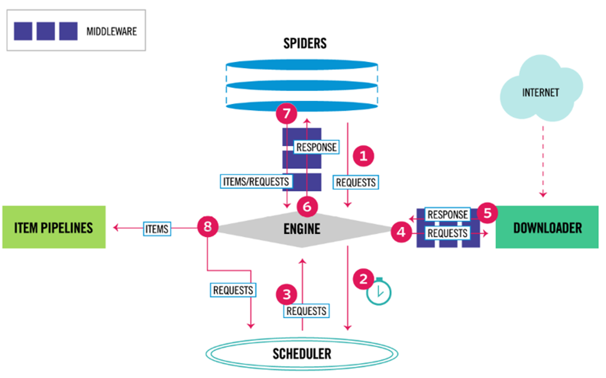
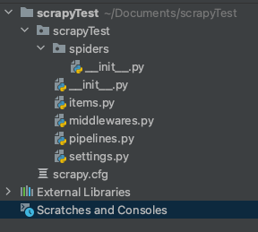

# 简单demo

## 流程

## 创建一个爬虫项目

	cd /Users/zheyiwang/Documents/ 
	scrapy startproject scrapyTest

自动生成项目
	
## 使用pycharm打开

	
	
## 代码

### spider.py

spiders文件夹表示一个爬虫可能有多个spider

在spiders文件夹下新建spider.py

	#coding:utf-8
	
	from scrapy.spiders import Spider
	from protego import Protego
	
	class HotSalesSpider(Spider):
	    name = "hot" #爬虫名称
	    start_urls = ["https://www.qidian.com/rank/hotsales?style=1&page=1"] # 需要访问的地址
	
	    def parse(self,response): # 数据解析
	        # 使用xpath定位
	        list_selector = response.xpath("//div[@class='book-mid-info']") #//表示遍历全部信息
	        for one_selector in list_selector:
	            # 获取小说信息
	            name = one_selector.xpath("h4/a/text()").extract()[0] # extract的作用是从列表中提取文字
	            # 获取作者
	            author = one_selector.xpath("p[1]/a[1]/text()").extract()[0]
	            # 获取类型
	            type = one_selector.xpath("p[1]/a[2]/text()").extract()[0]
	            # 获取形式
	            form = one_selector.xpath("p[1]/span/text()").extract()[0]
	            # 定义字典
	            hot_dict = {
	                "name": name,
	                "author": author,
	                "tpye": type,
	                "form": form
	            }
	            yield  hot_dict # 通过yield立即执行，减少函数单次运行的负担

### settings.py

增加下面的代码，保证csv中文显示不是乱码

 	FEED_EXPORT_ENCODING = 'gb18030'
	

## 执行

在cmd中定位到项目的位置

	cd /Users/zheyiwang/Documents/scrapyTest

	scrapy crawl hot -o hot.csv
	
### 参数解释

hot ：scrapy的名称
-o ：表示导出爬虫结果

