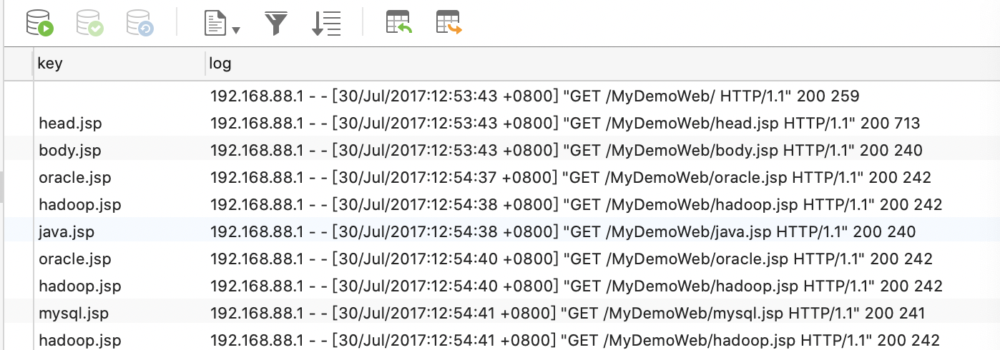

# 操作数据库Demo

## 创建mysql数据库

## 项目结构

### InsertToDatabase

	import java.sql.{Connection, DriverManager, PreparedStatement}
	import org.apache.spark.{SparkConf, SparkContext}
	
	object InsertToDatabase {
	
	  def main(args: Array[String]): Unit = {
	
	    //创建spacrkconf对象
	    val conf = new SparkConf().setAppName("Web Partition Demo").setMaster("local")
	
	    //创建sparkcontext
	    val sc = new SparkContext(conf)
	
	    // 读入数据
	    // 例如：192.168.88.1 - - [30/Jul/2017:12:53:43 +0800] "GET /MyDemoWeb/head.jsp HTTP/1.1" 200 713
	    val rdd1 = sc.textFile("/Users/zheyiwang/Downloads/localhost_access_log.2017-07-30.txt").map(
	
	      line => {
	
	        //解析字符串:
	        val index1 = line.indexOf("\"")  //找到第一个双引号
	        val index2 = line.lastIndexOf("\"") //找到第二个双引号
	        val line1 = line.substring(index1+1,index2) // 得到：GET /MyDemoWeb/head.jsp HTTP/1.1
	
	        //得到：/MyDemoWeb/head.jsp
	        val index3 = line1.indexOf(" ")
	        val index4 = line1.lastIndexOf(" ")
	        val line2 = line1.substring(index3+1,index4)  ///得到：MyDemoWeb/head.jsp
	
	        //得到jsp的名字
	        val line3 = line2.substring(line2.lastIndexOf("/") + 1) //得到： head.jsp
	
	        //返回一个元组:  (head.jsp,访问的日志信息)
	        (line3,line)
	      }
	    )
	
	    rdd1.foreachPartition(saveToMysql)
	    sc.stop()
	  }
	
	  //通过RDD的分区的迭代器: 返回素有的数据
	  //数据存入mysql
	  def saveToMysql(it:Iterator[(String,String)]) ={
	    var conn:Connection = null
	    var ps:PreparedStatement = null
	
	    try{
	      //得到数据库的链接
	      conn = DriverManager.getConnection("jdbc:mysql://localhost:3306/test","root","1qa2ws#ED")
	
	      //得到SQL的运行环境
	      ps = conn.prepareStatement("insert into logdata values(?,?)")
	
	      //将一个分区中的所有元素插入数据库
	      it.foreach(
	        data =>{
	          ps.setString(1,data._1) //按照数据库字段的先后顺序进行数据插入
	          ps.setString(2,data._2)
	          //执行SQL
	          ps.executeUpdate()
	        }
	      )
	
	    }catch{
	      case e1:Exception => println("Some Error Happend!" + e1.getMessage)
	    }finally {
	      //释放资源
	      if(ps != null) ps.close()
	      if(conn != null) conn.close()
	    }
	  }
	
	}

### pom.xml

	<?xml version="1.0" encoding="UTF-8"?>
	<project xmlns="http://maven.apache.org/POM/4.0.0"
	         xmlns:xsi="http://www.w3.org/2001/XMLSchema-instance"
	         xsi:schemaLocation="http://maven.apache.org/POM/4.0.0 http://maven.apache.org/xsd/maven-4.0.0.xsd">
	    <modelVersion>4.0.0</modelVersion>
	
	    <groupId>org.example</groupId>
	    <artifactId>webVisitCount</artifactId>
	    <version>1.0-SNAPSHOT</version>
	
	    <dependencies>
	        <dependency>
	            <groupId>org.apache.spark</groupId>
	            <artifactId>spark-core_2.12</artifactId>
	            <version>3.0.1</version>
	        </dependency>
	        <dependency>
	            <groupId>org.scala-lang</groupId>
	            <artifactId>scala-library</artifactId>
	            <version>2.12.12</version>
	        </dependency>
	        <dependency>
	            <groupId>mysql</groupId>
	            <artifactId>mysql-connector-java</artifactId>
	            <version>8.0.21</version>
	        </dependency>
	    </dependencies>
	
	</project>
	
### 执行结果	
	
