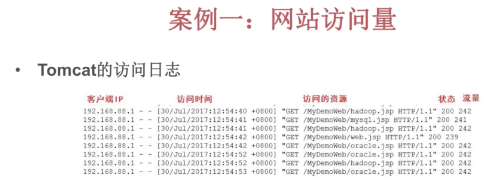
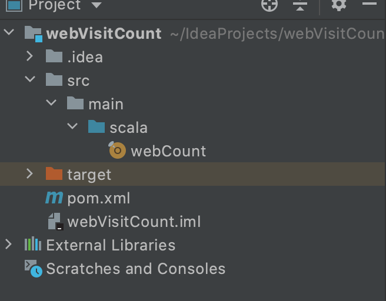

# 网站访问量统计Demo

## 日志模板

## 需求

统计出访问量最高的两个网站，显示格式如下：
(oracle.jsp.9), (hadoop.jsp,9)

## 代码

### webCount

	object webCount {
	
	  import org.apache.spark.{SparkConf, SparkContext}
	
	
	  def main(args: Array[String]): Unit = {
	
	
	    //创建spacrkconf对象
	    val conf = new SparkConf().setAppName("WebVisitCount Demo").setMaster("local")
	
	    //创建sparkcontext
	    val sc = new SparkContext(conf)
	
	    // 读入数据
	    // 例如：192.168.88.1 - - [30/Jul/2017:12:53:43 +0800] "GET /MyDemoWeb/head.jsp HTTP/1.1" 200 713
	    val rdd1 = sc.textFile("/Users/zheyiwang/Downloads/localhost_access_log.2017-07-30.txt").map(
	
	      line => {
	
	        //解析字符串:
	        val index1 = line.indexOf("\"")  //找到第一个双引号
	        val index2 = line.lastIndexOf("\"") //找到第二个双引号
	        val line1 = line.substring(index1+1,index2) // 得到：GET /MyDemoWeb/head.jsp HTTP/1.1
	
	        //得到：/MyDemoWeb/head.jsp
	        val index3 = line1.indexOf(" ")
	        val index4 = line1.lastIndexOf(" ")
	        val line2 = line1.substring(index3+1,index4)  ///得到：MyDemoWeb/head.jsp
	
	        //得到jsp的名字
	        val line3 = line2.substring(line2.lastIndexOf("/") + 1) //得到： head.jsp
	
	        //返回一个元组:  (head.jsp,1)
	        (line3,1)
	      }
	    )
	
	    //输出解析后的rdd
	    println(rdd1.collect().toBuffer)
	
	    //按照key进行聚合操作:
	    val rdd2 = rdd1.reduceByKey( _ + _)
	
	    //按照rdd2的value进行排序 :  (web.jsp,3)
	    // _._2 的意思是每个元素按照第二个字段排序
	    val rdd3 = rdd2.sortBy(_._2,false)
	
	    //取出排位最高的两个
	    println(rdd3.take(2).toBuffer)
	
	    //停止sc
	    sc.stop()
	
	  }
	
	}

### pom 

	<?xml version="1.0" encoding="UTF-8"?>
	<project xmlns="http://maven.apache.org/POM/4.0.0"
	         xmlns:xsi="http://www.w3.org/2001/XMLSchema-instance"
	         xsi:schemaLocation="http://maven.apache.org/POM/4.0.0 http://maven.apache.org/xsd/maven-4.0.0.xsd">
	    <modelVersion>4.0.0</modelVersion>
	
	    <groupId>org.example</groupId>
	    <artifactId>webVisitCount</artifactId>
	    <version>1.0-SNAPSHOT</version>
	
	    <dependencies>
	        <dependency>
	            <groupId>org.apache.spark</groupId>
	            <artifactId>spark-core_2.12</artifactId>
	            <version>3.0.1</version>
	        </dependency>
	        <dependency>
	            <groupId>org.scala-lang</groupId>
	            <artifactId>scala-library</artifactId>
	            <version>2.12.12</version>
	        </dependency>
	    </dependencies>
	
	</project>