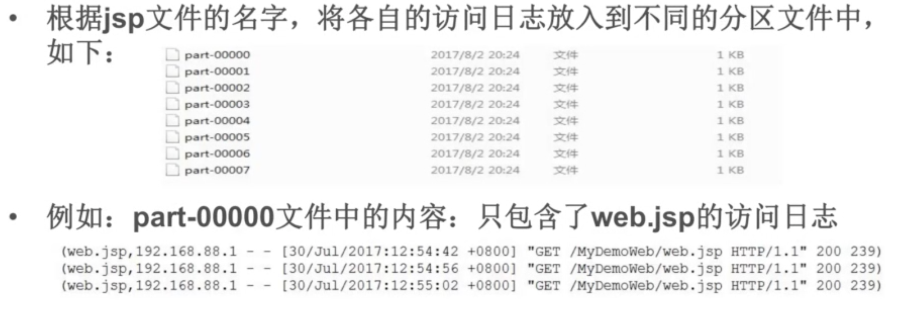
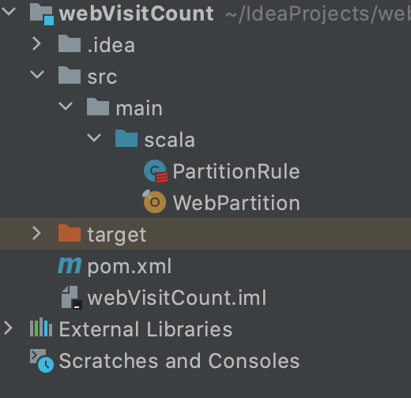

# 自定义分区Demo

## 需求

## 测试数据

统计网站访问频率文件夹内

## 项目结构

### PartitionRule

	import org.apache.spark.Partitioner
	
	import scala.collection.mutable
	
	class PartitionRule(allJSPName: Array[String]) extends Partitioner {
	
	  //定义一个Map集合,保存分区的规则:  head.jsp ---> 1     oracle.jsp ---> 2
	  val partitionMap = new mutable.HashMap[String,Int]()
	
	  //生成分区的规则
	  var partID = 0
	  for(jspName <- allJSPName){
	    partitionMap.put(jspName,partID)  // head.jsp 1
	    partID += 1
	  }
	
	  override def numPartitions: Int = partitionMap.size
	
	  override def getPartition(key: Any): Int = {
	    //根据JSP的文件名称返回对应的PartID
	    partitionMap.getOrElse(key.toString,0)
	  }
	
	}
	
注意：生成的part下标必须从0开始，所以partID需要从0开始。如果partId不是从0开始，则part-00001为空。
	
### WebPartition

	import org.apache.spark.{SparkConf, SparkContext}
	
	object WebPartition {
	
	  def main(args: Array[String]): Unit = {
	
	    //创建spacrkconf对象
	    val conf = new SparkConf().setAppName("Web Partition Demo").setMaster("local")
	
	    //创建sparkcontext
	    val sc = new SparkContext(conf)
	
	    // 读入数据
	    // 例如：192.168.88.1 - - [30/Jul/2017:12:53:43 +0800] "GET /MyDemoWeb/head.jsp HTTP/1.1" 200 713
	    val rdd1 = sc.textFile("/Users/zheyiwang/Downloads/localhost_access_log.2017-07-30.txt").map(
	
	      line => {
	
	        //解析字符串:
	        val index1 = line.indexOf("\"")  //找到第一个双引号
	        val index2 = line.lastIndexOf("\"") //找到第二个双引号
	        val line1 = line.substring(index1+1,index2) // 得到：GET /MyDemoWeb/head.jsp HTTP/1.1
	
	        //得到：/MyDemoWeb/head.jsp
	        val index3 = line1.indexOf(" ")
	        val index4 = line1.lastIndexOf(" ")
	        val line2 = line1.substring(index3+1,index4)  ///得到：MyDemoWeb/head.jsp
	
	        //得到jsp的名字
	        val line3 = line2.substring(line2.lastIndexOf("/") + 1) //得到： head.jsp
	
	        //返回一个元组:  (head.jsp,访问的日志信息)
	        (line3,line)
	      }
	    )
	
	    //得到所有的key：jsp的文件名称 ----> 建立分区规则
	    val rdd2 = rdd1.map(_._1).distinct().collect()
	
	    //创建自己的分区规则
	    val myPartRole = new PartitionRule(rdd2)
	
	    //进行分区
	    val rdd3 = rdd1.partitionBy(myPartRole)
	
	    rdd3.saveAsTextFile("/Users/zheyiwang/Downloads/test/ ")
	
	  }
	
	}

### pom.xml

	<?xml version="1.0" encoding="UTF-8"?>
	<project xmlns="http://maven.apache.org/POM/4.0.0"
	         xmlns:xsi="http://www.w3.org/2001/XMLSchema-instance"
	         xsi:schemaLocation="http://maven.apache.org/POM/4.0.0 http://maven.apache.org/xsd/maven-4.0.0.xsd">
	    <modelVersion>4.0.0</modelVersion>
	
	    <groupId>org.example</groupId>
	    <artifactId>webVisitCount</artifactId>
	    <version>1.0-SNAPSHOT</version>
	
	    <dependencies>
	        <dependency>
	            <groupId>org.apache.spark</groupId>
	            <artifactId>spark-core_2.12</artifactId>
	            <version>3.0.1</version>
	        </dependency>
	        <dependency>
	            <groupId>org.scala-lang</groupId>
	            <artifactId>scala-library</artifactId>
	            <version>2.12.12</version>
	        </dependency>
	    </dependencies>
	
	</project>

## 测试

执行程序后，数据会保存在对应文件夹内。每个文件只存一类日志。