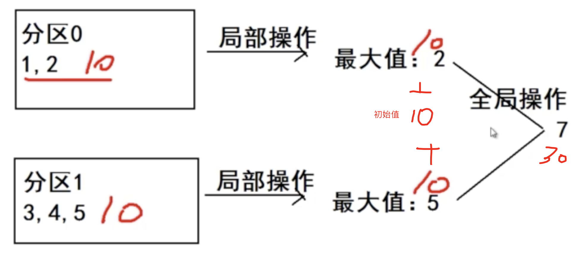

# RDD 高级算子

## mapPartitionsWithIndex

把RDD中每个分区的分区号和对应的值取出来，进行操作

### demo

	#创建一个RDD, 把值放到两个分区中
	scala> val rdd1 = sc.parallelize(List(1,2,3,4,5,6,7,8,9),2)
	rdd1: org.apache.spark.rdd.RDD[Int] = ParallelCollectionRDD[0] at parallelize at <console>:24
	
	#创建一个自定义函数：返回分区号中的所有元素
	scala> def func1(index:Int,iter:Iterator[Int]): Iterator[String]={
	                                iter.toList.map(x=>"[PartID:"+index +",value="+x+ "]").iterator
	                        }
	func1: (index: Int, iter: Iterator[Int])Iterator[String]
	
	#使用mapPartitionsWithIndex
	scala> rdd1.mapPartitionsWithIndex(func1).collect
	res0: Array[String] = Array([PartID:0,value=1], [PartID:0,value=2], [PartID:0,value=3], [PartID:0,value=4], [PartID:1,value=5], [PartID:1,value=6], [PartID:1,value=7], [PartID:1,value=8], [PartID:1,value=9])
	
可以看到，通过mapPartitionsWithIndex,将分区号和值都取出来了。

## aggregate

先对局部进行聚合，再对全局进行聚合

### demo1 ：聚合数字

	#创建一个RDD, 把值放到两个分区中
	scala> val rdd1 = sc.parallelize(List(1,2,3,4,5),2)
	rdd1: org.apache.spark.rdd.RDD[Int] = ParallelCollectionRDD[0] at parallelize at <console>:24
	
	
	#创建一个自定义函数：返回分区号中的所有元素
	scala> def func1(index:Int,iter:Iterator[Int]): Iterator[String]={
	                                iter.toList.map(x=>"[PartID:"+index +",value="+x+ "]").iterator
	                        }
	func1: (index: Int, iter: Iterator[Int])Iterator[String]

	#查看现在的分区情况
	scala> rdd1.mapPartitionsWithIndex(func1).collect
	res2: Array[String] = Array([PartID:0,value=1], [PartID:0,value=2], [PartID:1,value=3], [PartID:1,value=4], [PartID:1,value=5])
	
可以看到1\2在partID=0上，3\4\5在PartId=1上

##### (1) 需求：求每个分区中的最大值，再求和	
	
	scala> rdd1.aggregate(0)(math.max(_,_),_+_) 
	res3: Int = 7

aggregate(0)： 表示初始值为0

math.max(_,_)：表示前后对比，求最大值（单分区）

(math.max(_,_),_+_) ：将每一个分区的值求和

##### (2) 需求：初始值为10，求每个分区中的最大值，再求和	
	scala> rdd1.aggregate(10)(math.max(_,_),_+_) 
	res4: Int = 30

	10+10+10
	第一个10：初始值10
	第二个10：第一个分区的最大值
	第三个10：第二个分区的最大值

### demo2：聚合字符

	# 构建数据
	scala> val rdd2 = sc.parallelize(List("a","b","c","d","e","f"),2)
	rdd2: org.apache.spark.rdd.RDD[String] = ParallelCollectionRDD[2] at parallelize at <console>:24
	
	#打印字符
	scala> def func2(index:Int,iter:Iterator[String]): Iterator[String]={
	                  iter.toList.map(x=>"[PartID:"+index +",value="+x+ "]").iterator   }
	func2: (index: Int, iter: Iterator[String])Iterator[String]
	
	scala> rdd2.mapPartitionsWithIndex(func2).collect
	res5: Array[String] = Array([PartID:0,value=a], [PartID:0,value=b], [PartID:0,value=c], [PartID:1,value=d], [PartID:1,value=e], [PartID:1,value=f])
	
可以看到a\b\e在partID=0上，d\e\f在PartId=1上	

	scala> rdd2.aggregate("")(_+_,_+_) 
	res6: String = abcdef
	

	scala> rdd2.aggregate("|")(_+_,_+_) 
	res7: String = ||def|abc	
	
	
## aggregateByKey

先对局部进行聚合，再对全局进行聚合。数据格式是key:value格式

	scala> val pairRDD = sc.parallelize(List( ("cat",2), ("cat", 5), ("mouse", 4),("cat", 12), ("dog", 12), ("mouse", 2)), 2)
	pairRDD: org.apache.spark.rdd.RDD[(String, Int)] = ParallelCollectionRDD[4] at parallelize at <console>:24
	
	
	def func3(index:Int,iter:Iterator[(String,Int)]): Iterator[String]={
		iter.toList.map(x=>"[PartID:"+index +",value="+x+ "]").iterator
	}
	
	# 查看pairRDD中每个分区的数据
	scala> pairRDD.mapPartitionsWithIndex(func3).collect
	res8: Array[String] = Array([PartID:0,value=(cat,2)], [PartID:0,value=(cat,5)], [PartID:0,value=(mouse,4)], [PartID:1,value=(cat,12)], [PartID:1,value=(dog,12)], [PartID:1,value=(mouse,2)])
	
### 需求（1）将每个分区中动物最多的个数求和

	scala> pairRDD.aggregateByKey(0)(math.max(_,_),_+_).collect
	res10: Array[(String, Int)] = Array((dog,12), (cat,17), (mouse,6))	
### 需求（2）将每种动物的个数求和		

	scala> pairRDD.aggregateByKey(0)(_+_,_+_).collect
	res11: Array[(String, Int)] = Array((dog,12), (cat,19), (mouse,6))
	
也可以使用reduceByKey操作：

	pairRDD.reduceByKey(_+_).collect
	
	
## coalesce与repartition

都是将RDD中的分区进行重分区。

####区别：

coalesce： 默认不会进行Shuffle(false)

repartition：进行Shuffle操作
		
即：是否会将数据真正通过网络进行重分区

	val pairRDD = sc.parallelize(List( ("cat",2), ("cat", 5), ("mouse", 4),("cat", 12), ("dog", 12), ("mouse", 2)), 2)
		
	#进行重分区
	val rdd1 = pairRDD.repartition(3)   -----> 查看rdd1分区的长度：3
			 
	val rdd2 = pairRDD.coalesce(3)       ----> 查看rdd2分区的长度：2 
			 
	val rdd3 = pairRDD.coalesce(3,true)  ----> 查看rdd3分区的长度：3

