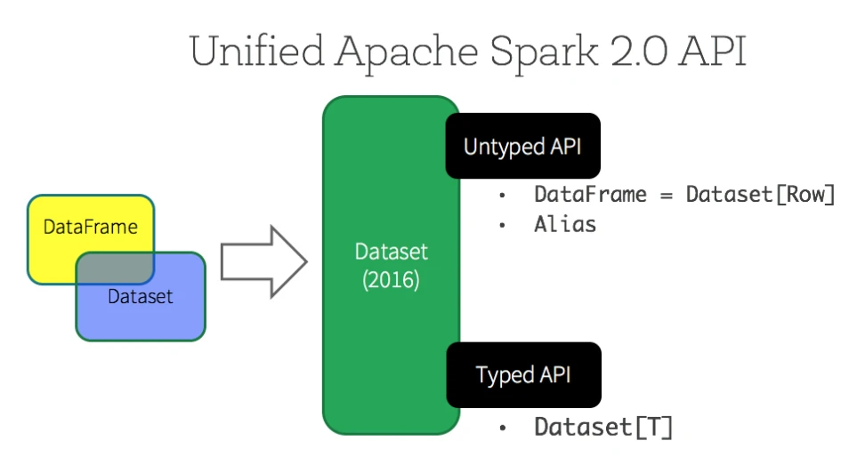
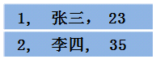
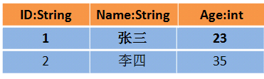
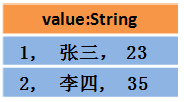

# RDD和DataFrame和DataSet

## 区别

假设RDD中的两行数据长这样：

那么DataFrame中的数据长这样 :

那么Dataset中的数据长这样:

* RDD是一个JVM驻内存对象，GC比较频繁，数据增加时Java序列化成本也会升高，不支持SparkSql，类型转化安全。
* DataFrame包括数据的结构信息，类似于关系型数据库中的表，性能上比RDD要高。数据是弱类型的，在执行时检查类型，类型转化不安全，不能直接获取每一列的值。数据以二进制的方式存在于堆外内存，减少了GC次数。
* Dataset可以认为是DataFrame的一个特例，数据只有一列，每一行的数据类型不确定，采用堆外内存存储，数据是强类型的，在编译时检查类型，类型转化安全。
