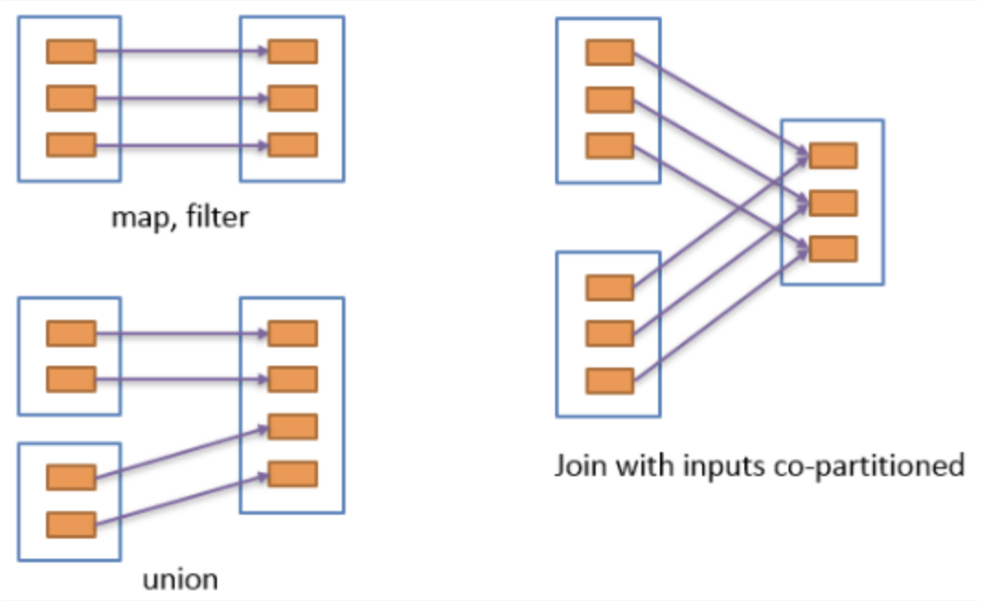
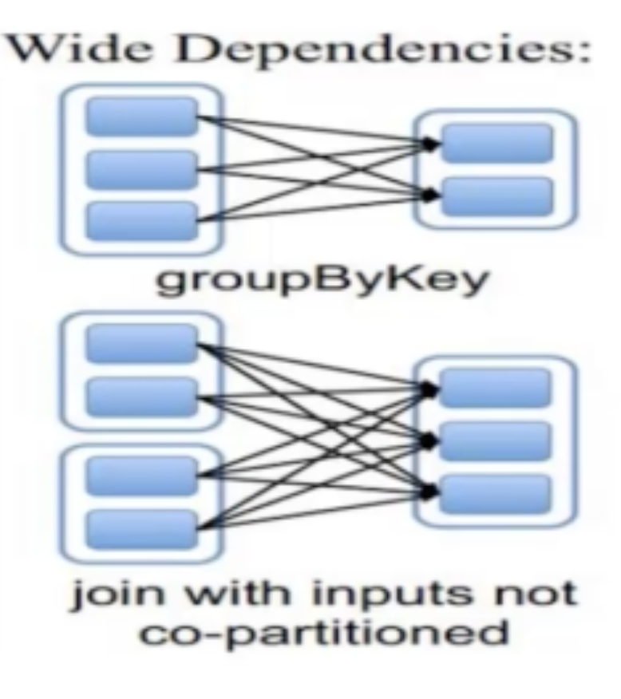
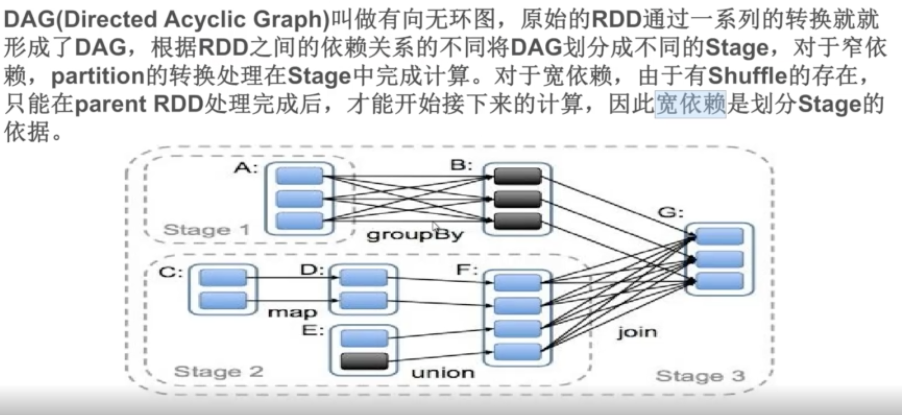

# RDD的依赖关系和Spark的Stage

## RDD的依赖关系

### 窄依赖
每一个父RDD的分区最多被一个子RDD分区使用

如图所示，map, filter, union等操作都是窄依赖

		             
### 宽依赖
多个子RDD的分区会依赖同一个父RDD的分区
		            

如图所示，groupByKey等操作都是窄依赖

## Stage

