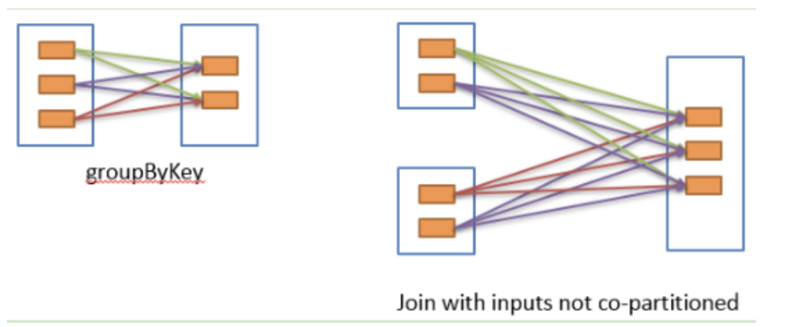

# RDD的依赖关系和Spark的Stage

## RDD的依赖关系

### 窄依赖
每一个父RDD的分区最多被一个子RDD分区使用

如图所示，map, filter, union等操作都是窄依赖

		             
### 宽依赖
多个子RDD的分区会依赖同一个父RDD的分区
		            

如图所示，groupByKey等操作都是窄依赖

### 窄依赖的优势

* 窄依赖比宽依赖更高效，资源消耗更少
* 窄依赖节点失败后的恢复更加高效

## Stage

spark 划分 stage 的整体思路是：从后往前推，遇到宽依赖就断开，划分为一个 stage；遇到窄依赖就将这个 RDD 加入该 stage 中