# Spark DAG Demo

参考：https://www.youtube.com/watch?v=LoFN_Q224fQ

## 前置条件

安装好Spark

## 操作步骤

### 进入脚本

	spark-shell --master local
	
### Demo 1

	val simpleNumbers = spark.range(1, 1000000)
	val times5 = simpleNumbers.selectExpr(" id * 5 as id")
	times5.show()

打印：

	+---+
	| id|
	+---+
	|  5|
	| 10|
	| 15|
	| 20|
	| 25|
	| 30|
	| 35|
	| 40|
	| 45|
	| 50|
	| 55|
	| 60|
	| 65|
	| 70|
	| 75|
	| 80|
	| 85|
	| 90|
	| 95|
	|100|
	+---+

查看jobs：

	http://localhost:4040/jobs/
	
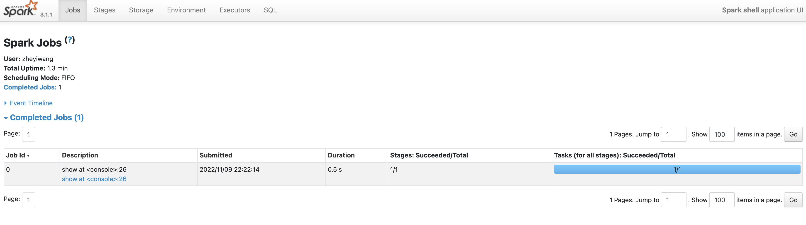

点击进去后可以看到：

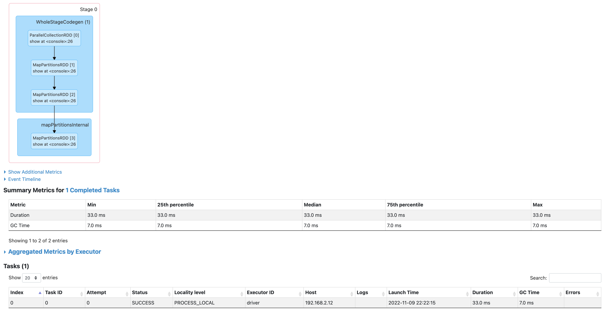

针对DAG：

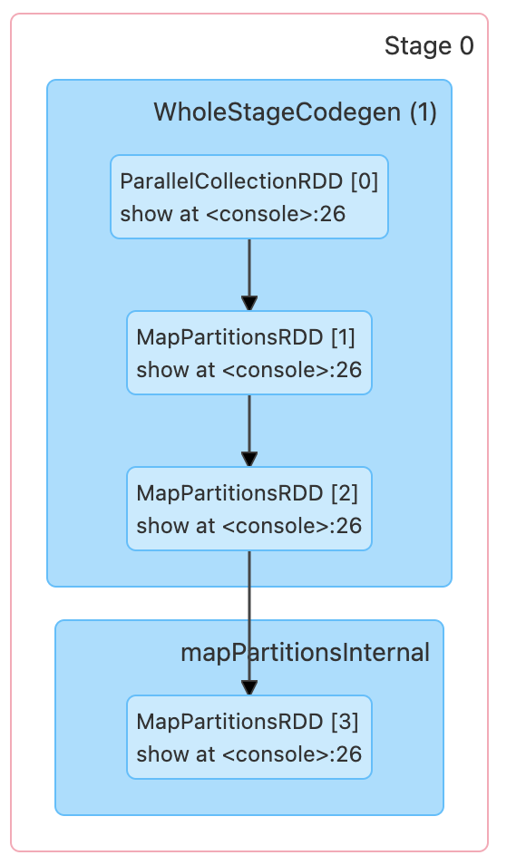

### DAG的理解：

* WholeStageCodegen (1) 是生成了一个Dataset
* mapPartitionsInternal 是做了 selectExpr(" id * 5 as id")

## Demo 2

	val moreNumbers = spark.range(1, 1000000, 2)
	val split7 = moreNumbers.repartition(7)
	split7.take(2).foreach(println)
	
打印：

	782521                                                                          
	263573

查看jobs：

	http://localhost:4040/jobs/
	
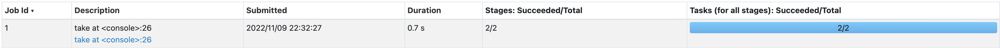

点进去以后可以看到：

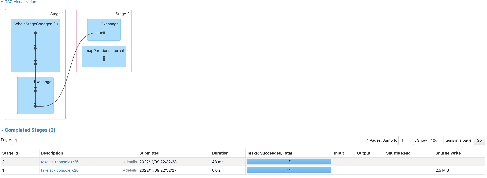

### DAG的理解：

#### stage1

WholeStageCodegen (1) 是生成了一个Dataset

#### stage2

Exchange是一个Shuffle

## Demo 3

	val ds1 = spark.range(1,1000000)
	val ds2 = spark.range(1,1000000,2)
	val ds3 = ds1.repartition(7)
	val ds4 = ds2.repartition(9)
	val ds5 = ds3.selectExpr(" id * 5 as id ")
	val joined = ds5.join(ds4, "id")
	val sum = joined.selectExpr("sum(id)")
	sum.show()
	
打印：

	+-----------+                                                                   
	|    sum(id)|
	+-----------+
	|50000000000|
	+-----------+

查看jobs：

	http://localhost:4040/jobs/
	
**可以看到Spark自己生成了2个任务**

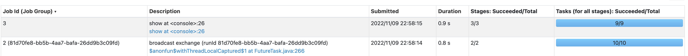

### job2

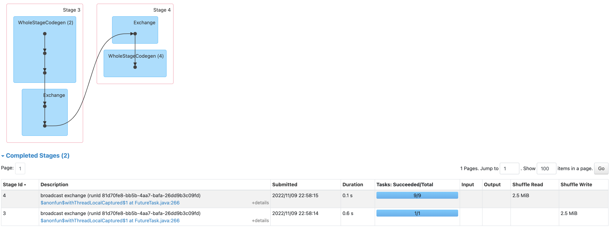

根据Repartition(9) 和 Task 数量9 共同证明了， job2是DS4的任务

* stage1 表示 spark.range(1,1000000,2)
* stage2 表示 ds2.repartition(9)

### job3
	
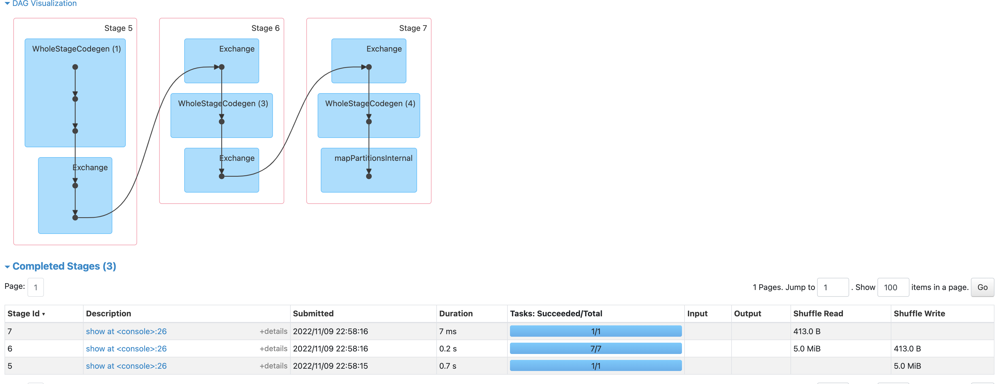	

* stage1 表示 spark.range(1,1000000)
* stage2 表示 ds1.repartition(7)
* stage3 表示  ds5.join(ds4, "id") & joined.selectExpr("sum(id)")

## Demo 4

增大了数字

	val ds1 = spark.range(1,100000000)
	val ds2 = spark.range(1,100000000,2)
	val ds3 = ds1.repartition(7)
	val ds4 = ds2.repartition(9)
	val ds5 = ds3.selectExpr("id * 5  as id")
	val joined = ds5.join(ds4, "id")
	val sum = joined.selectExpr("sum(id)")
	sum.show()

### 任务进行中
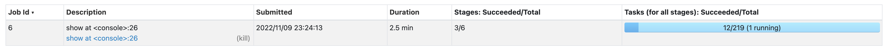

### 任务结束了
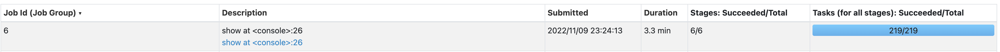	

DAG 图：

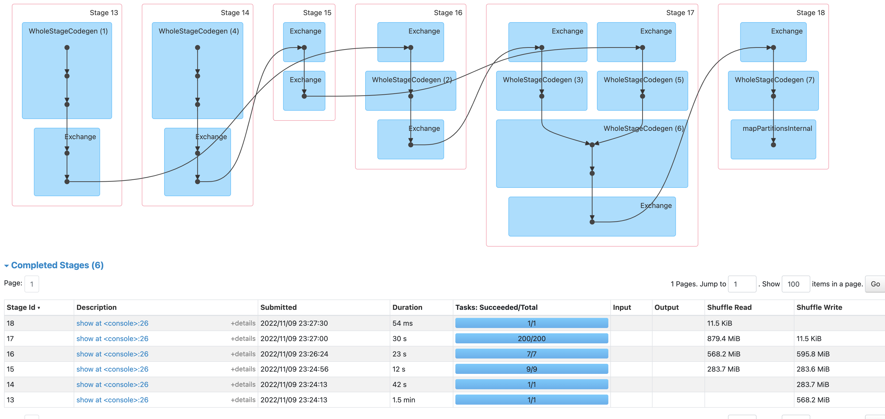

### 解释

* stage13: ds1 = spark.range(1,100000000) 可以和stage14被并行计算
* stage14: ds2 = spark.range(1,100000000,2)
* stage15：ds4 = ds2.repartition(9)，所以这里对应的Task数量是9
* stage16： ds3 = ds1.repartition(7)，所以这里对应的Task数量是7
* stage17：ds5.join(ds4, "id")
* stage18：sum = joined.selectExpr("sum(id)")

#### stage17

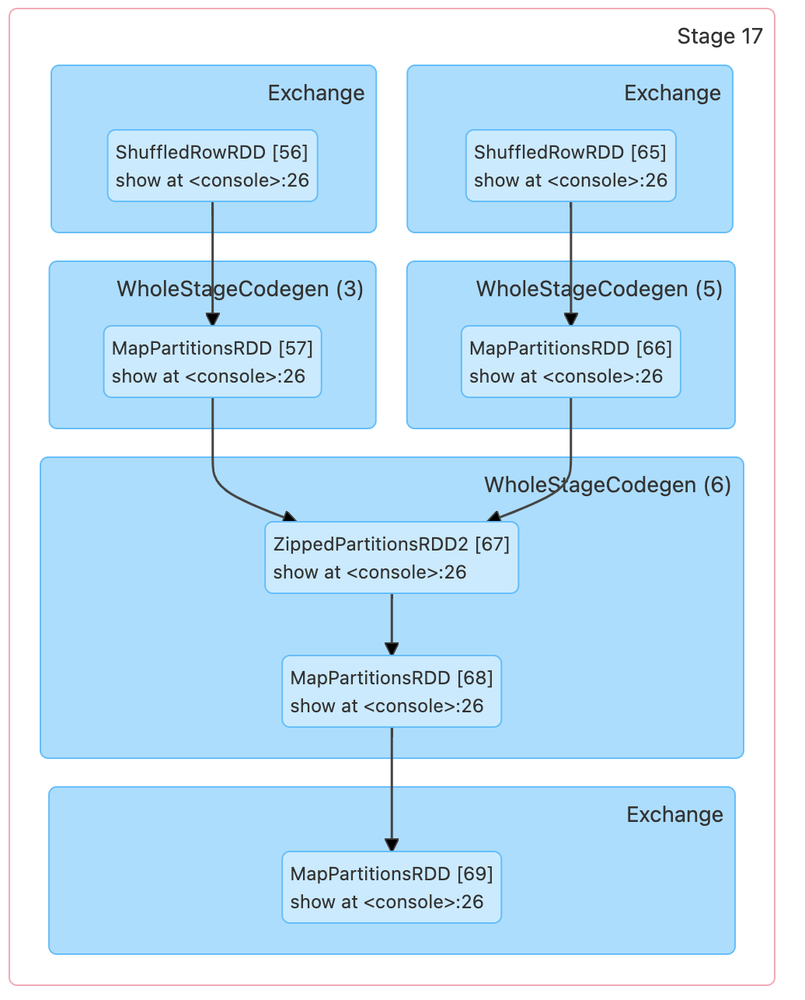

ZippedPartitions一般意味着是Join

	
	