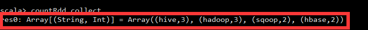

# Spark RDD

## 定义 

RDD（Resilient Distributed Datasets）弹性分布式数据集本质上是一个只读的分区记录集合。储存是按区(partition)处理的。所有的Spark操作都可以看成是一系列对RDD对象的操作,使用SparkContext来创建，SparkContext是Spark集群操作的入口。

RDD 具有容错机制，并且只读不能修改，可以执行确定的转换操作创建新的 RDD。具体来讲，RDD 具有以下几个属性。

> 只读：不能修改，只能通过转换操作生成新的 RDD。
> 
> 分布式：可以分布在多台机器上进行并行处理。
> 
> 弹性：计算过程中内存不够时它会和磁盘进行数据交换。
> 
> 基于内存：可以全部或部分缓存在内存中，在多次计算间重用。

## 操作RDD

	/root/spark-2.4.4-bin-hadoop2.7/bin
	
	./spark-shell

## Spark实现WordCount功能

### 准备测试数据

	vi /root/test1.txt

	hadoop hive
	hive hadoop
	hbase sqoop
	hbase sqoop
	hadoop hive

上传至HDFS

	hdfs dfs -put /root/test1.txt /input2

查看

	hdfs dfs -ls /input2

### 启动spark

	cd /root/spark-2.4.4-bin-hadoop2.7/bin
	./spark-shell

### 命令

	#读取hdfs的文件 
	val linesRdd = sc.textFile("hdfs://Master001:9000/input2/test1.txt")

	### 9000见Hadoop配置的RPC地址属性值

	#用flatMap方法对linesRdd进行分割成单词
	val wordsRdd = linesRdd.flatMap(line => line.split(" "))
	
	#用map方法，使得每个转化为map的key-value对，每个单词计数1；rdd类型为 RDD[(String, Int)]；
	val keyvalRdd = wordsRdd.map(word => (word, 1))

	#val keyvalRdd = wordsRdd.map(word => (word, 1))
	val countRdd = keyvalRdd.reduceByKey((a, b) => (a + b))

	#此时还没有进行运算；得执行collect才进行运算；
	countRdd.collect

	#用cache缓存，下一次collect速度会更快；
	countRdd.cache

	#把以上的整合成一行；
	sc.textFile("hdfs://Master001:9000/input2/test1.txt").flatMap(_.split(" ")).map((_, 1)).reduceByKey(_ + _).collect

	#存入HDFS
	sc.textFile("hdfs://Master001:9000/input2/test1.txt").flatMap(_.split(" ")).map((_, 1)).reduceByKey(_ + _).saveAsTextFile("/spark/output")

验证是否存入HDFS：

hdfs dfs -cat /spark/output/part-00000