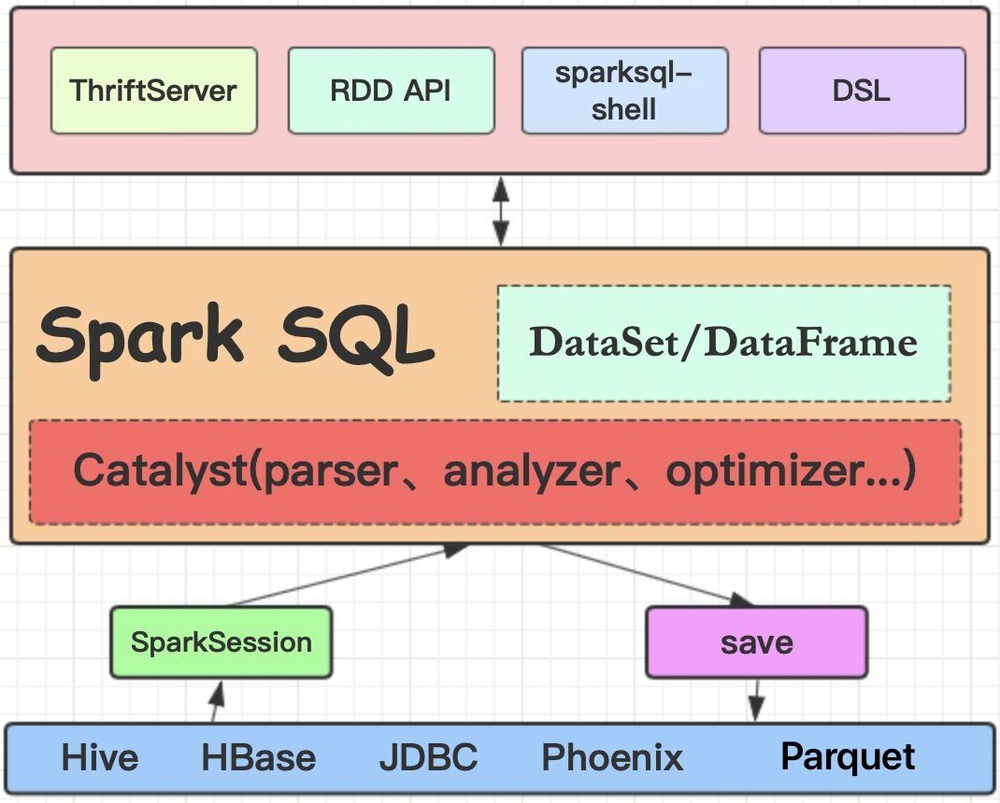
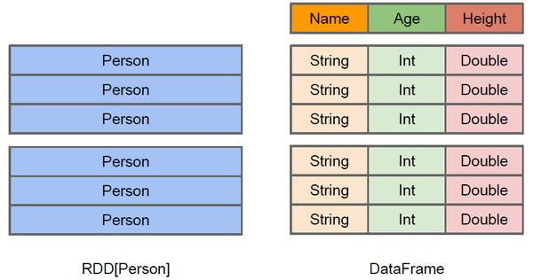
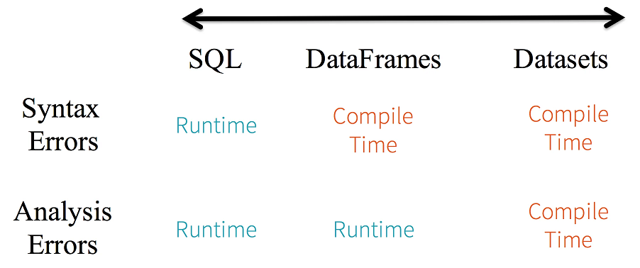
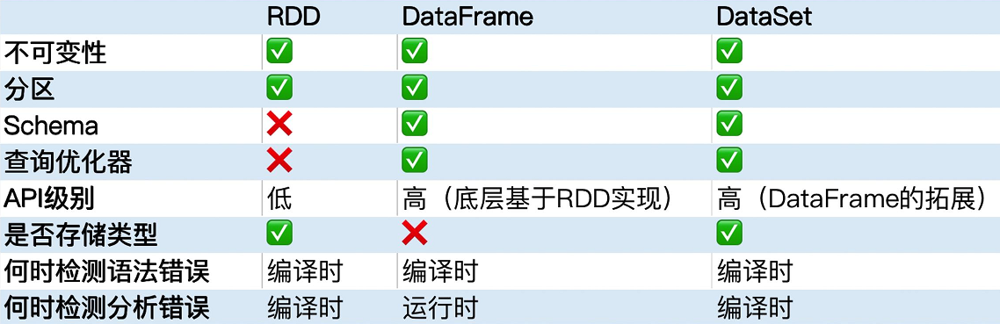

# Spark SQL 面试题

## Dateset/DataFrame

### DataFrame

DataFrame的数据都被组织到有名字的列中，就像关系型数据库中的表一样。它既包含数据结构信息schema，又包含数据。它除了提供与RDD类似的API之外，还提供了spark sql支持，方便了数据处理操作。

### DataSet

ataSet结构跟DataFrame一样，但它是强类型的，它包含的每一个元素已由case class定义，每一个属性的类型都是确定的，在编译阶段检查。它也支持spark sql。

## DataSet和DataFrame使用场景

DataFrame 和 Dataset API 都是基于 Spark SQL 引擎构建的，它使用 Catalyst 来生成优化后的逻辑和物理查询计划，因而会获得空间和速度上的效率。逻辑查询计划优化就是一个利用基于关系代数的等价变换，将高成本的操作替换为低成本操作的过程，把大结果集先过滤处理成小结果集，然后再做join之类的操作。

