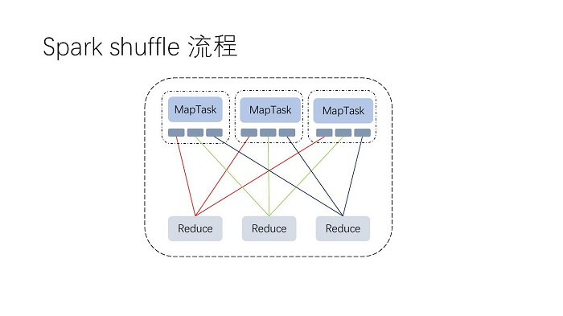
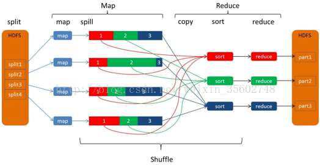
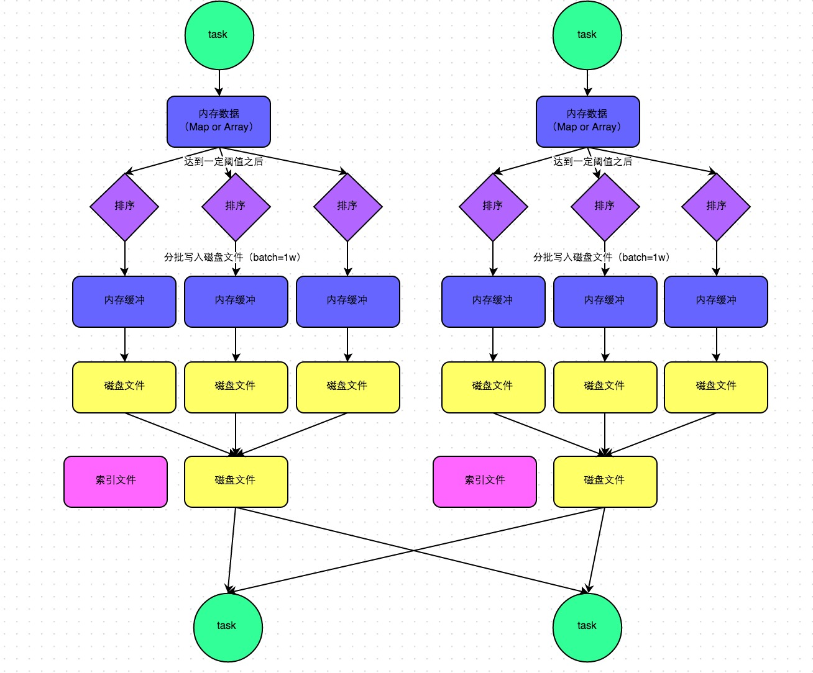
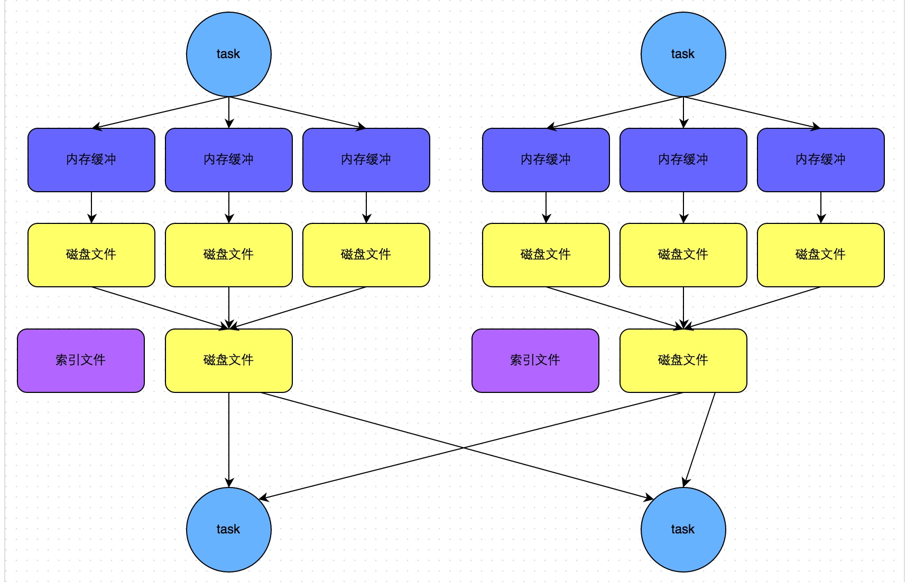

# Spark Shuffle

## 定义

在 MapReduce 框架中， Shuffle 阶段是连接 Map 与 Reduce 之间的桥梁， Map 阶段通过 Shuffle 过程将数据输出到 Reduce 阶段中。

所谓shuffle就是指把数据打乱重新组合。指数据从map task输出到reduce task输入的这段过程。

引起shuffle的算子有：

* repartition类的操作：repartition, coaleasce等
* ByKey类的操作：reduceByKey, groupByKey,  SortByKey等。相同的Key会到同一个节点上进行处理。
* join类的操作：join, cogroup等

###Spark Shuffle分为map side 和 reduce side。

一般将map task端的数据准备的shuffle阶段称为Shuffle Write,将reduce task端数据拷贝的阶段称为Shuffle Read。

reduce task会跨节点去拉取其他节点上的map task结果，一边拉取一边聚合。这一过程会消耗网络资源、内存和磁盘IO。

## Hadoop的shuffle

## SortShuffleManager

SortShuffleManager的运行机制主要分成两种，一种是普通运行机制，另一种是bypass运行机制。当shuffle read task的数量小于等于spark.shuffle.sort.bypassMergeThreshold参数的值时（默认为200），就会启用bypass机制。

 在该模式下，数据会先写入一个内存数据结构中(默认5M)，此时根据不同的shuffle算子，可能选用不同的数据结构。如果是reduceByKey这种聚合类的shuffle算子，那么会选用Map数据结构，一边通过Map进行聚合，一边写入内存;如果是join这种普通的shuffle算子，那么会选用Array数据结构，直接写入内存。接着，每写一条数据进入内存数据结构之后，就会判断一下，是否达到了某个临界阈值。如果达到临界阈值的话，那么就会尝试将内存数据结构中的数据溢写到磁盘，然后清空内存数据结构。

数据会先写入到内存数据结构中，边 map 边聚合，达到阈值后便会将数据溢写到磁盘并清空该数据结构。在写磁盘前，会先对数据进行排序，并分批写入磁盘文件，写入过程中，数据会先放进内存缓冲区，缓冲区满后在刷到磁盘，虽然减少了磁盘 IO ，但是此时最多可能会同时开 M*R 个buffer 缓冲区，对内存的压力也是比较大的。一般一个 shuffle map task 会发生多次溢写生成多个磁盘文件，最后会 merge 成一个磁盘文件，并生成一个文件段索引文件，为下游 reduce task 的拉取提供帮助。 生成磁盘文件数量就是 shuffle map task 的数量 - shuffle read shuffle read 过程没有太大改变

## bypass运行机制

而该机制与普通SortShuffleManager运行机制的不同在于：

bypass 机制起作用下的 sortmerge shuffle。本质上和 hashshuffle 差不多，只是在 shuffle write 后 多了一层 merge。

## spark 的shuffle调优

参考：https://blog.csdn.net/qichangjian/article/details/88039576

主要是调整缓冲的大小，拉取次数重试重试次数与等待时间，内存比例分配，是否进行排序操作等等

* spark.shuffle.file.buffer：BufferedOutputStream的buffer缓冲大小（默认是32K）。
* spark.reducer.maxSizeInFlight
* spark.shuffle.io.maxRetries and spark.shuffle.io.retryWait
* spark.shuffle.io.retryWait
* spark.shuffle.memoryFraction
* spark.shuffle.manager
* spark.shuffle.sort.bypassMergeThreshold
* spark.shuffle.consolidateFiles

