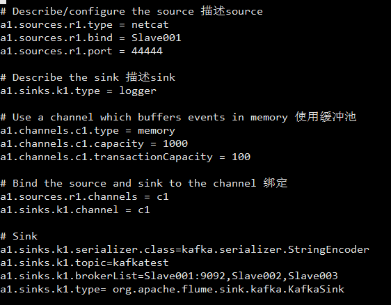

# Spark Streaming

## 简介

Spark Streaming 是从间歇拉取数据源（如Flume, Kafka等）中的数据来进行分析和处理的。每次拉去的数据都对应一个处理单位，处理单位即数据片段，又称为离散数据流。每次处理的数据片段都会被Spark Streaming包装成不可变的RDD推送到Spark内核进行处理。

## Kafka集群配合使用

在安装有zookeeper的服务器中：

###在Slave001解压kafka

	tar -zxvf kafka_2.11-2.3.1.tgz

###复制到其他节点

	scp -r  /root/kafka_2.11-2.3.1  root@Slave002:/root

	scp -r  /root/kafka_2.11-2.3.1  root@Slave003:/root

###在Slave各节点配置环境变量

	vi /etc/profile

	#插入
	export KAFKA_HOME=/root/kafka_2.11-2.3.1
	export PATH=$PATH:$KAFKA_HOME/bin
	
	#保存后刷新
	source /etc/profile

###在各节点配置节点标识

	vi /root/kafka_2.11-2.3.1/config/server.properties

	#Slave001中修改
	broker.id=0
	zookeeper.connect=Slave001:2181, Slave002:2181, Slave003:2181

	#Slave002中修改
	broker.id=1
	zookeeper.connect=Slave001:2181, Slave002:2181, Slave003:2181

	#Slave003中修改
	broker.id=2
	zookeeper.connect=Slave001:2181, Slave002:2181, Slave003:2181

注意：三个kafka中的broker id需要不一样

## 启动并使用Kafaka集群

###启动Zookeeper集群

###在各节点启动kafka:

	cd /root/kafka_2.11-2.3.1/bin
	nohup ./kafka-server-start.sh ../config/server.properties &

### 创建主题

	./kafka-topics.sh --create --zookeeper Slave001:2181,Slave002:2181,Slave003:2181 --replication-factor 3 --partitions 1 --topic HelloKafka

参数解释：

- zookeeper: 用于指定创建的主题信息需要存储到ZK集群列表
- relication-fator:主题目录的副本数量，其中副本包括主题下的所有数据
- partitions:创建主题下的分区数量
- topic:指定创建的主题名称

### 查看主题

	cd /root/kafka_2.11-2.3.1/bin
	./kafka-topics.sh --describe --zookeeper Slave001:2181,Slave002:2181,Slave003:2181 --topic HelloKafka

### 启动Kafka 生产者

	cd /root/kafka_2.11-2.3.1/bin
	./kafka-console-producer.sh --broker-list Slave001:9092,Slave002:9092,Slave003:9092 --topic HelloKafka

	> this is first test
	> this is second test02

### 启动消费者

	cd /root/kafka_2.11-2.3.1/bin

	./kafka-console-consumer.sh --bootstrap-server Slave001:9092,Slave002:9092,Slave003:9092 --from-beginning --topic HelloKafka
	

### 停止Kafka集群

在每一个节点中执行

	./kafka-server-stop.sh

# Kafka集成Flume
	
### 编写配置文件

vi /root/apache-flume-1.9.0-bin/conf/netcat.conf

在文件后面插入：

	# Sink
	a1.sinks.k1.serializer.class=kafka.serializer.StringEncoder
	a1.sinks.k1.topic=HelloKafka
	a1.sinks.k1.brokerList=Slave001:9092,Slave002,Slave003
	a1.sinks.k1.type= org.apache.flume.sink.kafka.KafkaSink
	a1.sinks.k1.channel = k1

	vi /root/apache-flume-1.9.0-bin/conf/flume_kafka.conf

	a1.sources = r1
	a1.channels = c1
	a1.sinks = k1
	
	 
	
	a1.sources.r1.type = exec
	#tail -F 根据文件名进行追踪
	a1.sources.r1.command = tail -F /root/hadoop-3.2.1/testdata/testflume.log
	a1.sources.r1.channels = c1
	
	 
	
	a1.channels.c1.type=memory
	a1.channels.c1.capacity=10000
	a1.channels.c1.transactionCapacity=100
	
	 
	
	a1.sinks.k1.type = org.apache.flume.sink.kafka.KafkaSink
	
	#指定kafka类型
	a1.sinks.k1.topic = HelloKafka

	#kafka集群地址
	a1.sinks.k1.brokerList = Slave001:9092,Slave002:9092,Slave003:9092
	a1.sinks.k1.requiredAcks = 1
	a1.sinks.k1.batchSize = 20
	a1.sinks.k1.channel = c1

###启动flume

	flume-ng agent --conf conf/ --name a1 --conf-file /root/apache-flume-1.9.0-bin/conf/flume_kafka.conf -Dflume.root.logger==INFO,console

### 编写测试文件

	mkdir /root/hadoop-3.2.1/testdata
	cd /root/hadoop-3.2.1/testdata

	#执行命令
	while true; do echo "hello testing do" >> testflume.log ; sleep 0.5; done

### 使用kafka接收

	#另外打开一个窗口
	
	cd /root/kafka_2.11-2.3.1/bin
	./kafka-console-consumer.sh --bootstrap-server Slave001:9092,Slave002:9092,Slave003:9092 --from-beginning --topic HelloKafka