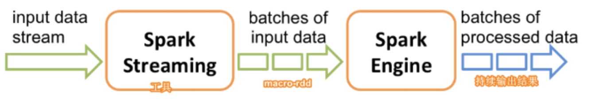

# DStream

## 定义

把连续的流式数据转换成离散的不连续的数据（RDD。Discretized（离散） Streams (DStreams)在内部，它的工作原理如下。 Spark Streaming接收实时输入数据流并将数据分成批处理，然后由Spark引擎处理以批量生成最终结果流。

## 重要函数

### transform(func)

通过RDD-to-RDD函数作用于源DStream中的各个RDD，可以是任意的RDD操作，从而返回一个新的RDD

	val result = words.map(x=>(x,1)).reduceByKey(_+_)

可以被简化为

	val wordPair = words.transform(x=>x.map(x=>(x,1)))

#### Demo

	import org.apache.spark.SparkConf
	import org.apache.spark.storage.StorageLevel
	import org.apache.spark.streaming.{Seconds, StreamingContext}
	
	object MyNetworkWordCount {
	
	  def main(args: Array[String]): Unit = {
	
	    //创建spacrkconf对象。 local表示只有一个线程，local[2]表示cpu有两个核
	    val sparkConf = new SparkConf().setAppName("Network word count Demo").setMaster("local[2]")
	
	    //创建一个StreamingContext,每隔3秒采集一次数据
	    val ssc = new StreamingContext(sparkConf,Seconds(3))
	
	    //创建Dstream，看成是一个输入流
	    val line = ssc.socketTextStream("192.168.2.101",1234,StorageLevel.MEMORY_AND_DISK)
	
	    //执行word count
	    val words = line.flatMap(_.split(" "))
	
	
	    val wordPair = words.transform(x=>x.map(x=>(x,1)))
	    wordPair.print()
	
	    //启动StreamingContext
	    ssc.start()
	
	    //等待计算完成
	    ssc.awaitTermination()
	
	  }
	
	}

### updateStateByKey(func)

1. 操作允许不断用新信息更新它的同时保持任意状态。比如累加历史统计结果。
1. 定义状态-状态可以是任何的数据类型
1. 定义状态更新函数-怎样利用更新前的状态和从输入流里面获取的新值更新状态

#### Demo

	import org.apache.spark.storage.StorageLevel
	import org.apache.spark.streaming.{Seconds, StreamingContext}
	import org.apache.spark.{SparkConf, SparkContext}
	
	object MyNetworkWordCountTotal {
	
	  def main(args: Array[String]): Unit = {
	
	    val conf = new SparkConf().setAppName("MyNetworkWordCountTotal").setMaster("local[2]")
	    val ssc = new StreamingContext(conf,Seconds(3))
	
	    //设置检查点目录，保存状态信息
	    ssc.checkpoint("hdfs://192.168.2.101:9000/sparkstreaming/checkpoint")
	
	    //创建Dstream，看成是一个输入流
	    val line = ssc.socketTextStream("192.168.2.101",1234,StorageLevel.MEMORY_AND_DISK_SER)
	
	    //执行word count
	    val words = line.flatMap(_.split(" "))
	
	    //定义一个函数用户累计每个单词出现的总频率。Option表示任意类型
	    val addFunc = (currValues:Seq[Int],preValueState:Option[Int]) =>{
	      //通过Spark内部的reduceByKey先按照key进行分组，
	      val curr = currValues.sum
	      //原来的值
	      val preCount = preValueState.getOrElse(0)
	
	      //返回累加后的值，Some是Option的子类
	      Some(curr+preCount)
	    }
	
	    //每个单词记一次数
	    val pairs = words.map(word=>(word,1))
	    val total = pairs.updateStateByKey[Int](addFunc)
	    total.print()
	
	    ssc.start()
	    ssc.awaitTermination()
	
	  }
	
	}

#### 测试 

netcat端：

	[root@wangzheyi ~]# nc -l -p 1234
	hello world
	hello you
	
spark端：

	-------------------------------------------
	Time: 1600244097000 ms
	-------------------------------------------
	(hello,1)
	(world,1)

	-------------------------------------------
	Time: 1600244097000 ms
	-------------------------------------------
	(hello,2)
	(world,1)
	(you,1)

hdfs中：

生成了checkpoint文件

	[root@wangzheyi ~]# hdfs dfs -ls /sparkstreaming/checkpoint
	Found 12 items
	drwxr-xr-x   - zheyiwang supergroup          0 2020-09-08 06:08 /sparkstreaming/checkpoint/1cd38ebc-0483-4a5f-a0e4-9ba1fa8a0c6b
	-rw-r--r--   3 zheyiwang supergroup       3870 2020-09-08 06:08 /sparkstreaming/checkpoint/checkpoint-1600244100000
	-rw-r--r--   3 zheyiwang supergroup       3873 2020-09-08 06:08 /sparkstreaming/checkpoint/checkpoint-1600244100000.bk
	-rw-r--r--   3 zheyiwang supergroup       3865 2020-09-08 06:08 /sparkstreaming/checkpoint/checkpoint-1600244103000
	-rw-r--r--   3 zheyiwang supergroup       3873 2020-09-08 06:08 /sparkstreaming/checkpoint/checkpoint-1600244103000.bk
	-rw-r--r--   3 zheyiwang supergroup       3866 2020-09-08 06:08 /sparkstreaming/checkpoint/checkpoint-1600244106000
	
	
#### 重启后

spark端重启后重新统计计数