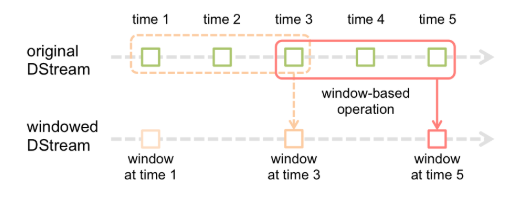

# 窗口模式

窗口函数，就是在DStream流上，以一个可配置的长度为窗口，以一个可配置的速率向前移动窗口，根据窗口函数的具体内容，分别对当前窗口中的这一波数据采取某个对应的操作算子。

**需要注意的是窗口长度，和窗口移动速率需要是batch time的整数倍。**

## 代码

### MyWindowWordCount

	import org.apache.spark.SparkConf
	import org.apache.spark.storage.StorageLevel
	import org.apache.spark.streaming.{Seconds, StreamingContext}
	
	object MyWindowWordCount {
	
	  def main(args: Array[String]): Unit = {
	
	
	    val conf = new SparkConf().setAppName("My window wordcount").setMaster("local[2]")
	    val ssc = new StreamingContext(conf,Seconds(3))
	
	    //读入数据
	    val lines = ssc.socketTextStream("192.168.2.101",1234,StorageLevel.MEMORY_AND_DISK_SER)
	
	    //单词计数
	    val words = lines.flatMap(_.split(" "))
	    //val result = words.map(x=>(x,1)).reduceByKey(_+_)
	
	    //使用窗户操作: 每9秒钟，把过去30秒的数据进行WordCount。30和9都是3秒的整数倍
	    val result = words.map(x=>(x,1)).reduceByKeyAndWindow((a:Int,b:Int)=>(a+b),Seconds(30),Seconds(9))
	
	    result.print()
	
	    //启动任务
	    ssc.start();
	
	    //等等计算完成
	    ssc.awaitTermination()
	
	
	  }
	
	}
