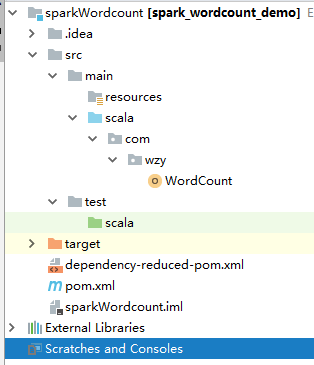
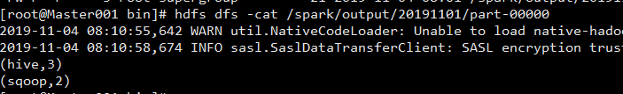

# Spark Wordcount Demo

## 数据

	hadoop hive
	hive hadoop
	hbase sqoop
	hbase sqoop
	hadoop hive

## Wordcount demo

**WordCount:**

	package com.wzy
	
	import org.apache.spark.{SparkConf, SparkContext}
	
	object WordCount {
	  def main(args: Array[String]): Unit = {
	    //设置分布式的运行平台，和appname
	    //使用Master运行平台，yarn，standalong（spark自带的运行平台），mesos，local四种
	    //local开发调试时用的环境，前三种一般为上线的运行环境
	    //local local[N] local[*]
	    val conf = new SparkConf().setMaster("yarn").setAppName("WordCount")
	    //构建sparkContext对象
	    val sc = new SparkContext(conf)
	    //加载数据源，获取RDD对象
	    val textFile = sc.textFile("hdfs://Master001:9000/input2/test1.txt")
	    val counts = textFile.flatMap(line => line.split(" ")).map(word => (word,1)).reduceByKey(_+_)
	    counts.saveAsTextFile("/spark/output/20191101")
	  }
	}

**pom.xml:**
	
	<?xml version="1.0" encoding="UTF-8"?>
	<project xmlns="http://maven.apache.org/POM/4.0.0"
	         xmlns:xsi="http://www.w3.org/2001/XMLSchema-instance"
	         xsi:schemaLocation="http://maven.apache.org/POM/4.0.0 http://maven.apache.org/xsd/maven-4.0.0.xsd">
	    <modelVersion>4.0.0</modelVersion>
	
	    <groupId>com.wzy</groupId>
	    <artifactId>spark_wordcount_demo</artifactId>
	    <version>1.0-SNAPSHOT</version>
	
	    <properties>
	        <maven.compiler.source>1.7</maven.compiler.source>
	        <maven.compiler.target>1.7</maven.compiler.target>
	        <encoding>UTF-8</encoding>
	
	        <!-- 这里对jar包版本做集中管理 -->
	        <scala.version>2.11.12</scala.version>
	        <spark.version>2.4.4</spark.version>
	        <hadoop.version>2.7.3</hadoop.version>
	    </properties>
	
	    <dependencies>
	        <dependency>
	            <!-- scala语言核心包 -->
	            <groupId>org.scala-lang</groupId>
	            <artifactId>scala-library</artifactId>
	            <version>${scala.version}</version>
	        </dependency>
	        <dependency>
	            <!-- spark核心包 -->
	            <groupId>org.apache.spark</groupId>
	            <artifactId>spark-core_2.12</artifactId>
	            <version>${spark.version}</version>
	        </dependency>
	
	        <dependency>
	            <!-- hadoop的客户端,用于访问HDFS -->
	            <groupId>org.apache.hadoop</groupId>
	            <artifactId>hadoop-client</artifactId>
	            <version>${hadoop.version}</version>
	        </dependency>
	    </dependencies>
	
	    <build>
	        <pluginManagement>
	            <plugins>
	                <!-- 编译scala的插件 -->
	                <plugin>
	                    <groupId>net.alchim31.maven</groupId>
	                    <artifactId>scala-maven-plugin</artifactId>
	                    <version>3.2.2</version>
	                </plugin>
	                <!-- 编译java的插件 -->
	                <plugin>
	                    <groupId>org.apache.maven.plugins</groupId>
	                    <artifactId>maven-compiler-plugin</artifactId>
	                    <version>3.5.1</version>
	                </plugin>
	            </plugins>
	        </pluginManagement>
	        <plugins>
	            <plugin>
	                <groupId>net.alchim31.maven</groupId>
	                <artifactId>scala-maven-plugin</artifactId>
	                <executions>
	                    <execution>
	                        <id>scala-compile-first</id>
	                        <phase>process-resources</phase>
	                        <goals>
	                            <goal>add-source</goal>
	                            <goal>compile</goal>
	                        </goals>
	                    </execution>
	                    <execution>
	                        <id>scala-test-compile</id>
	                        <phase>process-test-resources</phase>
	                        <goals>
	                            <goal>testCompile</goal>
	                        </goals>
	                    </execution>
	                </executions>
	            </plugin>
	
	            <plugin>
	                <groupId>org.apache.maven.plugins</groupId>
	                <artifactId>maven-compiler-plugin</artifactId>
	                <executions>
	                    <execution>
	                        <phase>compile</phase>
	                        <goals>
	                            <goal>compile</goal>
	                        </goals>
	                    </execution>
	                </executions>
	            </plugin>
	
	            <!-- 打jar插件 -->
	            <plugin>
	                <groupId>org.apache.maven.plugins</groupId>
	                <artifactId>maven-shade-plugin</artifactId>
	                <version>2.4.3</version>
	                <executions>
	                    <execution>
	                        <phase>package</phase>
	                        <goals>
	                            <goal>shade</goal>
	                        </goals>
	                        <configuration>
	                            <filters>
	                                <filter>
	                                    <artifact>*:*</artifact>
	                                    <excludes>
	                                        <exclude>META-INF/*.SF</exclude>
	                                        <exclude>META-INF/*.DSA</exclude>
	                                        <exclude>META-INF/*.RSA</exclude>
	                                    </excludes>
	                                </filter>
	                            </filters>
	                        </configuration>
	                    </execution>
	                </executions>
	            </plugin>
	        </plugins>
	    </build>
	
	</project>

## 注意事项

spark、spark、hadoop版本需要注意兼容性，demo中pmo使用的版本如下：

spark : 2.4.4

scala : 2.11.12

hadoop: 2.7.3

## 部署

使用maven package打包项目。上传至服务器后：

	#转到spark目录
	cd /root/spark-2.4.4-bin-hadoop2.7/bin

	#使用spark submit提交任务
	./spark-submit --class com.wzy.SparkWordCount --master spark://Master001:7077 --executor-memory 512M --total-executor-cores 2 /root/spark_wordcount_demo-1.0-SNAPSHOT.jar 

	#检查结果
	hdfs dfs -cat /spark/output/20191101/part-00000

结果如下：

