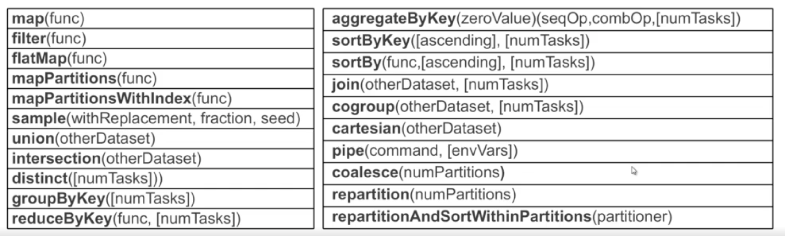
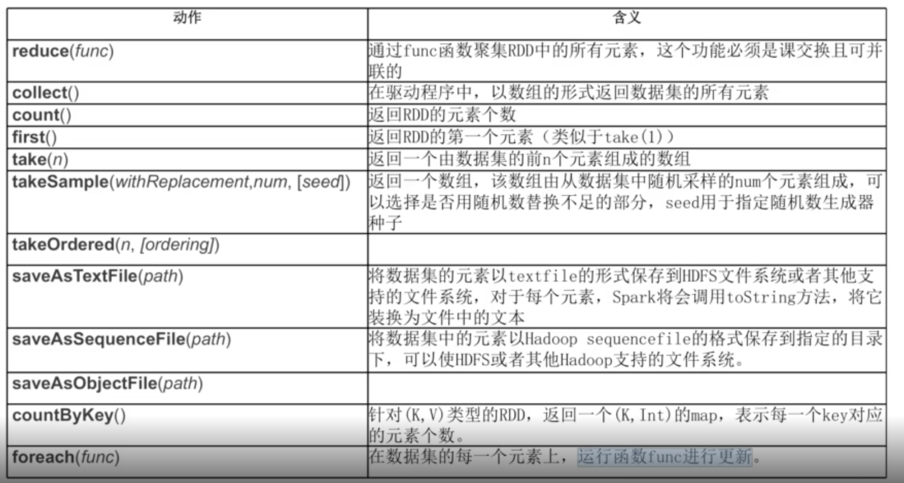

# Spark 常见算子

官方文档上列举共有32种常见算子，包括Transformation的20种操作和Action的12种操作。

## Transformation

不会触发计算

### Map

map是对数据1对1的遍历,并形成新的RDD

	#测试数据
	scala> val rdd1 = sc.parallelize(List(1,5,2,6,3,4,5,6,7))
	rdd1: org.apache.spark.rdd.RDD[Int] = ParallelCollectionRDD[0] at parallelize at <console>:24
	
	
	scala> rdd1.map((_,"*"))
	res0: org.apache.spark.rdd.RDD[(Int, String)] = MapPartitionsRDD[1] at map at <console>:26
	
	scala> res0.collect
	res1: Array[(Int, String)] = Array((1,*), (5,*), (2,*), (6,*), (3,*), (4,*), (5,*), (6,*), (7,*))	
	

	scala> rdd1.map((_ * 10))
	res2: org.apache.spark.rdd.RDD[Int] = MapPartitionsRDD[2] at map at <console>:26
	
	scala> res2.collect
	res3: Array[Int] = Array(10, 50, 20, 60, 30, 40, 50, 60, 70)	

### Filter

过滤操作，满足filter内function函数为true的RDD内所有元素组成一个新的数据集。

	#测试数据
	scala> val rdd1 = sc.parallelize(List(1,5,2,6,3,4,5,6,7))
	rdd1: org.apache.spark.rdd.RDD[Int] = ParallelCollectionRDD[0] at parallelize at <console>:24
	
	scala> rdd1.filter(_ > 5)
	res4: org.apache.spark.rdd.RDD[Int] = MapPartitionsRDD[3] at filter at <console>:26
	
	scala> res4.collect
	res5: Array[Int] = Array(6, 6, 7)

### FlatMap

压平进行拆分。

	scala> val rdd1 = sc.parallelize(List(1,5,2,6,3,4,5,6,7,11))
	rdd1: org.apache.spark.rdd.RDD[Int] = ParallelCollectionRDD[5] at parallelize at <console>:24
	
	scala> rdd1.flatMap(_.toString)
	res12: org.apache.spark.rdd.RDD[Char] = MapPartitionsRDD[6] at flatMap at <console>:26
	
	scala> res12.collect
	res13: Array[Char] = Array(1, 5, 2, 6, 3, 4, 5, 6, 7, 1, 1)

	scala> val books = sc.parallelize(List("Hadoop","Oracle","Java"))
	books: org.apache.spark.rdd.RDD[String] = ParallelCollectionRDD[7] at parallelize at <console>:24
	
	scala> books.flatMap(_.toList)
	res14: org.apache.spark.rdd.RDD[Char] = MapPartitionsRDD[8] at flatMap at <console>:26
	
	scala> res14.collect
	res15: Array[Char] = Array(H, a, d, o, o, p, O, r, a, c, l, e, J, a, v, a)

### Union

将两个RDD连接起来

	scala> val rdd4 = sc.parallelize(List(5,6,7,8))
	rdd4: org.apache.spark.rdd.RDD[Int] = ParallelCollectionRDD[9] at parallelize at <console>:24
	
	scala> val rdd5 = sc.parallelize(List(1,2,3,4,5))
	rdd5: org.apache.spark.rdd.RDD[Int] = ParallelCollectionRDD[10] at parallelize at <console>:24
	
	scala> val rdd6 = rdd4.union(rdd5)
	rdd6: org.apache.spark.rdd.RDD[Int] = UnionRDD[11] at union at <console>:27
	
	scala> rdd6.collect
	res16: Array[Int] = Array(5, 6, 7, 8, 1, 2, 3, 4, 5)

### Intersection

求两个RDD的共同部分

	scala> val rdd4 = sc.parallelize(List(5,6,7,8))
	rdd4: org.apache.spark.rdd.RDD[Int] = ParallelCollectionRDD[0] at parallelize at <console>:24
	
	scala> val rdd5 = sc.parallelize(List(1,2,3,4,5))
	rdd5: org.apache.spark.rdd.RDD[Int] = ParallelCollectionRDD[1] at parallelize at <console>:24
	
	scala> val rdd6 =rdd4.intersection(rdd5)
	rdd6: org.apache.spark.rdd.RDD[Int] = MapPartitionsRDD[7] at intersection at <console>:27
	
	scala> rdd6.collect
	res0: Array[Int] = Array(5)   

### Distinct

去掉一样的元素

	scala> val rdd8 = sc.parallelize(List(1,2,3,4,5,3,5,8))
	rdd8: org.apache.spark.rdd.RDD[Int] = ParallelCollectionRDD[8] at parallelize at <console>:24
	
	scala> rdd8.distinct
	res2: org.apache.spark.rdd.RDD[Int] = MapPartitionsRDD[11] at distinct at <console>:26
	
	scala> res2.collect
	res3: Array[Int] = Array(4, 8, 2, 1, 3, 5)

### GroupByKey

对于<key, value> 格式的RDD, 按照key排序

	scala> val rdd = sc.parallelize(Array(("I",1),("love",3),("I",2)))
	rdd: org.apache.spark.rdd.RDD[(String, Int)] = ParallelCollectionRDD[12] at parallelize at <console>:24
	
	scala> rdd.groupByKey.collect
	res4: Array[(String, Iterable[Int])] = Array((love,CompactBuffer(3)), (I,CompactBuffer(1, 2)))

复杂的例子：

	scala> val sen = sc.parallelize(List("I love Beijing","I love China","Beijing is the capital of China"))
	sen: org.apache.spark.rdd.RDD[String] = ParallelCollectionRDD[14] at parallelize at <console>:24
	
	scala>  sen.flatMap(_.split(" ")).map((_,1)).groupByKey.collect
	res5: Array[(String, Iterable[Int])] = Array((is,CompactBuffer(1)), (love,CompactBuffer(1, 1)), (capital,CompactBuffer(1)), (Beijing,CompactBuffer(1, 1)), (China,CompactBuffer(1, 1)), (I,CompactBuffer(1, 1)), (of,CompactBuffer(1)), (the,CompactBuffer(1)))

### ReduceByKey

类似于groupByKey([numTasks])，区别：reduceByKey会有一个combiner的过程，对每个分区上的数据先做一次合并，效率更高.

	scala> val sen = sc.parallelize(List("I love Beijing","I love China","Beijing is the capital of China"))
	sen: org.apache.spark.rdd.RDD[String] = ParallelCollectionRDD[14] at parallelize at <console>:24
	
	scala>  sen.flatMap(_.split(" ")).map((_,1)).reduceByKey(_+_).collect
	res12: Array[(String, Int)] = Array((is,1), (love,2), (capital,1), (Beijing,2), (China,2), (I,2), (of,1), (the,1))

### cartesian

求笛卡尔积,跟关系型数据库多表查询一样。

	例 给出三个域：
	　　D1=SUPERVISOR ={ 张清玫，刘逸 }
	　　D2=SPECIALITY={计算机专业，信息专业}
	　　D3=POSTGRADUATE={李勇，刘晨，王敏}
	　　则D1，D2，D3的笛卡尔积为D：
	　　D=D1×D2×D3 ＝
	　　｛(张清玫，计算机专业，李勇)，(张清玫，计算机专业，刘晨)，
	　　(张清玫，计算机专业，王敏)，(张清玫，信息专业，李勇)，
	　　(张清玫，信息专业，刘晨)，(张清玫，信息专业，王敏)，
	　　(刘逸，计算机专业，李勇)，(刘逸，计算机专业，刘晨)，
	　　(刘逸，计算机专业，王敏)，(刘逸，信息专业，李勇)，
	　　(刘逸，信息专业，刘晨)，(刘逸，信息专业，王敏) ｝
	　　

实现代码：

	scala> val SUPERVISOR=sc.parallelize(List("张清玫","刘逸"))
	SUPERVISOR: org.apache.spark.rdd.RDD[String] = ParallelCollectionRDD[24] at parallelize at <console>:24

	scala> val SPECIALITY=sc.parallelize(List("计算机专业","信息专业"))
	SPECIALITY: org.apache.spark.rdd.RDD[String] = ParallelCollectionRDD[25] at parallelize at <console>:24

	scala> val POSTGRADUATE=sc.parallelize(List("李勇","刘晨","王敏"))
	POSTGRADUATE: org.apache.spark.rdd.RDD[String] = ParallelCollectionRDD[26] at parallelize at <console>:24
	
	scala> val ans =SUPERVISOR.cartesian(SPECIALITY).cartesian(POSTGRADUATE)
	ans: org.apache.spark.rdd.RDD[((String, String), String)] = CartesianRDD[28] at cartesian at <console>:29
	
	scala> ans.collect
	res13: Array[((String, String), String)] = Array(((张清玫,计算机专业),李勇), ((张清玫,计算机专业),刘晨), ((张清玫,计算机专业),王敏), ((张清玫,信息专业),李勇), ((张清玫,信息专业),刘晨), ((张清玫,信息专业),王敏), ((刘逸,计算机专业),李勇), ((刘逸,计算机专业),刘晨), ((刘逸,计算机专业),王敏), ((刘逸,信息专业),李勇), ((刘逸,信息专业),刘晨), ((刘逸,信息专业),王敏))	

## Action

会触发计算

### collection

触发计算

	scala> val rdd1 = sc.parallelize(List(5,6,7,8))
	rdd1: org.apache.spark.rdd.RDD[Int] = ParallelCollectionRDD[29] at parallelize at <console>:24
	
	scala> rdd1.collect
	res14: Array[Int] = Array(5, 6, 7, 8)

### reduce

	scala> val rdd1 = sc.parallelize(List(1,5,2,6,3,4,5,6,7))
	rdd1: org.apache.spark.rdd.RDD[Int] = ParallelCollectionRDD[30] at parallelize at <console>:24
	
	scala> val rdd2 = rdd1.reduce(_ + _)
	rdd2: Int = 39

注意：(_ + _)的意思是前面一个元素加上后面一个元素

### count

统计

	scala> val rdd1 = sc.parallelize(List(1,5,2,6,3,4,5,6,7))
	rdd1: org.apache.spark.rdd.RDD[Int] = ParallelCollectionRDD[30] at parallelize at <console>:24
	
	scala> rdd1.count
	res15: Long = 9
	
### top
降序排列后，取前几个元素

	scala> val rdd1 = sc.parallelize(List(1,5,2,6,3,4,5,6,7))
	rdd1: org.apache.spark.rdd.RDD[Int] = ParallelCollectionRDD[30] at parallelize at <console>:24
	
	scala> rdd1.top(3)
	res17: Array[Int] = Array(7, 6, 6)
	
	
### take
不排序，取出前几个元素

	scala> val rdd1 = sc.parallelize(List(1,5,2,6,3,4,5,6,7))
	rdd1: org.apache.spark.rdd.RDD[Int] = ParallelCollectionRDD[30] at parallelize at <console>:24
	
	scala> rdd1.take(3)
	res18: Array[Int] = Array(1, 5, 2)

### first

取出第一条

	scala> val rdd1 = sc.parallelize(List(1,5,2,6,3,4,5,6,7))
	rdd1: org.apache.spark.rdd.RDD[Int] = ParallelCollectionRDD[30] at parallelize at <console>:24

	scala> rdd1.first
	res19: Int = 1
	
### takeOrdered

跟top类似，不过是升序排列

	scala> val rdd1 = sc.parallelize(List(1,5,2,6,3,4,5,6,7))
	rdd1: org.apache.spark.rdd.RDD[Int] = ParallelCollectionRDD[30] at parallelize at <console>:24

	scala> rdd1.takeOrdered(3)
	res20: Array[Int] = Array(1, 2, 3)

### foreach

循环

	scala> val rdd1 = sc.parallelize(List(1,5,2,6,3,4,5,6,7))
	rdd1: org.apache.spark.rdd.RDD[Int] = ParallelCollectionRDD[30] at parallelize at <console>:24

	scala> rdd1.collect.foreach(println)
	1
	5
	2
	6
	3
	4
	5
	6
	7