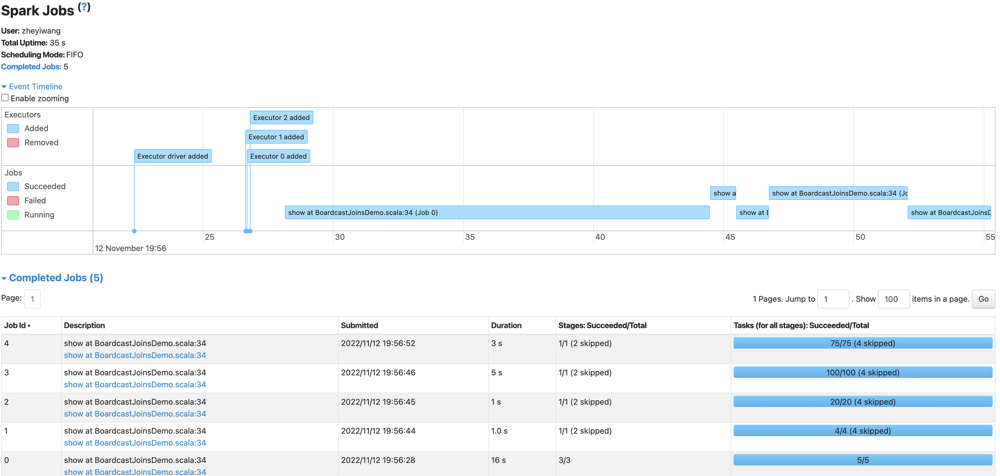
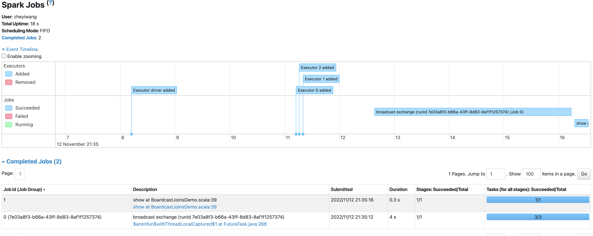
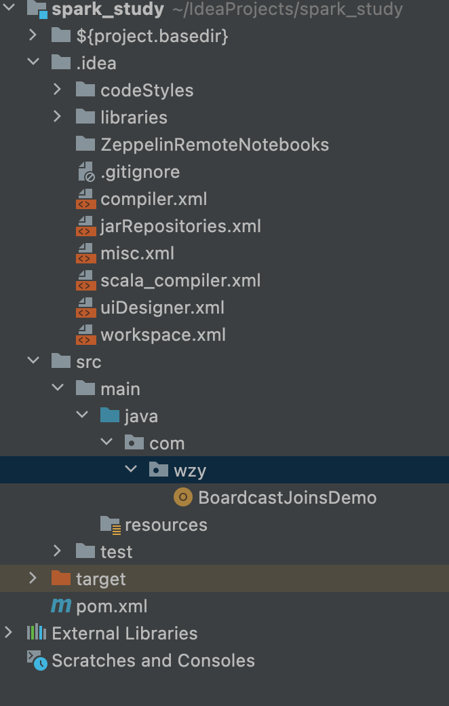

# Broadcast joins in Apache Spark

参考：https://www.youtube.com/watch?v=af2k52NjcUo

## 没有Broadcst之前

### 执行计划

	== Physical Plan ==
	*(5) Project [id#0L, medal#5]
	+- *(5) SortMergeJoin [id#0L], [cast(id#4 as bigint)], Inner
	   :- *(2) Sort [id#0L ASC NULLS FIRST], false, 0
	   :  +- Exchange hashpartitioning(id#0L, 200), ENSURE_REQUIREMENTS, [id=#27]
	   :     +- *(1) Range (1, 100000000, step=1, splits=2)
	   +- *(4) Sort [cast(id#4 as bigint) ASC NULLS FIRST], false, 0
	      +- Exchange hashpartitioning(cast(id#4 as bigint), 200), ENSURE_REQUIREMENTS, [id=#33]
	         +- *(3) Filter isnotnull(id#4)
	            +- *(3) Scan ExistingRDD[id#4,medal#5]

#### 解释执行计划

* Project [id#0L, medal#5]：  val joined = table.join(lookupTable,"id")
* SortMergeJoin ：因为要join，所以需要做SortMerge。 sortMerge由两个2个stage组成，stage2he stage4
* stage2: huge dataset
* stage4: small dataset

####特别注意：
当Exchange出现的时候，spark会重新对数组排序，这里的例子是根据id#0L, 200)排序

## Boardcast 之后

### 执行计划
	== Physical Plan ==
	BroadcastNestedLoopJoin BuildRight, Inner
	:- *(1) Range (1, 100000000, step=1, splits=2)
	+- BroadcastExchange IdentityBroadcastMode, [id=#56]
	   +- *(2) Scan ExistingRDD[id#4,medal#5]

## 代码

	package com.wzy
	
	import org.apache.spark.rdd.RDD
	import org.apache.spark.sql.types.{IntegerType, StringType, StructField, StructType}
	import org.apache.spark.sql.{DataFrame, Row, SparkSession}
	import org.apache.spark.sql.functions._
	
	object BoardcastJoinsDemo {
	
	  val spark =SparkSession.builder()
	.appName("Repartion and coalesce")
	    .master("spark://192.168.2.113:7077")
	    .getOrCreate()
	
	  //huge dataset
	  val table = spark.range(1,100000000) //生成 (id, num)
	
	  //small dataset
	  val rows: RDD[Row] = spark.sparkContext.parallelize(List(
	    Row(1,"gold"),
	    Row(2,"silver"),
	    Row(3,"bronze")
	  ))
	
	  val rowSchema = StructType(Array(
	    StructField("id",IntegerType),
	    StructField("medal",StringType),
	  ))
	
	  //lookup操作
	  val lookupTable:DataFrame = spark.createDataFrame(rows, rowSchema)
	
	  val joined = table.join(lookupTable,"id")
	  joined.explain()
	  //joined.show()
	
	  val joinedSmart = table.join(broadcast(lookupTable),"id")
	  joinedSmart.explain()
	  joinedSmart.show()
	
	  def main(args: Array[String]): Unit = {
	      Thread.sleep(10000000)
	  }
	}

### pom.xml

	<?xml version="1.0" encoding="UTF-8"?>
	<project xmlns="http://maven.apache.org/POM/4.0.0"
	         xmlns:xsi="http://www.w3.org/2001/XMLSchema-instance"
	         xsi:schemaLocation="http://maven.apache.org/POM/4.0.0 http://maven.apache.org/xsd/maven-4.0.0.xsd">
	    <modelVersion>4.0.0</modelVersion>
	
	    <groupId>org.example</groupId>
	    <artifactId>spark_study</artifactId>
	    <version>1.0-SNAPSHOT</version>
	
	    <properties>
	        <maven.compiler.source>8</maven.compiler.source>
	        <maven.compiler.target>8</maven.compiler.target>
	    </properties>
	
	    <dependencies>
	
	
	        <dependency>
	            <groupId>org.apache.spark</groupId>
	            <artifactId>spark-core_2.12</artifactId>
	            <version>3.1.3</version>
	        </dependency>
	
	        <dependency>
	            <groupId>org.scala-lang</groupId>
	            <artifactId>scala-library</artifactId>
	            <version>2.12.10</version>
	        </dependency>
	
	        <dependency>
	            <groupId>org.apache.spark</groupId>
	            <artifactId>spark-sql_2.12</artifactId>
	            <version>3.1.3</version>
	        </dependency>
	
	
	    </dependencies>
	
	
	    <repositories>
	        <repository>
	            <id>nexus-aliyun</id>
	            <name>Nexus aliyun</name>
	            <layout>default</layout>
	            <url>http://maven.aliyun.com/nexus/content/groups/public</url>
	            <snapshots>
	                <enabled>false</enabled>
	                <updatePolicy>never</updatePolicy>
	            </snapshots>
	            <releases>
	                <enabled>true</enabled>
	                <updatePolicy>never</updatePolicy>
	            </releases>
	        </repository>
	
	    </repositories>
	
	    <pluginRepositories>
	        <pluginRepository>
	            <id>ali-plugin</id>
	            <url>http://maven.aliyun.com/nexus/content/groups/public/</url>
	            <snapshots>
	                <enabled>false</enabled>
	                <updatePolicy>never</updatePolicy>
	            </snapshots>
	            <releases>
	                <enabled>true</enabled>
	                <updatePolicy>never</updatePolicy>
	            </releases>
	        </pluginRepository>
	    </pluginRepositories>
	
	    <build>
	        <plugins>
	            <!-- 指定编译java的插件 -->
	            <plugin>
	                <groupId>org.apache.maven.plugins</groupId>
	                <artifactId>maven-compiler-plugin</artifactId>
	                <version>3.5.1</version>
	                <configuration>
	                    <source>1.8</source>
	                    <target>1.8</target>
	                </configuration>
	            </plugin>
	
	            <!-- 指定编译scala的插件 -->
	            <plugin>
	                <groupId>net.alchim31.maven</groupId>
	                <artifactId>scala-maven-plugin</artifactId>
	                <version>3.2.2</version>
	                <executions>
	                    <execution>
	                        <goals>
	                            <goal>compile</goal>
	                            <goal>testCompile</goal>
	                        </goals>
	                        <configuration>
	                            <args>
	                                <arg>-dependencyfile</arg>
	                                <arg>${project.build.directory}/.scala_dependencies</arg>
	                            </args>
	                        </configuration>
	                    </execution>
	                </executions>
	            </plugin>
	
	
	            <!--  把依赖jar中的用到的类，提取到自己的jar中 -->
	            <plugin>
	                <groupId>org.apache.maven.plugins</groupId>
	                <artifactId>maven-assembly-plugin</artifactId>
	                <version>2.6</version>
	                <configuration>
	                    <archive>
	                        <manifest>
	                            <mainClass></mainClass>
	                        </manifest>
	                    </archive>
	                    <descriptorRefs>
	                        <descriptorRef>jar-with-dependencies</descriptorRef>
	                    </descriptorRefs>
	                </configuration>
	                <!--下面是为了使用 mvn package命令，如果不加则使用mvn assembly-->
	                <executions>
	                    <execution>
	                        <id>make-assemble</id>
	                        <phase>package</phase>
	                        <goals>
	                            <goal>single</goal>
	                        </goals>
	                    </execution>
	                </executions>
	            </plugin>
	        </plugins>
	    </build>
	
	</project>

## 打印结果

	+---+------+
	| id| medal|
	+---+------+
	|  1|  gold|
	|  3|bronze|
	|  2|silver|
	+---+------+
	

