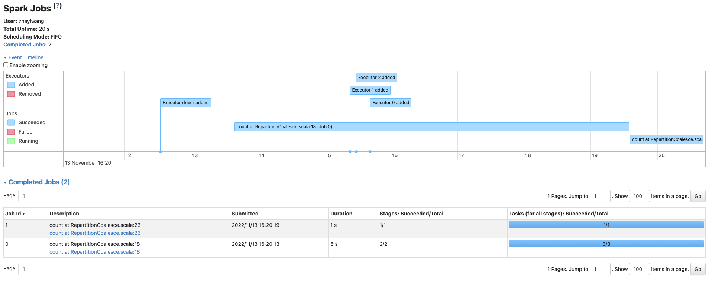
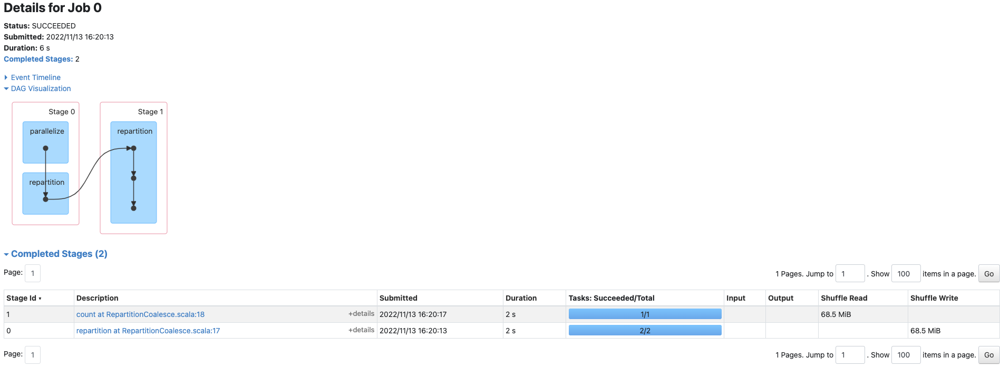
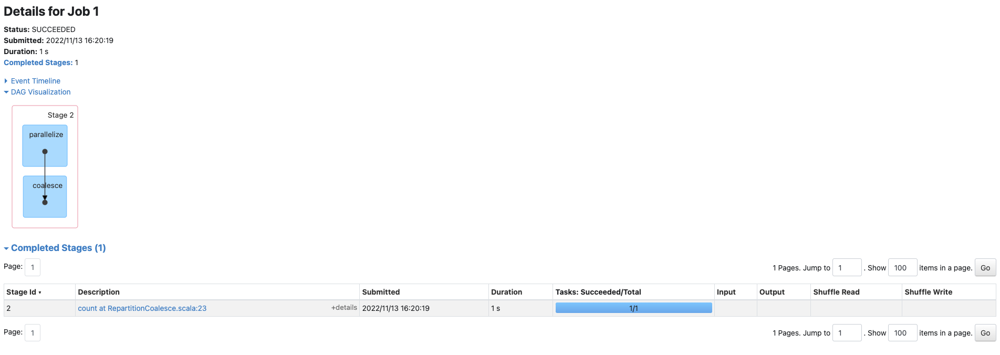

# Spark Repartition vs Coalesce

参考：https://www.youtube.com/watch?v=PpuII_EmiYM&list=PLmtsMNDRU0Bw6VnJ2iixEwxmOZNT7GDoC&index=5

## DAG 图对比

其中，6s的job是repartition, 1s的job是Coalesce

### Repartition

###  Coalesce

## 代码

	package com.wzy
	
	import org.apache.spark.sql.SparkSession
	
	object RepartitionCoalesce {
	
	  val spark =SparkSession.builder()
	    .appName("Repartion and coalesce")
	    .master("spark://192.168.2.113:7077")
	    .getOrCreate()
	
	  val sc = spark.sparkContext
	
	  val numbers = sc.parallelize( 1 to 10000000) //等于spark可用的partition数量
	
	  //repartition
	  val repartitonedNumbers = numbers.repartition(1)
	  repartitonedNumbers.count() // repartition incurs a shuffle
	
	
	  // coalesce
	  val coalescedNumbers = numbers.coalesce(1)
	  coalescedNumbers.count() // calesece has NO shuffle - "stitches" partitions together
	
	  //结论
	  //当增加 partition数量的时候， coalesce = repartition, 当减少的时候， coalesce快
	
	  def main(args: Array[String]): Unit = {
	    Thread.sleep(1000000)
	  }

}
