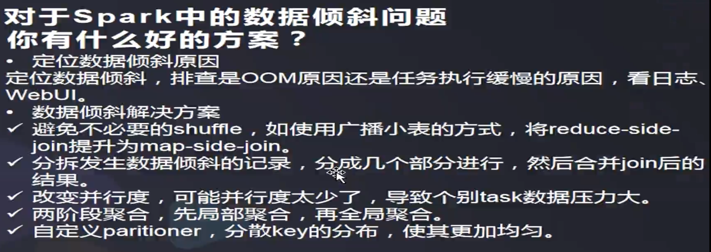

# Spark 数据倾斜问题

参考：http://itindex.net/detail/57899-spark-%E6%95%B0%E6%8D%AE-%E6%96%B9%E6%B3%95

##解决方案

### 使用Hive ETL预处理

* 场景：若Hive表中数据不均匀，且业务中会频繁用Spark对Hive表分析；
* 思路：用Hive对数据预处理（对key聚合等操作），原本是Spark对Hive的原表操作，现在就是对Hive预处理后的表操作；
* 原理：从根源解决了数据倾斜，规避了了Spark进行Shuffle类算子操作。但Hive ETL中进行聚合等操作会发生数据倾斜，只是把慢转移给了Hive ETL；
* 优点：方便，效果好，规避了Spark数据倾斜；
* 缺点：治标不治本，Hive ETL会数据倾斜

### 过滤导致倾斜的key

* 场景：发生倾斜的key很少且不重要；
* 思路：对发生倾斜的key过滤掉。比方在Spark SQL中用where子句或filter过滤，若每次作业执行，需要动态判定可使用sample算子对RDD采样后取数据量最多的key过滤；
* 原理：对倾斜的key过滤后，这些key便不会参与后面的计算，从本质上消除数据倾斜；
* 优点：简单，效果明显；
* 缺点：适用场景少，实际中导致倾斜的key很多。

### 提高Shuffle操作并行度

* 场景：任何场景都可以，优先选择的最简单方案；
* 思路：对RDD操作的Shuffle算子传入一个参数，也就是设置Shuffle算子执行时的Shuffle read task数量。对于Spark SQL的Shuffle类语句（如group by，join）即spark.sql.shuffle.partitions，代表shuffle read task的并行度，默认值是200可修改；
* 原理：增大shuffle read task参数值，让每个task处理比原来更少的数据；
* 优点：简单，有效；
* 缺点：缓解的效果很有限。

### 两阶段聚合（局部聚合+全局聚合）

* 场景：对RDD进行reduceByKey等聚合类shuffle算子，SparkSQL的groupBy做分组聚合这两种情况
* 思路：首先通过map给每个key打上n以内的随机数的前缀并进行局部聚合，即(hello, 1) (hello, 1) (hello, 1) (hello, 1)变为(1_hello, 1) (1_hello, 1) (2_hello, 1)，并进行reduceByKey的局部聚合，然后再次map将key的前缀随机数去掉再次进行全局聚合；
* 原理：对原本相同的key进行随机数附加，变成不同key，让原本一个task处理的数据分摊到多个task做局部聚合，规避单task数据过量。之后再去随机前缀进行全局聚合；
* 优点：效果非常好（对聚合类Shuffle操作的倾斜问题）；
* 缺点：范围窄（仅适用于聚合类的Shuffle操作，join类的Shuffle还需其它方案）。

### 将reduce join转为map join

* 场景：对RDD或Spark SQL使用join类操作或语句，且join操作的RDD或表比较小（百兆或1,2G）；
* 思路：使用broadcast和map类算子实现join的功能替代原本的join，彻底规避shuffle。对较小RDD直接collect到内存，并创建broadcast变量；并对另外一个RDD执行map类算子，在该算子的函数中，从broadcast变量（collect出的较小RDD）与当前RDD中的每条数据依次比对key，相同的key执行你需要方式的join；
* 原理：若RDD较小，可采用广播小的RDD，并对大的RDD进行map，来实现与join同样的效果。简而言之，用broadcast-map代替join，规避join带来的shuffle（无Shuffle无倾斜）；
* 优点：效果很好（对join操作导致的倾斜），根治；
* 缺点：适用场景小（大表+小表），广播（driver和executor节点都会驻留小表数据）小表也耗内存。

### repartition

这个也是较常用的方法，它的本质就是减少 task 处理的数据量，一般发生在 shuffle 之前，当然它本身也是个 shuffle 操作