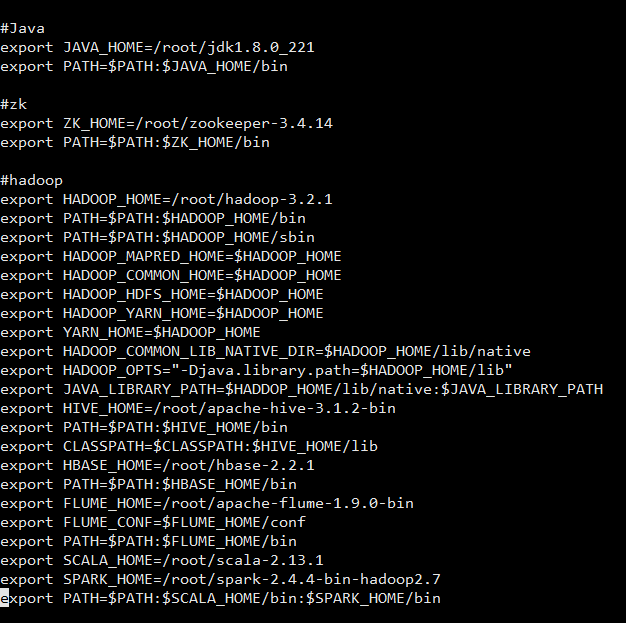
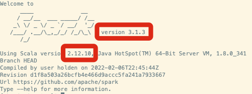

# Spark 环境搭建（单节点）

## 前提条件

需要搭建好Hadoop集群

## Spark搭建步骤

### 安装Spark 和 Scala

	tar -zxvf spark-2.4.4-bin-hadoop2.7.tgz
	tar -zxvf scala-2.13.1.tgz

### 配置环境变量

vi /etc/profile

	#插入
	export SCALA_HOME=/root/scala-2.13.1
	export SPARK_HOME=/root/spark-2.4.4-bin-hadoop2.7
	export PATH=$PATH:$SCALA_HOME/bin:$SPARK_HOME/bin

注意：Spark_home后面接sbin

 source /etc/profile

验证：

	pyspark --version
	scala -version

一定注意这两个版本要匹配，否则会出错

## 设置Spark变量

### 配置环境变量

	cp /root/spark-2.4.4-bin-hadoop2.7/conf/spark-env.sh.template /root/spark-2.4.4-bin-hadoop2.7/conf/spark-env.sh

	vi /root/spark-2.4.4-bin-hadoop2.7/conf/spark-env.sh

	#插入

	# 配置JAVA_HOME，一般来说，不配置也可以，但是可能会出现问题，还是配上吧
	export JAVA_HOME=/root/jdk1.8.0_221
	# 一般来说，spark任务有很大可能性需要去HDFS上读取文件，所以配置上
	# 如果说你的spark就读取本地文件，也不需要yarn管理，不用配
	export HADOOP_CONF_DIR=/root/hadoop-3.2.1/etc/hadoop
	# 设置Master的主机名
	export SPARK_MASTER_HOST=Master001
	# 提交Application的端口，默认就是这个，万一要改呢，改这里
	export SPARK_MASTER_PORT=7077
	# 每一个Worker最多可以使用的cpu core的个数，我虚拟机就一个...
	# 真实服务器如果有32个，你可以设置为32个
	export SPARK_WORKER_CORES=1
	# 每一个Worker最多可以使用的内存，我的虚拟机就2g
	# 真实服务器如果有128G，你可以设置为100G
	export SPARK_WORKER_MEMORY=1g
	#设置pid存储位置
	export SPARK_PID_DIR=/root/spark-2.4.4-bin-hadoop2.7/pids

### 新建文件夹

	mkdir /root/spark-2.4.4-bin-hadoop2.7/pids

### 配置工作节点

	cp /root/spark-2.4.4-bin-hadoop2.7/conf/slaves.template /root/spark-2.4.4-bin-hadoop2.7/conf/slaves

	vi /root/spark-2.4.4-bin-hadoop2.7/conf/slaves

	#插入
	Slave001
	Slave002
	Slave003

	#删除
	localhost

### 重命名启动和停止命令

	mv /root/spark-2.4.4-bin-hadoop2.7/sbin/start-all.sh /root/spark-2.4.4-bin-hadoop2.7/sbin/start-spark-all.sh

	mv /root/spark-2.4.4-bin-hadoop2.7/sbin/stop-all.sh /root/spark-2.4.4-bin-hadoop2.7/sbin/stop-spark-all.sh
	

## 配置各节点

### 复制文件到各节点

	#Master002
	scp -r /root/scala-2.13.1 root@Master002:/root
	scp -r /root/spark-2.4.4-bin-hadoop2.7 root@Master002:/root

	#Slave001
	scp -r /root/scala-2.13.1 root@Slave001:/root
	scp -r /root/spark-2.4.4-bin-hadoop2.7 root@Slave001:/root  

	#Slave002
	scp -r /root/scala-2.13.1 root@Slave002:/root
	scp -r /root/spark-2.4.4-bin-hadoop2.7 root@Slave002:/root     

	#Slave003
	scp -r /root/scala-2.13.1 root@Slave003:/root
	scp -r /root/spark-2.4.4-bin-hadoop2.7 root@Slave003:/root

### 修改各节点的 /etc/profile文件

	#插入
	export SCALA_HOME=/root/scala-2.13.1
	export SPARK_HOME=/root/spark-2.4.4-bin-hadoop2.7
	export PATH=$PATH:$SCALA_HOME/bin:$SPARK_HOME/sbin

 source /etc/profile

## 启动Spark集群

### 启动zookeeper集群

在Slave001, Slave002, Slave003中

### 启动Hadoop

	start-all.sh
	hdfs haadmin -transitionToActive --forcemanual  nn1
	hdfs dfsadmin -safemode leave
	hadoop fsck -delete /

### 启动Spark集群

	start-spark-all.sh

### 停止Spark集群

	stop-spark-all.sh

查看管理页面

	http://192.168.195.128:8080

	
## 错误排查

如果要通过spark查mysql数据库，则需要在spark/jars目录下下放对应的mysql-connector-java
