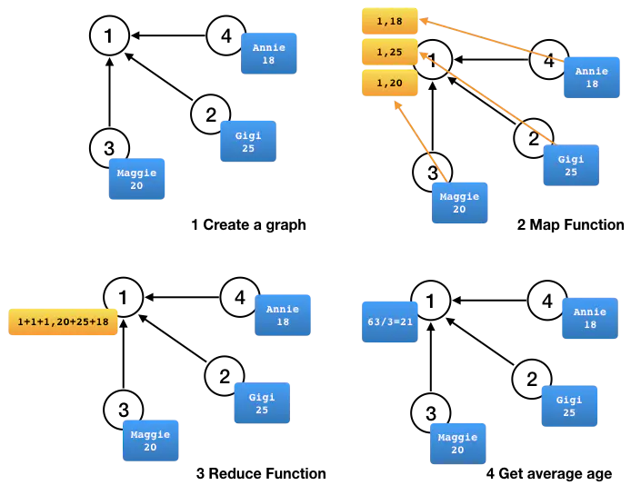

# GraphX aggregateMessages Demo

参考：https://www.jianshu.com/p/1a855073b6f5

## 算法过程

## 数据准备

### users.txt

	1,Andy,40
	2,Gigi,25
	3,Maggie,20
	4,Annie,18
	5,Amanda,24
	6,Matei,30
	7,Martin,35

### followers.txt

	2 1
	3 1
	4 1
	7 3
	6 2
	5 2
	
## Demo

	package com.wzy
	
	import org.apache.spark.graphx.{GraphLoader, VertexRDD}
	import org.apache.spark.sql.SparkSession
	
	object AggregateMessagesTest {
	  def main(args: Array[String]): Unit = {
	
	    val spark = SparkSession.builder()
	      .appName("spark dataset")
	      .master("spark://192.168.2.123:7077")
	      //本地测试运行需要加这一句话，部署在生产环境则删除
	      .config("spark.jars", "/Users/zheyiwang/IdeaProjects/SparkApps/target/SparkApps-1.0-SNAPSHOT-jar-with-dependencies.jar")
	      .getOrCreate()
	    val sc = spark.sparkContext
	    import spark.implicits._
	
	    val users = (sc.textFile("hdfs://192.168.2.121:9000/data/users.txt")
	      .map(line => line.split(","))
	      .map( row => (row(0).toLong, (row(1), row(2).toLong))))
	    val followerGraph = GraphLoader.edgeListFile(sc, "hdfs://192.168.2.121:9000/data/followers.txt")
	
	    println("------users---------")
	    users.collect().foreach(println(_))
	
	    println("------ followerGraph vertices --------")
	    followerGraph.vertices.collect().foreach(println(_))
	
	    // 添加用户属性
	    val graph = followerGraph.outerJoinVertices(users) {
	      (_, _, attr) => attr.get
	    }
	
	    println("------graph vertices-------")
	    graph.vertices.collect().foreach(println(_))
	
	    println("------graph edge-------")
	    graph.edges.collect().foreach(println(_))
	
	
	    // 计算粉丝的数量以及年龄和
	    val followers: VertexRDD[(Int, Long)] = graph.aggregateMessages[(Int, Long)](
	      triplet => { // Map Function
	        // 发送顶点数和年龄到被关注者
	        triplet.sendToDst((1, triplet.srcAttr._2))
	      },
	      // 累计粉丝数量和年龄
	      (a, b) => (a._1 + b._1, a._2 + b._2) // Reduce Function
	    )
	
	    // 计算平均年龄
	    val avgAgeOfFollowers: VertexRDD[Double] =
	      followers.mapValues( (id, value) => value match { case (count, totalAge) => totalAge / count } )
	    // 显示结果
	    avgAgeOfFollowers.collect.foreach(println(_))
	
	  }
	}

## 打印

	------users---------
	(1,(Andy,40))
	(2,(Gigi,25))
	(3,(Maggie,20))
	(4,(Annie,18))
	(5,(Amanda,24))
	(6,(Matei,30))
	(7,(Martin,35))
	
	------ followerGraph vertices --------
	(4,1)
	(6,1)
	(2,1)
	(1,1)
	(3,1)
	(7,1)
	(5,1)
	

	------graph vertices-------
	(4,(Annie,18))
	(6,(Matei,30))
	(2,(Gigi,25))
	(1,(Andy,40))
	(3,(Maggie,20))
	(7,(Martin,35))
	(5,(Amanda,24))
	
	------graph edge-------
	Edge(2,1,1)
	Edge(3,1,1)
	Edge(4,1,1)
	Edge(7,3,1)
	Edge(5,2,1)
	Edge(6,2,1)
	
	(2,27.0)
	(1,21.0)
	(3,35.0)