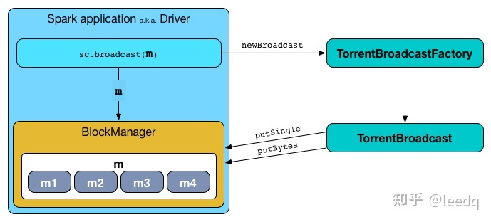

# Spark中广播变量（boardcast）的使用

参考：https://zhuanlan.zhihu.com/p/354811884

## 概念

在默认情况下，当Spark在集群的多个不同节点的多个任务上并行运行一个函数时，它会把函数中涉及到的每个变量，在每个任务上都生成一个副本。但是，有时候，需要在多个任务之间共享变量，或者在任务（Task）和任务控制节点（Driver Program）之间共享变量。为了满足这种需求，

Spark提供了两种类型的变量：
广播变量（broadcast variables）和累加器（accumulators）。

广播变量用来把变量在所有节点的内存之间进行共享。累加器则支持在所有不同节点之间进行累加计算（比如计数或者求和）。

## 为什么使用广播变量

默认情况下，task执行的算子中，使用了外部的变量，每个task都会获取一份变量的副本，有多少task就会有多少副本，并且都需要从driver端序列化发送到执行端。如果task太多，或者变量太大，都会造成网络IO和内存不必要的频繁读写，加上序列化和反序列化，会严重影响程序性能。

广播变量的好处，不是每个task一份变量副本，而是变成每个节点的executor才一份副本。这样的话，就可以让变量产生的副本大大减少。

广播变量，初始的时候，就在Drvier上有一份副本。task在运行的时候，想要使用广播变量中的数据，此时首先会在自己本地的Executor对应的
BlockManager中，尝试获取变量副本；如果本地没有，BlockManager，也许会从远程的Driver上面去获取变量副本；也有可能从距离比较近的其他
节点的Executor的BlockManager上去获取，并保存在本地的BlockManager中；BlockManager负责管理某个Executor对应的内存和磁盘上的数据，
此后这个executor上的task，都会直接使用本地的BlockManager中的副本。

## 如何使用

可以通过调用SparkContext.broadcast(v)来从一个普通变量v中创建一个广播变量。这个广播变量就是对普通变量v的一个包装器，通过调用value方法就可以获得这个广播变量的值，具体代码如下：

	scala> val broadcastVar = sc.broadcast(Array(1, 2, 3))
	broadcastVar: org.apache.spark.broadcast.Broadcast[Array[Int]] = Broadcast(0)
	scala> broadcastVar.value
	res0: Array[Int] = Array(1, 2, 3)

这个广播变量被创建以后，那么在集群中的任何函数中，都应该使用广播变量broadcastVar的值，而不是使用v的值，这样就不会把v重复分发到这些节点上。此外，一旦广播变量创建后，普通变量v的值就不能再发生修改，从而确保所有节点都获得这个广播变量的相同的值。

	//将mapRdd广播后返回broadcastValue
	val broadcastValue: Broadcast[Array[(String, String)]] = sc.broadcast(mapRdd)
	//获取广播变量的值
	val getBroadCastMap: Map[String, String] = broadcastValue.value.toMap
	
## 原理

初始的时候，在Driver端有一个副本数据。广播变量后，task运行的时候，在使用副本数据前，首先在所在本地Executor对应的BlockManager中，尝试获取副本数据；如果本地没有，即从Driver端拉取副本数据，并且保存在所在本地的BlockManager中；此后这个Executor上所有的task，都会直接使用本地BlockManager中的副本数据。另Executor的BlockManager除了从Driver端拉取数据，也可能从其他节点的BlockManager中拉去副本数据。

BlockManager：负责管理某个Executor对应的内存和磁盘的数据，尝试本地BlockManager中招map数据。

## Broadcast Join的条件

1、被广播的表需要小于spark.sql.autoBroadcastJoinThreshold所配置的值，默认是10M（或者加了broadcast join的hint）

2、基表不能被广播，比如 left outer join时，只能广播右表

