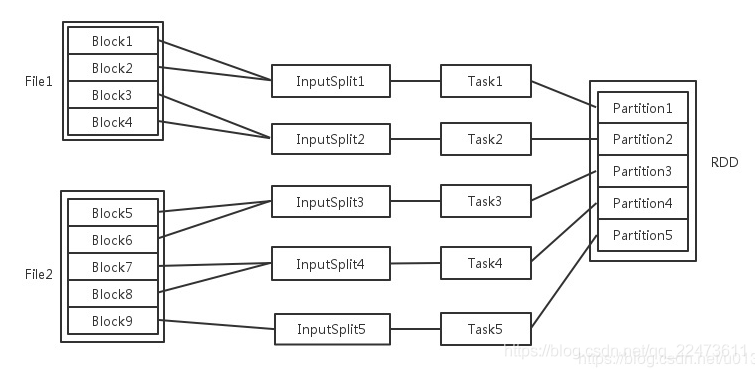

# Spark分区 partition

参考：https://blog.csdn.net/qq_22473611/article/details/107822168

## 概念

每一个过程的任务数，对应一个inputSplit1, Partition输入可能以多个文件的形式存储在HDFS上，，每个File都包含了很多块，（128M切分），称为Block。

当Spark读取这些文件作为输入时，会根据具体数据格式对应的InputFormat进行解析，一般是将若干个Block合并成一个输入分片，称为InputSplit，注意InputSplit不能跨越文件。

随后将为这些输入分片生成具体的Task。InputSplit与Task是一一对应的关系。

随后这些具体的Task每个都会被分配到集群上的某个节点的某个Executor去执行。

* 每个节点可以起一个或多个Executor。
* 每个Executor由若干core组成，每个Executor的每个core一次只能执行一个Task。
* 每个Task执行的结果就是生成了目标RDD的一个partiton。

注意： 这里的core是虚拟的core而不是机器的物理CPU核，可以理解为就是Executor的一个工作线程。Task被执行的并发度 = Executor数目 * 每个Executor核数（=core总个数）

## repartition适用场景

### 处理能力不够

RDD单个分区数据量比较大，或者单个分区处理比较慢，都可以通过repartition进行操作，这个时候numPartitions自然是要比当前的分区数要大一些。

单个分区数据量比较大，这种case在读取和处理hdfs文件的时候并不常见，因为默认spark读取hdfs文件的分区数和hdfs文件的block的数量是一致的。这个mr的mapper数量类似。但是对于Spark Streaming 任务，如果是window窗口较长，就比较容易出现单个分区数据量较大的情况。

 还有一种case，比如每个需要有外部的一些读写操作，这个时候大量数据在一个partition中，会因为外部存储、单机处理能力，网络等的性能瓶颈导致数据每个partition的数据处理变慢，举个例子，往redis里写数据，如果每个partition数据量特别大，如果使用的是redis的非批量的，基本每个数据需要一次数据请求，假设采用的是pipleline的形式，依然会因为数据量很大导致这个分区的写入很慢，从而导致任务执行时间较长。这种问题在Spark Streaming的任务中影响比较大。这个时候通过repartition增加分区数量效果也会很明显。

### 数据倾斜

数据倾斜，这个自然不不用说了，使用repartition可以将数据进行打散，避免倾斜导致的执行耗时不均匀的问题。

## Spark数据分区方式  