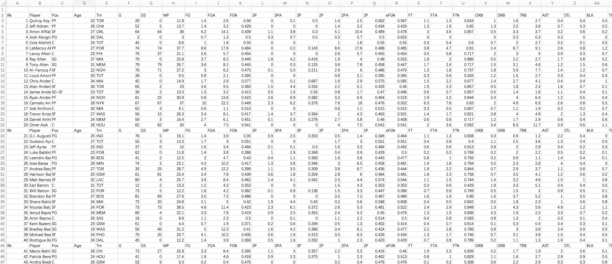

# 15.1 NBA大数据分析 - 准备数据

## 数据

NBABaskeball目录下：

数据Schema：

	Rk：每个文件中的行号
	Player：球员姓名
	Pos：球员位置
	Age：球员年龄
	Tm：所在球队(Team)
	G：出场次数(games)
	GS：首发次数(games started)
	MP：平均每场出场时间(minutes played)
	FG：命中次数(field goals)
	FGA：投篮出手次数(field goals attempt)
	FG%：投篮命中率(field goal percentage)
	3P：3分球命中次数(3-pointers)
	3PA：3分球出手次数(3-pointer attempt)
	3P%：3分球命中率(3-pointer percentage)
	2P：2分球命中次数
	2PA：2分球出手次数
	2P%：2分球命中率
	eFG%：有效投篮命中率(不包含罚篮)
	FT：罚球(free throw)命中次数
	FTA：罚球出手次数
	FT%：罚球命中率
	ORB：前场篮板(offensive rebound)次数
	DRB：后场篮板(deffensive rebound)次数
	TRB：篮板总数(total rebound)
	AST：助攻次数(assists)
	STL：抢断(steal)次数
	BLK：盖帽(block)次数
	TOV：失误(Turnover)次数
	PF：个人犯规(personal foul)次数
	PTS：总得分(points)
	

## 代码

	package com.wzy
	
	import org.apache.spark.sql.SparkSession
	
	object NBABasketball_Analysis {
	
	  def main(args: Array[String]): Unit = {
	    val spark = SparkSession.builder()
	      .appName("NBA Baseketball")
	      .master("spark://192.168.2.123:7077")
	      //本地测试运行需要加这一句话，部署在生产环境则删除
	      .config("spark.jars", "/Users/zheyiwang/IdeaProjects/SparkApps/target/SparkApps-1.0-SNAPSHOT-jar-with-dependencies.jar")
	      .getOrCreate()
	    val sc = spark.sparkContext
	    import spark.implicits._
	
	    val DATA_PATH = "hdfs://192.168.2.121:9000/data/NBABasketball"
	    val TMP_PATH = "hdfs://192.168.2.121:9000/data/basketball_tmp"
	
	    //读文件
	    for (i <- 1970 to 2016) {
	      val yearStats = sc.textFile(s"${DATA_PATH}/leagues_NBA_$i*").repartition(sc.defaultParallelism)
	      yearStats.filter(x => x.contains(",")) //过滤掉表头
	        .map(x => (i, x))
	        .saveAsTextFile(s"${TMP_PATH}/BasketballStatsWithYear/$i/")
	    }
	
	  }
	}

## 数据读写过程

### 读csv文件并按照partition写入HDFS中

	drwxr-xr-x   - zheyiwang supergroup          0 2023-02-12 16:03 /data/basketball_tmp/BasketballStatsWithYear/1970
	drwxr-xr-x   - zheyiwang supergroup          0 2023-02-12 16:03 /data/basketball_tmp/BasketballStatsWithYear/1971
	drwxr-xr-x   - zheyiwang supergroup          0 2023-02-12 16:03 /data/basketball_tmp/BasketballStatsWithYear/1972
	drwxr-xr-x   - zheyiwang supergroup          0 2023-02-12 16:03 /data/basketball_tmp/BasketballStatsWithYear/1973
	drwxr-xr-x   - zheyiwang supergroup          0 2023-02-12 16:03 /data/basketball_tmp/BasketballStatsWithYear/1974
	drwxr-xr-x   - zheyiwang supergroup          0 2023-02-12 16:03 /data/basketball_tmp/BasketballStatsWithYear/1975
	drwxr-xr-x   - zheyiwang supergroup          0 2023-02-12 16:03 /data/basketball_tmp/BasketballStatsWithYear/1976
	drwxr-xr-x   - zheyiwang supergroup          0 2023-02-12 16:03 /data/basketball_tmp/BasketballStatsWithYear/1977
	drwxr-xr-x   - zheyiwang supergroup          0 2023-02-12 16:03 /data/basketball_tmp/BasketballStatsWithYear/1978
	drwxr-xr-x   - zheyiwang supergroup          0 2023-02-12 16:03 /data/basketball_tmp/BasketballStatsWithYear/1979
	drwxr-xr-x   - zheyiwang supergroup          0 2023-02-12 16:03 /data/basketball_tmp/BasketballStatsWithYear/1980
	drwxr-xr-x   - zheyiwang supergroup          0 2023-02-12 16:03 /data/basketball_tmp/BasketballStatsWithYear/1981
	drwxr-xr-x   - zheyiwang supergroup          0 2023-02-12 16:03 /data/basketball_tmp/BasketballStatsWithYear/1982
	drwxr-xr-x   - zheyiwang supergroup          0 2023-02-12 16:03 /data/basketball_tmp/BasketballStatsWithYear/1983
	drwxr-xr-x   - zheyiwang supergroup          0 2023-02-12 16:03 /data/basketball_tmp/BasketballStatsWithYear/1984
	drwxr-xr-x   - zheyiwang supergroup          0 2023-02-12 16:03 /data/basketball_tmp/BasketballStatsWithYear/1985
	drwxr-xr-x   - zheyiwang supergroup          0 2023-02-12 16:03 /data/basketball_tmp/BasketballStatsWithYear/1986
	drwxr-xr-x   - zheyiwang supergroup          0 2023-02-12 16:03 /data/basketball_tmp/BasketballStatsWithYear/1987
	drwxr-xr-x   - zheyiwang supergroup          0 2023-02-12 16:03 /data/basketball_tmp/BasketballStatsWithYear/1988
	drwxr-xr-x   - zheyiwang supergroup          0 2023-02-12 16:03 /data/basketball_tmp/BasketballStatsWithYear/1989
	drwxr-xr-x   - zheyiwang supergroup          0 2023-02-12 16:04 /data/basketball_tmp/BasketballStatsWithYear/1990
	drwxr-xr-x   - zheyiwang supergroup          0 2023-02-12 16:04 /data/basketball_tmp/BasketballStatsWithYear/1991
	drwxr-xr-x   - zheyiwang supergroup          0 2023-02-12 16:04 /data/basketball_tmp/BasketballStatsWithYear/1992
	drwxr-xr-x   - zheyiwang supergroup          0 2023-02-12 16:04 /data/basketball_tmp/BasketballStatsWithYear/1993
	drwxr-xr-x   - zheyiwang supergroup          0 2023-02-12 16:04 /data/basketball_tmp/BasketballStatsWithYear/1994
	drwxr-xr-x   - zheyiwang supergroup          0 2023-02-12 16:04 /data/basketball_tmp/BasketballStatsWithYear/1995
	drwxr-xr-x   - zheyiwang supergroup          0 2023-02-12 16:04 /data/basketball_tmp/BasketballStatsWithYear/1996
	drwxr-xr-x   - zheyiwang supergroup          0 2023-02-12 16:04 /data/basketball_tmp/BasketballStatsWithYear/1997
	drwxr-xr-x   - zheyiwang supergroup          0 2023-02-12 16:04 /data/basketball_tmp/BasketballStatsWithYear/1998
	drwxr-xr-x   - zheyiwang supergroup          0 2023-02-12 16:04 /data/basketball_tmp/BasketballStatsWithYear/1999
	drwxr-xr-x   - zheyiwang supergroup          0 2023-02-12 16:04 /data/basketball_tmp/BasketballStatsWithYear/2000
	drwxr-xr-x   - zheyiwang supergroup          0 2023-02-12 16:04 /data/basketball_tmp/BasketballStatsWithYear/2001
	drwxr-xr-x   - zheyiwang supergroup          0 2023-02-12 16:04 /data/basketball_tmp/BasketballStatsWithYear/2002
	drwxr-xr-x   - zheyiwang supergroup          0 2023-02-12 16:04 /data/basketball_tmp/BasketballStatsWithYear/2003
	drwxr-xr-x   - zheyiwang supergroup          0 2023-02-12 16:04 /data/basketball_tmp/BasketballStatsWithYear/2004
	drwxr-xr-x   - zheyiwang supergroup          0 2023-02-12 16:04 /data/basketball_tmp/BasketballStatsWithYear/2005
	drwxr-xr-x   - zheyiwang supergroup          0 2023-02-12 16:04 /data/basketball_tmp/BasketballStatsWithYear/2006
	drwxr-xr-x   - zheyiwang supergroup          0 2023-02-12 16:04 /data/basketball_tmp/BasketballStatsWithYear/2007
	drwxr-xr-x   - zheyiwang supergroup          0 2023-02-12 16:04 /data/basketball_tmp/BasketballStatsWithYear/2008
	drwxr-xr-x   - zheyiwang supergroup          0 2023-02-12 16:04 /data/basketball_tmp/BasketballStatsWithYear/2009
	drwxr-xr-x   - zheyiwang supergroup          0 2023-02-12 16:04 /data/basketball_tmp/BasketballStatsWithYear/2010
	drwxr-xr-x   - zheyiwang supergroup          0 2023-02-12 16:04 /data/basketball_tmp/BasketballStatsWithYear/2011
	drwxr-xr-x   - zheyiwang supergroup          0 2023-02-12 16:04 /data/basketball_tmp/BasketballStatsWithYear/2012
	drwxr-xr-x   - zheyiwang supergroup          0 2023-02-12 16:04 /data/basketball_tmp/BasketballStatsWithYear/2013
	drwxr-xr-x   - zheyiwang supergroup          0 2023-02-12 16:04 /data/basketball_tmp/BasketballStatsWithYear/2014
	drwxr-xr-x   - zheyiwang supergroup          0 2023-02-12 16:04 /data/basketball_tmp/BasketballStatsWithYear/2015
	drwxr-xr-x   - zheyiwang supergroup          0 2023-02-12 16:04 /data/basketball_tmp/BasketballStatsWithYear/2016

以2016年数据为例：

	-rw-r--r--   3 zheyiwang supergroup          0 2023-02-12 16:04 /data/basketball_tmp/BasketballStatsWithYear/2016/_SUCCESS
	-rw-r--r--   3 zheyiwang supergroup      11095 2023-02-12 16:04 /data/basketball_tmp/BasketballStatsWithYear/2016/part-00000
	-rw-r--r--   3 zheyiwang supergroup      10950 2023-02-12 16:04 /data/basketball_tmp/BasketballStatsWithYear/2016/part-00001
	-rw-r--r--   3 zheyiwang supergroup      10985 2023-02-12 16:04 /data/basketball_tmp/BasketballStatsWithYear/2016/part-00002
	-rw-r--r--   3 zheyiwang supergroup      11107 2023-02-12 16:04 /data/basketball_tmp/BasketballStatsWithYear/2016/part-00003
	-rw-r--r--   3 zheyiwang supergroup      11013 2023-02-12 16:04 /data/basketball_tmp/BasketballStatsWithYear/2016/part-00004
	-rw-r--r--   3 zheyiwang supergroup      11015 2023-02-12 16:04 /data/basketball_tmp/BasketballStatsWithYear/2016/part-00005
	
内容包括：

	[zheyi@hudi1 ~]$ hdfs dfs -cat /data/basketball_tmp/BasketballStatsWithYear/2016/part-00000

	(2016,227,Chris Kaman,C,33,POR,6,2,9.8,1.5,3.8,.391,0.0,0.0,,1.5,3.8,.391,.391,0.0,0.0,,0.5,1.0,1.5,0.8,0.0,0.0,0.7,1.0,3.0)
	(2016,233,Sean Kilpatrick,SG,26,DEN,5,0,6.8,0.6,2.2,.273,0.6,2.2,.273,0.0,0.0,,.409,0.6,0.8,.750,0.2,0.2,0.4,0.2,0.4,0.0,0.2,0.6,2.4)
	(2016,239,Shane Larkin,PG,23,BRK,41,5,20.3,2.8,6.1,.448,0.6,1.5,.383,2.2,4.7,.469,.494,0.8,1.0,.775,0.2,1.9,2.1,3.7,1.3,0.2,1.6,1.6,6.8)
	(2016,244,David Lee,PF,32,BOS,30,4,15.7,2.9,6.4,.453,0.0,0.0,.000,2.9,6.4,.455,.453,1.3,1.7,.784,1.4,3.0,4.3,1.8,0.4,0.4,1.3,1.7,7.1)
	(2016,250,Jeremy Lin,PG,27,CHO,42,8,27.1,4.1,9.7,.429,1.0,3.1,.315,3.2,6.6,.482,.479,3.2,4.0,.799,0.6,2.6,3.2,3.1,0.7,0.6,1.9,2.4,12.5)
	(2016,256,Trey Lyles,PF,20,UTA,41,27,18.6,2.0,4.5,.435,0.5,1.0,.475,1.5,3.6,.425,.487,0.6,1.0,.610,1.0,3.2,4.2,0.8,0.3,0.3,0.8,1.5,5.0)
	(2016,261,Kendall Marshall,PG,24,PHI,12,5,14.3,1.5,4.4,.340,0.5,1.8,.286,1.0,2.7,.375,.396,0.3,0.5,.667,0.1,1.0,1.1,3.3,0.5,0.0,2.1,0.7,3.8)
	(2016,267,James Michael McAdoo,PF,23,GSW,25,0,5.9,0.9,1.6,.550,0.0,0.0,,0.9,1.6,.550,.550,0.5,1.1,.481,0.6,0.7,1.3,0.4,0.3,0.2,0.4,0.7,2.3)
	(2016,273,Mitch McGary,PF,23,OKC,13,0,4.2,0.5,1.1,.429,0.0,0.2,.000,0.5,0.8,.545,.429,0.3,0.6,.500,0.3,0.7,1.0,0.2,0.0,0.2,0.5,0.6,1.2)
	(2016,279,Jordan Mickey,PF,21,BOS,3,0,2.0,0.7,1.0,.667,0.0,0.0,,0.7,1.0,.667,.667,1.0,1.0,1.000,0.7,0.3,1.0,0.3,0.0,0.3,0.0,0.3,2.3)
	(2016,284,Patrick Mills,PG,27,SAS,44,2,20.3,3.0,7.0,.434,1.4,3.6,.380,1.7,3.4,.490,.531,0.4,0.5,.800,0.3,1.5,1.8,2.4,0.9,0.1,0.8,1.1,7.8)
	(2016,290,E'Twaun Moore,SG,26,CHI,32,0,15.2,2.0,4.2,.489,0.4,1.0,.406,1.6,3.2,.515,.538,0.3,0.6,.579,0.2,1.4,1.6,0.8,0.5,0.1,0.6,1.2,4.8)
	(2016,296,Timofey Mozgov,C,29,CLE,39,30,17.9,2.6,5.1,.510,0.0,0.2,.143,2.6,4.9,.524,.513,1.1,1.4,.764,1.5,2.8,4.3,0.4,0.4,0.8,1.0,2.1,6.3)
	(2016,301,Shabazz Napier,PG,24,ORL,36,0,12.1,1.4,4.0,.340,0.6,1.9,.313,0.8,2.1,.364,.413,0.8,1.0,.806,0.2,0.8,1.0,2.0,0.5,0.0,1.0,0.8,4.1)
	(2016,307,Nerlens Noel,PF,21,PHI,39,35,29.3,4.3,8.4,.514,0.0,0.0,,4.3,8.4,.514,.514,1.8,3.2,.561,2.2,6.1,8.3,1.3,1.5,1.5,2.4,2.4,10.4)
	(2016,313,Johnny O'Bryant,PF,22,MIL,42,3,14.7,1.5,3.5,.432,0.0,0.0,1.000,1.5,3.5,.428,.435,0.5,0.8,.667,1.1,1.9,3.0,0.6,0.4,0.1,0.6,1.8,3.5)
	(2016,319,Zaza Pachulia,C,31,DAL,43,43,29.2,3.5,7.3,.479,0.0,0.0,.000,3.5,7.2,.482,.479,3.4,4.3,.793,3.7,7.0,10.7,1.9,1.0,0.4,1.9,2.7,10.4)
	(2016,324,Lamar Patterson,SG,24,ATL,29,0,12.8,0.9,2.4,.366,0.4,1.5,.256,0.5,1.0,.536,.444,0.5,0.7,.700,0.1,1.6,1.7,1.3,0.2,0.1,0.7,1.5,2.7)
	(2016,330,Nikola Pekovic,C,30,MIN,8,2,14.4,2.1,4.6,.459,0.0,0.0,,2.1,4.6,.459,.459,1.9,2.3,.833,0.6,1.1,1.8,0.9,0.0,0.0,0.9,2.3,6.1)
	(2016,336,Otto Porter,SF,22,WAS,34,32,32.1,4.9,10.6,.458,1.2,3.8,.313,3.7,6.8,.539,.514,1.6,2.0,.783,1.4,4.2,5.6,2.1,1.6,0.4,1.2,2.4,12.5)
	(2016,341,Phil Pressey,PG,24,PHI,14,0,12.1,1.5,3.9,.382,0.3,0.9,.308,1.2,3.0,.405,.418,0.6,1.3,.500,0.0,1.6,1.6,3.3,0.8,0.1,1.4,1.0,3.9)
	(2016,347,J.J. Redick,SG,31,LAC,40,40,27.7,5.5,11.2,.490,2.7,5.5,.493,2.8,5.7,.487,.611,2.8,3.1,.880,0.1,1.6,1.7,1.6,0.5,0.1,1.0,1.7,16.4)
	(2016,353,Nate Robinson,PG,31,NOP,2,1,11.5,0.0,0.5,.000,0.0,0.5,.000,0.0,0.0,,.000,0.0,0.0,,0.0,0.0,0.0,2.0,0.5,0.0,0.0,2.5,0.0)
	(2016,359,Terry Rozier,PG,21,BOS,17,0,6.0,0.7,2.8,.250,0.1,0.7,.167,0.6,2.1,.278,.271,0.2,0.2,1.000,0.4,0.6,1.0,0.5,0.0,0.0,0.5,0.6,1.7)	