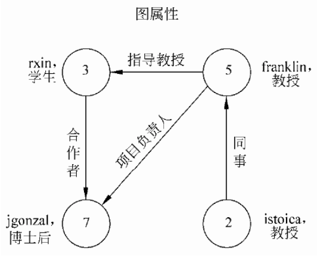

# 18.1 SparkX婚恋社交网络多维度分析-基础概念demo

## 代码

	package com.wzy
	
	import org.apache.spark.graphx._
	import org.apache.spark.rdd.RDD
	import org.apache.spark.sql.SparkSession
	
	object Graphx_VerticesEdgesTripletsDemo {
	
	  def main(args: Array[String]): Unit = {
	
	    val spark = SparkSession.builder()
	      .appName("spark dataset")
	      .master("spark://192.168.2.123:7077")
	      //本地测试运行需要加这一句话，部署在生产环境则删除
	      .config("spark.jars", "/Users/zheyiwang/IdeaProjects/SparkApps/target/SparkApps-1.0-SNAPSHOT-jar-with-dependencies.jar")
	      .getOrCreate()
	    val sc = spark.sparkContext
	    import spark.implicits._
	
	    // 创建顶点的RDD
	    val users = sc.parallelize(Array((3L, ("rxin", "student")), (7L, ("jgonzal", "postdoc")),
	      (5L, ("franklin", "prof")), (2L, ("istoica", "prof"))))   // （id, (name, pos)）
	
	    // 创建边的RDD
	    val relationships: RDD[Edge[String]] =
	      sc.parallelize(Array(Edge(3L, 7L, "collab"), Edge(5L, 3L, "advisor"),
	        Edge(2L, 5L, "colleague"), Edge(5L, 7L, "pi"))) //  （源id，目的id，属性）
	
	    // 定义案例中顶点的默认使用者，在缺失使用者的情况，图可以建立关联
	    val defaultUser = ("John Doe", "Missing")
	
	    // 初始化图
	    val graph: Graph[(String, String), String] = Graph(users, relationships, defaultUser)
	
	    // 统计图中职业是博士后的节点
	    val filteredVertices: VertexId = graph.vertices.filter { case (id, (name, pos)) => pos == "postdoc" }.count
	    println("图中职业是博士后的节点数量计数为：    " + filteredVertices)
	
	    // 统计图中边的源ID大于目的ID
	    val filteredSrcDstId: VertexId = graph.edges.filter(e => e.srcId > e.dstId).count
	    System.out.println("图中边的源ID大于目的ID的数量是：    " + filteredSrcDstId)
	
	    val resTriplets: RDD[EdgeTriplet[(String, String), String]] = graph.triplets
	    for (elem <- resTriplets.collect()) {
	      println("三元组：    " + elem)
	    }
	
	    for (elem <- graph.vertices.collect()) {
	      println("graph.vertices：    " + elem)
	    }
	
	    for (elem <- graph.edges.collect()) {
	      println("graph.edges：    " + elem)
	    }
	
	    //数据存放的目录；
	    var dataPath = "hdfs://192.168.2.121:9000/data/"
	
	    val graphFromFile: Graph[PartitionID, PartitionID] = GraphLoader.edgeListFile(sc, dataPath + "web-Google.txt")
	    for (elem <- graphFromFile.vertices.collect()) {
	      println("graphFromFile.vertices：    " + elem)
	    }
	
	
	  }
	
	}

## 打印

	图中职业是博士后的节点数量计数为：    1
	
	图中边的源ID大于目的ID的数量是：    1

	三元组：    ((3,(rxin,student)),(7,(jgonzal,postdoc)),collab)
	三元组：    ((5,(franklin,prof)),(3,(rxin,student)),advisor)
	三元组：    ((2,(istoica,prof)),(5,(franklin,prof)),colleague)
	三元组：    ((5,(franklin,prof)),(7,(jgonzal,postdoc)),pi)

	graph.vertices：    (2,(istoica,prof))
	graph.vertices：    (3,(rxin,student))
	graph.vertices：    (7,(jgonzal,postdoc))
	graph.vertices：    (5,(franklin,prof))
	
	graph.edges：    Edge(3,7,collab)
	graph.edges：    Edge(5,3,advisor)
	graph.edges：    Edge(2,5,colleague)
	graph.edges：    Edge(5,7,pi)

	graphFromFile.vertices：    (116943,1)
	graphFromFile.vertices：    (656403,1)
	graphFromFile.vertices：    (411653,1)
	graphFromFile.vertices：    (230645,1)
	graphFromFile.vertices：    (261419,1)
	graphFromFile.vertices：    (889175,1)
	graphFromFile.vertices：    (272041,1)
	graphFromFile.vertices：    (15393,1)
	graphFromFile.vertices：    (568833,1)
	graphFromFile.vertices：    (702613,1)
	......

