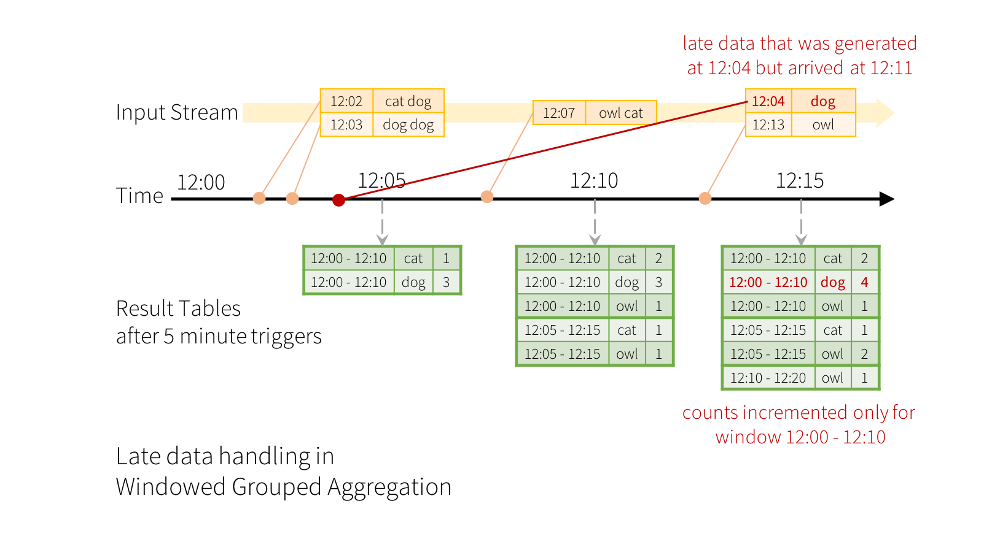

# 2.4.1 Spark Streaming

## word count demo

### 开启监听

	nc -lk 9999
	
输入word

### 代码 
	
	package com.wzy
	
	import org.apache.spark.sql.{SparkSession}
	
	object RDD_Movie_Users_Analyzer {
	
	  def main(args: Array[String]): Unit = {
	
	    val spark = SparkSession.builder()
	      .appName("spark streaming demo")
	      .master("spark://192.168.2.123:7077")
	      //本地测试运行需要加这一句话，部署在生产环境则删除
	      //.config("spark.jars", "/Users/zheyiwang/IdeaProjects/spark_study/target/spark_study-1.0-SNAPSHOT-jar-with-dependencies.jar")
	      .getOrCreate()
	
	    import spark.implicits._
	
	    val lines = spark.readStream.format("socket").option("host","192.168.2.123").option("port","9999").load()
	    val words = lines.as[String].flatMap(_.split(" "))
	    val wordcount = words.groupBy("value").count()
	    val query = wordcount.writeStream.outputMode("complete").format("console").start()
	
	    query.awaitTermination()
	
	  }
	
	}

打包以后传到服务器
	
### 提交命令	
	
	sh spark-submit  --class com.wzy.RDD_Movie_Users_Analyzer --master spark://192.168.2.123:7077 /home/zheyi/spark_study-1.0-SNAPSHOT-jar-with-dependencies.jar
	

### 输入

	hello spark
	apache spark
	
### 输出
	
	+------+-----+
	| value|count|
	+------+-----+
	| hello|    1|
	|apache|    1|
	| spark|    2|
	+------+-----+

## 窗口函数的应用

参考：https://blog.csdn.net/weixin_45316851/article/details/106633768

### Window Operations on Event Time

在stream中的每行包含了生成的时间。10分钟的窗口内计数单词，每5分钟更新一次。计数counts将会被group key（ie：the word）和window（根据event-time计算）索引

#### 代码

	package com.wzy
	
	import org.apache.spark.sql.SparkSession
	import org.apache.spark.sql.functions.window
	
	object RDD_Movie_Users_Analyzer {
	
	  def main(args: Array[String]): Unit = {
	
	    val spark = SparkSession.builder()
	      .appName("spark streaming demo")
	      .master("spark://192.168.2.123:7077")
	      //本地测试运行需要加这一句话，部署在生产环境则删除
	      //.config("spark.jars", "/Users/zheyiwang/IdeaProjects/spark_study/target/spark_study-1.0-SNAPSHOT-jar-with-dependencies.jar")
	      .getOrCreate()
	
	    import spark.implicits._
	
	    val lines = spark.readStream.format("socket").option("host","192.168.2.123").option("port","9999").load()
	    val words = lines.as[String].flatMap(_.split(" "))
	
	    println("10分钟的窗口内计数单词，每5分钟更新一次:")
	    val windowedCounts = words
	      .groupBy(
	        //10分钟为窗口大小，5分钟滑动一次
	        window($"timestamp", "10 minutes", "5 minutes"),
	        $"word")
	      .count()
	
	    val query = windowedCounts.writeStream.outputMode("complete").format("console").start()
	
	    query.awaitTermination()
	
	  }
	
	}

### Handling Late Data and Watermarking

假设12:04（即event-time）生成的一个word可以在12:11被应用程序接收。应用程序应该使用时间12:04而不是12:11更新窗口的较旧计数，即12:00 - 12:10。这在我们基于窗口的分组中很自然有可能发生- Structured Streaming可以长时间维持部分聚合的中间状态，以便延迟的数据可以正确地更新旧窗口的聚合

但是，为了长久的运行这个查询，必须限制内存中间状态的数量。这就意味着，系统需要知道什么时候能够从内存中删除旧的聚合，此时默认应用接受延迟的数据之后不再进行聚合。Spark2.1中引入了watermarking（水位线），它能够让engine自动跟踪当前的数据中的event time并据此删除旧的状态表。你可以通过指定event-time列和时间阀值来指定一个查询的watermark，阀值以内的数据才会被处理。对于一个特定的开始于时间T的window窗口，引擎engine将会保持状态并且允许延迟的数据更新状态直到（max event time seen by the engine - late threshold > T）。换句话说，阀值内的数据将被聚合，阀值外的数据将会被丢弃

下图表示收到的数据最大的envent-time，实线是水印（计算方法是运算截止到触发点时收到的数据的最大event-time减去late threshold，也就是10）。

代码：

	package com.wzy
	
	import org.apache.spark.sql.SparkSession
	import org.apache.spark.sql.functions.window
	
	object RDD_Movie_Users_Analyzer {
	
	  def main(args: Array[String]): Unit = {
	
	    val spark = SparkSession.builder()
	      .appName("spark streaming demo")
	      .master("spark://192.168.2.123:7077")
	      //本地测试运行需要加这一句话，部署在生产环境则删除
	      //.config("spark.jars", "/Users/zheyiwang/IdeaProjects/spark_study/target/spark_study-1.0-SNAPSHOT-jar-with-dependencies.jar")
	      .getOrCreate()
	
	    import spark.implicits._
	
	    val lines = spark.readStream.format("socket").option("host","192.168.2.123").option("port","9999").load()
	    val words = lines.as[String].flatMap(_.split(" "))
	
	    println("10分钟的窗口内计数单词，每5分钟更新一次:")
	    val windowedCounts = words
	      .withWatermark("timestamp", "10 minutes")
	      .groupBy(
	        //10分钟为窗口大小，5分钟滑动一次
	        window($"timestamp", "10 minutes", "5 minutes"),
	        $"word")
	      .count()
	
	    val query = windowedCounts.writeStream.outputMode("complete").format("console").start()
	
	    query.awaitTermination()
	
	  }
	}

## 4种输出数据的处理方式

* writeStream.format("parquest").start()
* writeStream.format("console").start()
* writeStream.format("memory").queryName("table").start()
* writeStream.foreach(....).start()
