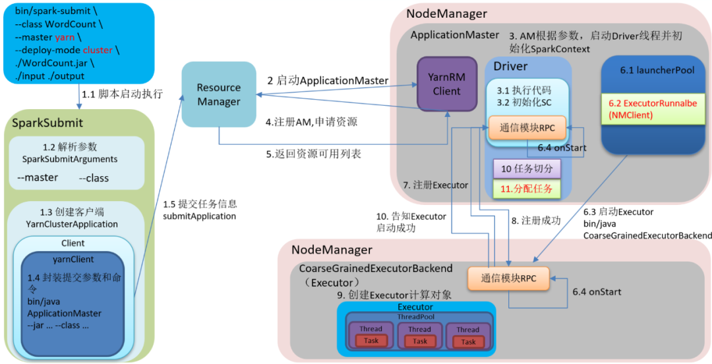

# Spark的架构与作业提交流程

## 概述
1. Driver端启动SparkSubmit进程，启动后开始向Master进行通信，此时创建了一个对象（SparkContext），接着向Master发送任务消息
1. Master接收到任务信息后，开始资源调度，此时会和所有的Worker进行通信，找到空闲的Worker，并通知Worker来拿取任务和启动相应的Executor
1. Executor启动后，开始与Driver进行反向注册，接下来Driver开始把任务发送给相应的Executor，Executor开始计算任务

## 详细流程

1. 调用SparkSubmit类，内部执行submit --> doRunMain -> 通过反射获取应用程序的主类对象 --> 执行主类的main方法。
1. 构建SparkConf和SparkContext对象，在SparkContext入口做了三件事，创建了SparkEnv对象（创建了ActorSystem对象），TaskScheduler（用来生成并发送task给Executor），DAGScheduler（用来划分Stage）。
1. ClientActor将任务信息封装到ApplicationDescription对象里并且提交给Master。
1. Master收到ClientActor提交的任务信息后，把任务信息存在内存中，然后又将任务信息放到队列中。
1. 当开始执行这个任务信息的时候，调用scheduler方法，进行资源的调度。
1. 将调度好的资源封装到LaunchExecutor并发送给对应的Worker。
1. Worker接收到Master发送过来的调度信息（LaunchExecutor）后，将信息封装成一个ExecutorRunner对象。
1. 封装成ExecutorRunner后，调用ExecutorRunner的start方法，开始启动 CoarseGrainedExecutorBackend对象。
1. Executor启动后向DriverActor进行反向注册。
1. 与DriverActor注册成功后，创建一个线程池（ThreadPool），用来执行任务。
1. 当所有的Executor注册完成后，意味着作业环境准备好了，Driver端会结束与SparkContext对象的初始化。
1. 当Driver初始化完成后（创建了sc实例），会继续执行我们提交的App的代码，当触发了Action的RDD算子时，就触发了一个job，这时就会调用DAGScheduler对象进行Stage划分。
1. DAGScheduler开始进行Stage划分。
1. 将划分好的Stage按照区域生成一个一个的task，并且封装到TaskSet对象，然后TaskSet提交到TaskScheduler。
1. TaskScheduler接收到提交过来的TaskSet，拿到一个序列化器，对TaskSet序列化，将序列化好的TaskSet封装到LaunchExecutor并提交到DriverActor。
1. 把LaunchExecutor发送到Executor上。
1. Executor接收到DriverActor发送过来的任务（LaunchExecutor），会将其封装成TaskRunner，然后从线程池中获取线程来执行TaskRunner。
1. TaskRunner拿到反序列化器，反序列化TaskSet，然后执行App代码，也就是对RDD分区上执行的算子和自定义函数。