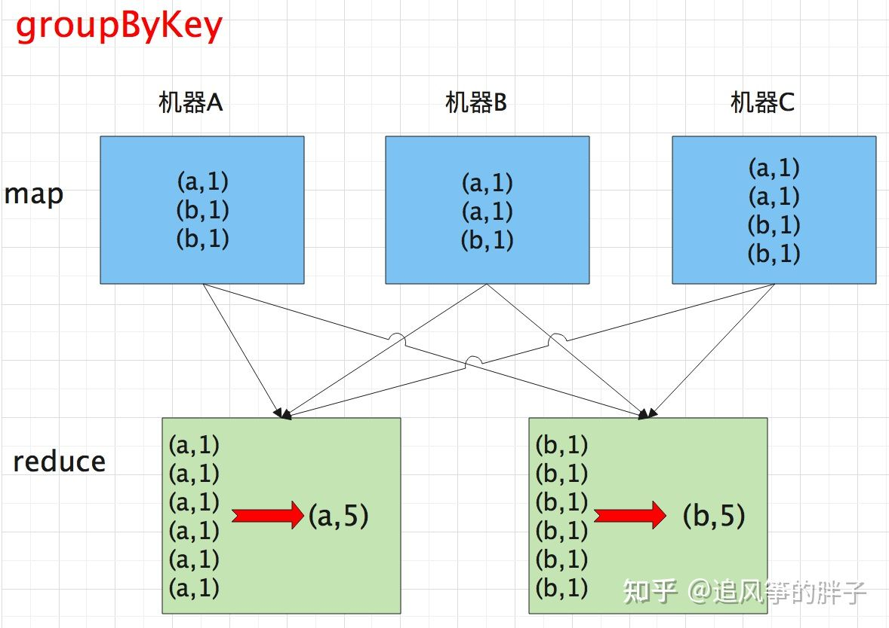
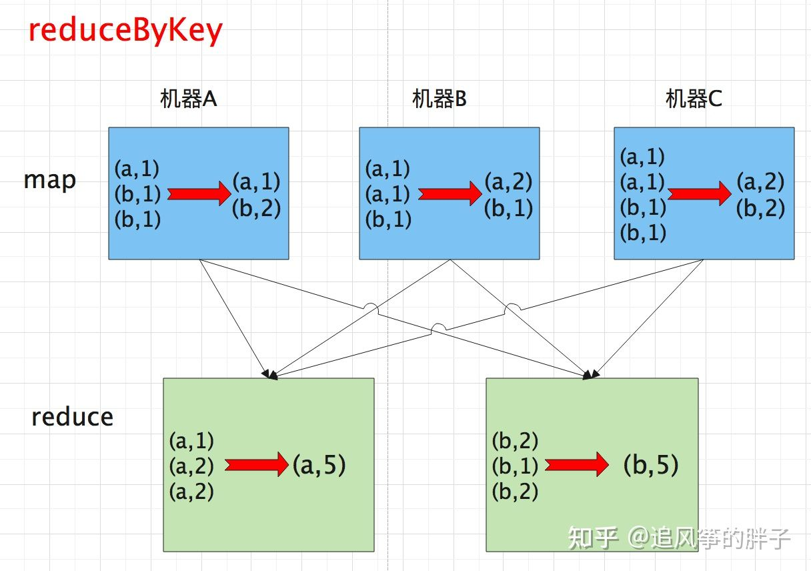

# groupByKey和reduceByKey的区别

## 原理层面的区别

reduceByKey 会在map端的默认开启combine进行本地聚合，groupByKey 不会在map端进行combine。

在map端先进行一次聚合，很极大的减小reduce端的压力，一般来说，map的机器数量是远大于reduce的机器数量的。通过map聚合的方式可以把计算压力平均到各台机器，最终在reduce端只需要汇总map端聚合完成的数据即可，极大的提高效率。

