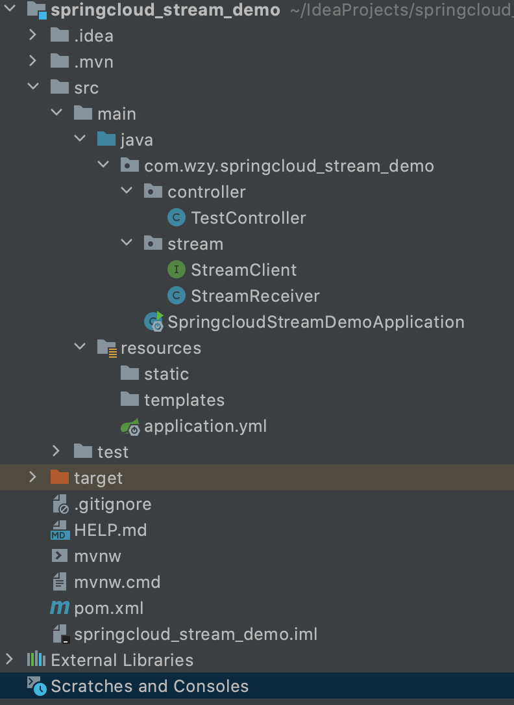
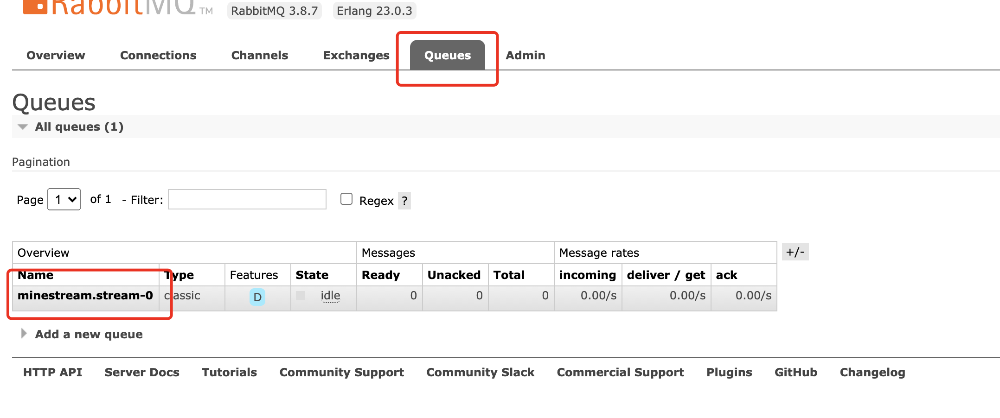
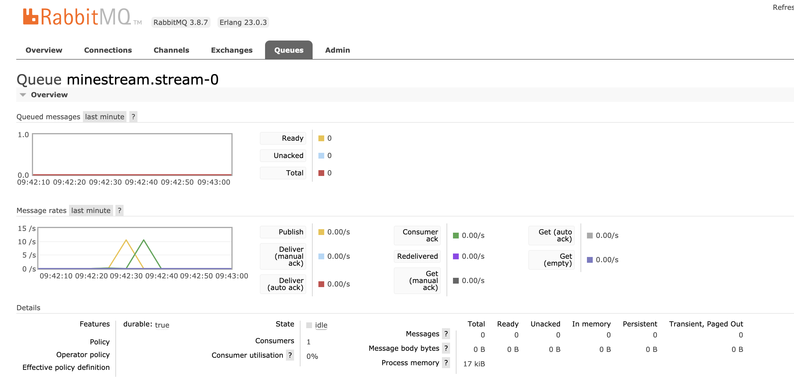

# Spring cloud stream Demo
参考：https://blog.csdn.net/hubo_88/article/details/80904165

## 搭建步骤

### 引入依赖

	<?xml version="1.0" encoding="UTF-8"?>
	<project xmlns="http://maven.apache.org/POM/4.0.0" xmlns:xsi="http://www.w3.org/2001/XMLSchema-instance"
	         xsi:schemaLocation="http://maven.apache.org/POM/4.0.0 https://maven.apache.org/xsd/maven-4.0.0.xsd">
	    <modelVersion>4.0.0</modelVersion>
	    <parent>
	        <groupId>org.springframework.boot</groupId>
	        <artifactId>spring-boot-starter-parent</artifactId>
	        <version>2.3.3.RELEASE</version>
	        <relativePath/> <!-- lookup parent from repository -->
	    </parent>
	    <groupId>com.wzy</groupId>
	    <artifactId>springcloud_stream_demo</artifactId>
	    <version>0.0.1-SNAPSHOT</version>
	    <name>springcloud_stream_demo</name>
	    <description>Demo project for Spring Boot</description>
	
	    <properties>
	        <java.version>1.8</java.version>
	    </properties>
	
	    <dependencies>
	        <dependency>
	            <groupId>org.springframework.cloud</groupId>
	            <artifactId>spring-cloud-starter-stream-rabbit</artifactId>
	            <version>3.0.8.RELEASE</version>
	        </dependency>
	        <dependency>
	            <groupId>org.springframework.boot</groupId>
	            <artifactId>spring-boot-starter-web</artifactId>
	        </dependency>
	
	        <dependency>
	            <groupId>org.springframework.boot</groupId>
	            <artifactId>spring-boot-starter-test</artifactId>
	            <scope>test</scope>
	            <exclusions>
	                <exclusion>
	                    <groupId>org.junit.vintage</groupId>
	                    <artifactId>junit-vintage-engine</artifactId>
	                </exclusion>
	            </exclusions>
	        </dependency>
	        <dependency>
	            <groupId>org.springframework.amqp</groupId>
	            <artifactId>spring-rabbit-test</artifactId>
	            <scope>test</scope>
	        </dependency>
	    </dependencies>
	
	    <build>
	        <plugins>
	            <plugin>
	                <groupId>org.springframework.boot</groupId>
	                <artifactId>spring-boot-maven-plugin</artifactId>
	            </plugin>
	        </plugins>
	    </build>
	
	</project>

### 配置文件

	server:
	  port: 9898
	spring:
	  application:
	    name: spring-cloud-stream
	  rabbitmq:
	    host: 127.0.0.1
	    port: 5672
	    username: guest
	    password: guest
	  cloud:
	    stream:
	      bindings:
	        myInput:
	          #指定输入通道对应的主题名
	          destination: minestream
	          #指定该应用实例属于 stream 消费组
	          group: stream
	          contentType: application/json
	          consumer:
	            #通过该参数开启消费者分区功能
	            partitioned: true
	        myOutput:
	          #指定输出通道对应的主题名
	          destination: minestream
	          producer:
	            #通过该参数指定了分区键的表达式规则，可以根据实际的输出消息规则配置 SpEL 来生成合适的分区键
	            partitionKeyExpression: payload
	            partitionCount: 2
	      #该参数指定了当前消费者的总实例数量
	      instance-count: 2
	      #该参数设置了当前实例的索引号，从 0 开始，最大值为 spring.cloud.stream.instance-count 参数 - 1
	      instance-index: 0
	      
### 创建消息通道绑定的接口 StreamClient

	package com.wzy.springcloud_stream_demo.stream;
	
	import org.springframework.cloud.stream.annotation.Input;
	import org.springframework.cloud.stream.annotation.Output;
	import org.springframework.messaging.MessageChannel;
	import org.springframework.messaging.SubscribableChannel;
	
	public interface StreamClient {
	
	    String INPUT = "myInput";
	    String OUTPUT = "myOutput";
	
	    @Input(StreamClient.INPUT)
	    SubscribableChannel input();
	
	    @Output(StreamClient.OUTPUT)
	    MessageChannel output();
	}	      
	
创建 StreamClient 接口，通过 @Input和 @Output注解定义输入通道和输出通道，另外，@Input 和 @Output 注解都还有一个 value 属性，该属性可以用来设置消息通道的名称，这里指定的消息通道名称分别是 myInput 和 myOutput。如果直接使用两个注解而没有指定具体的 value 值，则会默认使用方法名作为消息通道的名称。

当定义输出通道的时候，需要返回 MessageChannel 接口对象，该接口定义了向消息通道发送消息的方法；定义输入通道时，需要返回 SubscribableChannel 接口对象，该接口集成自 MessageChannel 接口，它定义了维护消息通道订阅者的方法。

在完成了消息通道绑定的定义后，这些用于定义绑定消息通道的接口则可以被 @EnableBinding 注解的 value 参数指定，从而在应用启动的时候实现对定义消息通道的绑定，Spring Cloud Stream 会为其创建具体的实例，而开发者只需要通过注入的方式来获取这些实例并直接使用即可。下面就来创建用于接收来自 RabbitMQ 消息的消费者 StreamReceiver

### 创建消费者 StreamReceiver

	package com.wzy.springcloud_stream_demo.stream;
	
	import org.slf4j.Logger;
	import org.slf4j.LoggerFactory;
	import org.springframework.cloud.stream.annotation.EnableBinding;
	import org.springframework.cloud.stream.annotation.StreamListener;
	import org.springframework.stereotype.Component;
	
	@Component
	@EnableBinding(value = {StreamClient.class})
	public class StreamReceiver {
	
	    private Logger logger = LoggerFactory.getLogger(StreamReceiver.class);
	
	    @StreamListener(StreamClient.INPUT)
	    public void receive(String message) {
	        //从MQ中读取消息
	        logger.info("StreamReceiver: {}", message);
	    }
	}

@EnableBinding 注解用来指定一个或多个定义了 @Input 或 @Output 注解的接口，以此实现对消息通道（Channel）的绑定。上面我们通过 @EnableBinding(value = {StreamClient.class}) 绑定了 StreamClient 接口，该接口是我们自己实现的对输入输出消息通道绑定的定义

@StreamListener，主要定义在方法上，作用是将被修饰的方法注册为消息中间件上数据流的事件监听器，注解中的属性值对应了监听的消息通道名。上面我们将 receive 方法注册为 myInput 消息通道的监听处理器，当我们往这个消息通道发送信息的时候，receiver 方法会执行。

### 启动类

	package com.wzy.springcloud_stream_demo;
	
	
	import org.springframework.boot.SpringApplication;
	import org.springframework.boot.autoconfigure.SpringBootApplication;
	
	@SpringBootApplication
	public class SpringcloudStreamDemoApplication {
	
	    public static void main(String[] args) {
	        SpringApplication.run(SpringcloudStreamDemoApplication.class, args);
	    }
	    
	}
	
### TestController

	package com.wzy.springcloud_stream_demo.controller;
	
	import com.wzy.springcloud_stream_demo.stream.StreamClient;
	import org.springframework.beans.factory.annotation.Autowired;
	import org.springframework.messaging.support.MessageBuilder;
	import org.springframework.web.bind.annotation.GetMapping;
	import org.springframework.web.bind.annotation.RestController;
	
	@RestController
	public class TestController {
	
	    @Autowired
	    private StreamClient streamClient;
	
	    @GetMapping("send")
	    public void send() {
	        //往MQ中写消息
	        streamClient.output().send(MessageBuilder.withPayload("Hello World...").build());
	    }
	}

## 测试

启动微服务发送请求：

	http://localhost:9898/send

启动rabbitMQ, 访问：

	http://localhost:15672/
	
	

可以看到queues的变化

	

微服务中可以看到打印的日志：

	2020-09-03 09:42:35.217  INFO 1325 --- [ream.stream-0-1] c.w.s.stream.StreamReceiver              : StreamReceiver: Hello World...
	2020-09-03 09:42:35.362  INFO 1325 --- [ream.stream-0-1] c.w.s.stream.StreamReceiver              : StreamReceiver: Hello World...
	2020-09-03 09:42:35.521  INFO 1325 --- [ream.stream-0-1] c.w.s.stream.StreamReceiver              : StreamReceiver: Hello World...
	2020-09-03 09:42:35.666  INFO 1325 --- [ream.stream-0-1] c.w.s.stream.StreamReceiver              : StreamReceiver: Hello World...
	2020-09-03 09:42:35.812  INFO 1325 --- [ream.stream-0-1] c.w.s.stream.StreamReceiver              : StreamReceiver: Hello World...
	2020-09-03 09:42:35.957  INFO 1325 --- [ream.stream-0-1] c.w.s.stream.StreamReceiver              : StreamReceiver: Hello World...
	2020-09-03 09:42:36.094  INFO 1325 --- [ream.stream-0-1] c.w.s.stream.StreamReceiver              : StreamReceiver: Hello World...
