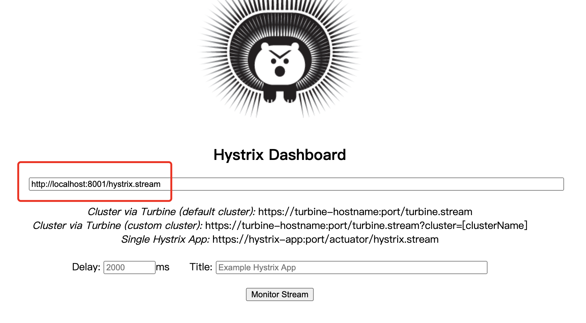
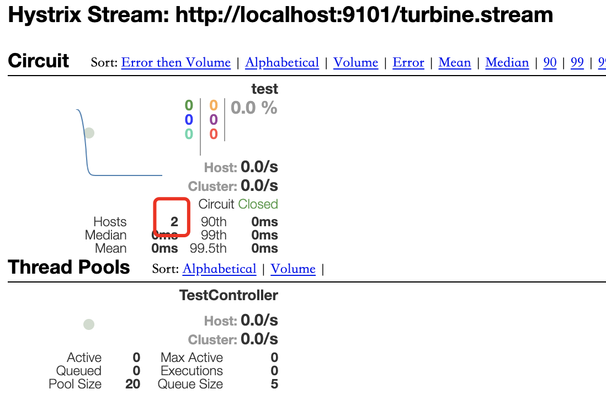

# SpringCloud 最简Demo

---

## 项目架构

## 搭建步骤

###搭建父项目

新建一个Maven 父项目:Springcloud_demo

#### pom

	<?xml version="1.0" encoding="UTF-8"?>
	<project xmlns="http://maven.apache.org/POM/4.0.0"
	         xmlns:xsi="http://www.w3.org/2001/XMLSchema-instance"
	         xsi:schemaLocation="http://maven.apache.org/POM/4.0.0 http://maven.apache.org/xsd/maven-4.0.0.xsd">
	    <modelVersion>4.0.0</modelVersion>
	
	    <groupId>com.wzy</groupId>
	    <artifactId>springcloud_demo</artifactId>
	    <packaging>pom</packaging>
	    <version>1.0-SNAPSHOT</version>
	    
	</project>

### 搭建Eureka

父项目右键--> new -->Module

#### EurekaDemoApplication

	package com.wzy.eureka_demo;
	
	import org.springframework.boot.SpringApplication;
	import org.springframework.boot.autoconfigure.SpringBootApplication;
	import org.springframework.cloud.netflix.eureka.server.EnableEurekaServer;
	
	@SpringBootApplication
	@EnableEurekaServer
	public class EurekaDemoApplication {
	
	    public static void main(String[] args) {
	        SpringApplication.run(EurekaDemoApplication.class, args);
	    }
	
	}

加上@EnableEurekaServer注解

#### application.yml

	server:
	  port: 6001
	
	spring:
	  application:
	    name: eureka6001
	
	eureka:
	  client:
	    fetch-registry: false
	    register-with-eureka: false
	    service-url:
	      defaultZone: http://eureka6001:6001/eureka, http://eureka6002:6002/eureka
	  environment: dev #eureka显示信息，这里的内容不影响eureka读取配置相关内容   

#### pom

	<?xml version="1.0" encoding="UTF-8"?>
	<project xmlns="http://maven.apache.org/POM/4.0.0" xmlns:xsi="http://www.w3.org/2001/XMLSchema-instance"
	         xsi:schemaLocation="http://maven.apache.org/POM/4.0.0 https://maven.apache.org/xsd/maven-4.0.0.xsd">
	    <modelVersion>4.0.0</modelVersion>
	    <parent>
	        <groupId>org.springframework.boot</groupId>
	        <artifactId>spring-boot-starter-parent</artifactId>
	        <version>2.2.2.RELEASE</version>
	        <relativePath/> <!-- lookup parent from repository -->
	    </parent>
	    <groupId>com.wzy</groupId>
	    <artifactId>eureka_demo</artifactId>
	    <version>0.0.1-SNAPSHOT</version>
	    <name>eureka_demo</name>
	    <description>Demo project for Spring Boot</description>
	
	    <properties>
	        <java.version>1.8</java.version>
	        <spring-cloud.version>Hoxton.SR1</spring-cloud.version>
	    </properties>
	
	    <dependencies>
	        <dependency>
	            <groupId>org.springframework.cloud</groupId>
	            <artifactId>spring-cloud-starter-netflix-eureka-server</artifactId>
	        </dependency>
	
	        <dependency>
	            <groupId>org.springframework.boot</groupId>
	            <artifactId>spring-boot-starter-test</artifactId>
	            <scope>test</scope>
	            <exclusions>
	                <exclusion>
	                    <groupId>org.junit.vintage</groupId>
	                    <artifactId>junit-vintage-engine</artifactId>
	                </exclusion>
	            </exclusions>
	        </dependency>
	
	
	    </dependencies>
	
	    <dependencyManagement>
	        <dependencies>
	            <dependency>
	                <groupId>org.springframework.cloud</groupId>
	                <artifactId>spring-cloud-dependencies</artifactId>
	                <version>${spring-cloud.version}</version>
	                <type>pom</type>
	                <scope>import</scope>
	            </dependency>
	        </dependencies>
	    </dependencyManagement>
	
	    <build>
	        <finalName>eureka-server</finalName>
	        <plugins>
	            <plugin>    <!-- 该插件的主要功能是进行项目的打包发布处理 -->
	                <groupId>org.springframework.boot</groupId>
	                <artifactId>spring-boot-maven-plugin</artifactId>
	                <configuration> <!-- 设置程序执行的主类 -->
	                    <mainClass>com.wzy.eureka_demo.EurekaDemoApplication</mainClass>
	                </configuration>
	                <executions>
	                    <execution>
	                        <goals>
	                            <goal>repackage</goal>
	                        </goals>
	                    </execution>
	                </executions>
	            </plugin>
	        </plugins>
	    </build>
	
	</project>

修改打包方式

### 搭建Porvider

父项目右键--> new -->Module --> Spring spring initializer， 

勾选eureka discovery, spring web, hystrix(非必须)

#### configs

	package com.wzy.provider_demo.config;
	
	import com.netflix.hystrix.contrib.metrics.eventstream.HystrixMetricsStreamServlet;
	import org.springframework.boot.web.servlet.ServletRegistrationBean;
	import org.springframework.context.annotation.Bean;
	import org.springframework.context.annotation.Configuration;
	
	@Configuration
	public class configs {
	
	    //hystrix dashboard相关配置
	    @Bean
	    public ServletRegistrationBean getServlet() {
	        HystrixMetricsStreamServlet streamServlet = new HystrixMetricsStreamServlet();
	        ServletRegistrationBean registrationBean = new ServletRegistrationBean(streamServlet);
	        registrationBean.setLoadOnStartup(1);
	        registrationBean.addUrlMappings("/actuator/hystrix.stream");
	        registrationBean.setName("HystrixMetricsStreamServlet");
	        return registrationBean;
	    }
	
	}

该文件为Hystrix 相关配置

#### TestController

	package com.wzy.provider_demo.controller;
	
	import com.netflix.hystrix.contrib.javanica.annotation.HystrixCommand;
	import org.springframework.web.bind.annotation.GetMapping;
	import org.springframework.web.bind.annotation.PathVariable;
	import org.springframework.web.bind.annotation.RestController;
	
	@RestController
	public class TestController {
	
	    @GetMapping("/test/{info}")
	    @HystrixCommand(fallbackMethod = "getFallBack")
	    public String test(@PathVariable("info") String info){
	        int i = 1/0; //模拟错误
	        return "provider1 returns" + info;
	    }
	
	    //fallback方法的请求报文和返回结构需要跟原方法一致
	    public String getFallBack(String info){
	        return "fallback "+ info;
	    }
	}

#### ProviderDemoApplication

	package com.wzy.provider_demo;
	
	import org.springframework.boot.SpringApplication;
	import org.springframework.boot.autoconfigure.SpringBootApplication;
	import org.springframework.cloud.client.circuitbreaker.EnableCircuitBreaker;
	import org.springframework.cloud.client.discovery.EnableDiscoveryClient;
	import org.springframework.cloud.netflix.hystrix.dashboard.EnableHystrixDashboard;
	
	@EnableDiscoveryClient
	@SpringBootApplication
	@EnableCircuitBreaker
	public class ProviderDemoApplication {
	
	    public static void main(String[] args) {
	        SpringApplication.run(ProviderDemoApplication.class, args);
	    }
	
	}

加上@EnableCircuitBreaker 表示开始Hystrix， @EnableDiscoveryClient表示被Eureka注册发现。

#### application.yml

	server:
	  port: 8001
	
	eureka:
	  client:
	    service-url:
	      defaultZone: http://eureka6001:6001/eureka, http://eureka6002:6002/eureka
	  instance:
	    instance-id: provider1   #在信息列表显示主机名称
	    prefer-ip-address: true  # 访问路径变为ip地址
	
	spring:
	  application:
	    name: provider  # 名字相同则认为是同一个服务

 

### 搭建zuul

父项目右键--> new -->Module --> Spring spring initializer， 

勾选eureka discovery, zuul 

#### GatewayDemoApplication

	package com.wzy.gateway_demo;
	
	import org.springframework.boot.SpringApplication;
	import org.springframework.boot.autoconfigure.SpringBootApplication;
	import org.springframework.cloud.client.discovery.EnableDiscoveryClient;
	import org.springframework.cloud.netflix.zuul.EnableZuulProxy;
	
	@SpringBootApplication
	@EnableZuulProxy
	@EnableDiscoveryClient
	public class GatewayDemoApplication {
	
	    public static void main(String[] args) {
	        SpringApplication.run(GatewayDemoApplication.class, args);
	    }
	
	}

加上@EnableZuulProxy 表示开启网关

#### application.yml

	server:
	  port: 5001
	
	eureka:
	  client:
	    service-url:
	      defaultZone: http://eureka6001:6001/eureka, http://eureka6002:6002/eureka
	  instance:
	    instance-id: zuul   #在信息列表显示主机名称
	    prefer-ip-address: true  # 访问路径变为ip地址
	
	spring:
	  application:
	    name: zuul
	zuul:
	  prefix: /
	  ignored-services:
	    "*"
	  routes:
	    provider: /p/**  #把所有请求provider服务的请求都映射到/p下

其中，最后一段配置的意思是将所有的请求，映射到provider（在eureka中注册的名字需要如此）的/p/路径下。一般只用于provider

### 搭建consumer

父项目右键--> new -->Module --> Spring spring initializer， 

勾选eureka discovery, openfeign, spring web

#### consumerController 

	package com.wzy.consumer.controller;
	
	import com.wzy.consumer.service.consumerService;
	import org.springframework.beans.factory.annotation.Autowired;
	import org.springframework.web.bind.annotation.RequestMapping;
	import org.springframework.web.bind.annotation.RestController;
	
	@RestController
	public class consumerController {
	
	    @Autowired
	    consumerService consumerService;
	
	    @RequestMapping("/consumer")
	    public String testFeign(){
	        return consumerService.testFeign("1111");
	    }
	
	}

#### consumerService

	package com.wzy.consumer.service;
	
	import org.springframework.cloud.openfeign.FeignClient;
	import org.springframework.web.bind.annotation.PathVariable;
	import org.springframework.web.bind.annotation.RequestMapping;
	
	@FeignClient(name = "PROVIDER") //需要跟provider在eureka中注册的名字一样
	public interface consumerService {
	
	    @RequestMapping("/test/{info}")  //需要跟provider的Url保持一致
	    public String testFeign(@PathVariable("info") String info);
	
	}

使用了声明式的方式。 @FeignClient 注解表示映射请求哪一个服务。 具体的方法，需要跟服务的相关方法保持请求URL一致。

#### ConsumerApplication

	package com.wzy.consumer;
	
	import org.springframework.boot.SpringApplication;
	import org.springframework.boot.autoconfigure.SpringBootApplication;
	import org.springframework.cloud.client.discovery.EnableDiscoveryClient;
	import org.springframework.cloud.openfeign.EnableFeignClients;
	
	@SpringBootApplication
	@EnableFeignClients(basePackages={"com.wzy"})
	@EnableDiscoveryClient
	public class ConsumerApplication {
	
	    public static void main(String[] args) {
	        SpringApplication.run(ConsumerApplication.class, args);
	    }
	}

加上注解@EnableFeignClients,并指明basePackages。 

#### application.yml

	server:
	  port: 7001
	
	spring:
	  application:
	    name: consumer
	
	eureka:
	  client:
	    service-url:
	      defaultZone: http://eureka6001:6001/eureka, http://eureka6002:6002/eureka
	    fetch-registry: true
	  instance:
	    instance-id: consumer   #在信息列表显示主机名称
	    prefer-ip-address: true  # 访问路径变为ip地址

## 搭建Hystrix Dashboard

父项目右键--> new -->Module --> Spring spring initializer，

勾选eureka discovery, hystrix dashboard, springweb

###HystrixdashboardDemoApplication

	package com.wzy.hystrixdashboard_demo;
	
	import org.springframework.boot.SpringApplication;
	import org.springframework.boot.autoconfigure.SpringBootApplication;
	import org.springframework.cloud.client.circuitbreaker.EnableCircuitBreaker;
	import org.springframework.cloud.netflix.hystrix.dashboard.EnableHystrixDashboard;
	
	@SpringBootApplication
	@EnableHystrixDashboard
	public class HystrixdashboardDemoApplication {
	
	    public static void main(String[] args) {
	        SpringApplication.run(HystrixdashboardDemoApplication.class, args);
	    }
	
	}

### application.yml

	server:
	  port: 9001
	
	eureka:
	  client:
	    service-url:
	      defaultZone: http://eureka6001:6001/eureka, http://eureka6002:6002/eureka
	  instance:
	    instance-id: hystrix_dashboard   #在信息列表显示主机名称
	    prefer-ip-address: true  # 访问路径变为ip地址
	
	
	spring:
	  application:
	    name: hystrix_dashboard  # 名字相同则认为是同一个服务
	
	hystrix:
	  dashboard:
	    proxy-stream-allow-list: "*"

访问页面：

	http://localhost:9001/hystrix
	

填入：http://localhost:8001/actuator/hystrix.stream

## 搭建Turbine

父项目右键--> new -->Module --> Spring spring initializer，

勾选eureka discovery, turbine, spring web

###TurbineDemoApplication

	package com.wzy.turbine_demo;
	
	import org.springframework.boot.SpringApplication;
	import org.springframework.boot.autoconfigure.SpringBootApplication;
	import org.springframework.cloud.client.discovery.EnableDiscoveryClient;
	import org.springframework.cloud.netflix.hystrix.dashboard.EnableHystrixDashboard;
	import org.springframework.cloud.netflix.turbine.EnableTurbine;
	
	@SpringBootApplication
	@EnableDiscoveryClient
	@EnableTurbine
	public class TurbineDemoApplication {
	
	    public static void main(String[] args) {
	        SpringApplication.run(TurbineDemoApplication.class, args);
	    }
	
	}

### application.yml

	server:
	  port: 9101
	
	spring:
	  application:
	    name: turbine
	
	eureka:
	  client:
	    service-url:
	      defaultZone: http://eureka6001:6001/eureka, http://eureka6002:6002/eureka
	  instance:
	    instance-id: turbine  #在信息列表显示主机名称
	    prefer-ip-address: true  # 访问路径变为ip地址
	
	turbine:
	  app-config: PROVIDER  #填入在eureka中注册的名字。如果有多个服务则用逗号分隔开
	  combine-host-port: true
	  cluster-name-expression: new String('default')

查看信息：

	http://localhost:9101/turbine.stream
	
在Hystrix Dashboard中填入上面的链接可以看到聚合监控

## 搭建Gateway

zuul和gateway功能类似，选择其中一个就可以承担路由功能。

父项目右键--> new -->Module --> Spring spring initializer，

勾选eureka discovery, spring gateway

### GatewayDemoApplication

	package com.wzy.gateway_demo;
	
	import org.springframework.boot.SpringApplication;
	import org.springframework.boot.autoconfigure.SpringBootApplication;
	import org.springframework.cloud.client.discovery.EnableDiscoveryClient;
	
	@SpringBootApplication
	@EnableDiscoveryClient
	public class GatewayDemoApplication {
	
	    public static void main(String[] args) {
	        SpringApplication.run(GatewayDemoApplication.class, args);
	    }
	
	}

### application.yml

	server:
	  port: 4001
	
	spring:
	  cloud:
	    gateway:
	      routes:
	        - id: before_route
	          uri: http://localhost:7001/consumer
	          predicates:
	            - Path=/consumer
	  application:
	    name: gateway
	
	
	eureka:
	  client:
	    service-url:
	      defaultZone: http://eureka6001:6001/eureka, http://eureka6002:6002/eureka
	  instance:
	    instance-id: gateway  #在信息列表显示主机名称
	    prefer-ip-address: true  # 访问路径变为ip地址
	    
	    

### 测试

访问 http://localhost:4001/consumer， 即可以路由到consumer微服务中

## 搭建config server

**用于配置外部的资源文件,支持对属性值进行加解密**

父项目右键--> new -->Module --> Spring spring initializer，

勾选eureka discovery, config server

### ConfigServerDemoApplication

	package com.wzy.config_server_demo;
	
	import org.springframework.boot.SpringApplication;
	import org.springframework.boot.autoconfigure.SpringBootApplication;
	import org.springframework.cloud.client.discovery.EnableDiscoveryClient;
	import org.springframework.cloud.config.server.EnableConfigServer;
	
	@SpringBootApplication
	@EnableConfigServer
	@EnableDiscoveryClient
	public class ConfigServerDemoApplication {
	
	    public static void main(String[] args) {
	        SpringApplication.run(ConfigServerDemoApplication.class, args);
	    }
	}
	

### application.yml

	server:
	  port: 4001
	
	spring:
	  application:
	    name: config_server  #配置文件名（当应用名跟配置文件相同时可以不用配置）
	  cloud:
	    config:
	      server:
	        git:
	          uri: https://github.com/chriswangzheyi/microconfig.git
	          username: chriswangzheyi
	          password: wzy19910921
	
	eureka:
	  client:
	    service-url:
	      defaultZone: http://eureka6001:6001/eureka, http://eureka6002:6002/eureka
	    fetch-registry: true
	  instance:
	    instance-id: config_server   #在信息列表显示主机名称
	    prefer-ip-address: true  # 访问路径变为ip地址
	

### 测试

	http://localhost:4001/test/dev

返回：

	{"name":"test","profiles":["dev"],"label":null,"version":"863135d7c2d15d66fa83ffb2ab037c6d493ed73f","state":null,"propertySources":[{"name":"https://github.com/chriswangzheyi/microconfig.git/test-dev.properties","source":{"word":"hello dev "}}]}

### 规则

####　注：仓库中的配置文件会被转换成web接口，访问规则：

	/{application}/{profile}[/{label}]
	/{application}-{profile}.yml
	/{label}/{application}-{profile}.yml
	/{application}-{profile}.properties
	/{label}/{application}-{profile}.properties

使用配置参考同一级的文件《配置中心Demo》

## 使用Docker构建容器

### 准备

将项目所有的子项目打包，并上传至服务器，创建对应的文件夹。

### Eureka1
	
	#构建Dockerfile
	vi Dockerfile
	
	FROM docker.io/kdvolder/jdk8
	VOLUME /tmp
	ADD eureka-server.jar /eureka-server.jar
	EXPOSE 6001
	ENTRYPOINT ["java","-jar","/eureka-server.jar"]

生成镜像
	
	docker build -t zheyi_eureka1 .

### Eureka2

	#构建Dockerfile
	vi Dockerfile

	FROM docker.io/kdvolder/jdk8
	VOLUME /tmp
	ADD eureka-server.jar /eureka-server.jar
	EXPOSE 6002
	ENTRYPOINT ["java","-jar","/eureka-server.jar"]

生成镜像
	
	docker build -t zheyi_eureka2 .

### Zuul

	#构建Dockerfile
	vi Dockerfile

	FROM docker.io/kdvolder/jdk8
	VOLUME /tmp
	ADD zuul_demo-0.0.1-SNAPSHOT.jar /zuul_demo-0.0.1-SNAPSHOT.jar
	EXPOSE 5001
	ENTRYPOINT ["java","-jar","/zuul_demo-0.0.1-SNAPSHOT.jar"]

生成镜像
	
	docker build -t zheyi_zuul .

### Provider1

	#构建Dockerfile
	vi Dockerfile

	FROM docker.io/kdvolder/jdk8
	VOLUME /tmp
	ADD provider_demo-0.0.1-SNAPSHOT.jar /provider_demo-0.0.1-SNAPSHOT.jar
	
	EXPOSE 8001
	ENTRYPOINT ["java","-jar","/provider_demo-0.0.1-SNAPSHOT.jar"]

生成镜像
	
	docker build -t zheyi_provider1 .

### Provider2

	#构建Dockerfile
	vi Dockerfile

	FROM docker.io/kdvolder/jdk8
	VOLUME /tmp
	ADD provider_demo2-0.0.1-SNAPSHOT.jar /provider_demo2-0.0.1-SNAPSHOT.jar
	
	EXPOSE 8002
	ENTRYPOINT ["java","-jar","/provider_demo2-0.0.1-SNAPSHOT.jar"]
	

生成镜像
	
	docker build -t zheyi_provider2 .

### Consumer

	#构建Dockerfile
	vi Dockerfile

	FROM docker.io/kdvolder/jdk8
	VOLUME /tmp
	ADD consumer-0.0.1-SNAPSHOT.jar /consumer-0.0.1-SNAPSHOT.jar
	EXPOSE 7001
	ENTRYPOINT ["java","-jar","/consumer-0.0.1-SNAPSHOT.jar"]

生成镜像
	
	docker build -t zheyi_consumer .

### 启动容器

	docker run -idt --name=eureka1 -p 6001:6001 zheyi_eureka1
	docker run -idt --name=eureka2 -p 6002:6002 zheyi_eureka2 
	docker run -idt --name=zuul -p 5001:5001 zheyi_zuul
	docker run -idt --name=consumer -p 7001:7001 zheyi_consumer 
	docker run -idt --name=provider1 -p 8001:8001 zheyi_provider1
	docker run -idt --name=provider2 -p 8002:8002 zheyi_provider2

### 验证

	#验证eureka
	http://47.112.142.231:6001/

	#验证eureka2
	http://47.112.142.231:6002/

	#验证zuul网关
	http://47.112.142.231:5001/p/test/1

	#验证provider1
	http://47.112.142.231:8001/test/1

	#验证provider2
	http://47.112.142.231:8002/test/1	

	# 验证consumer
	http://47.112.142.231:7001/consumer
