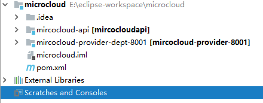
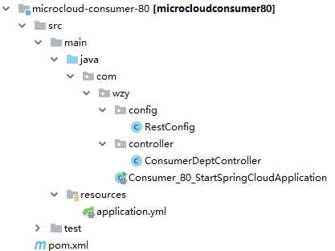

**搭建Spring cloud demo**   

 **1.新建一个maven服务**   
microcloud 作为父项目

**2.创建子模块**

右键父项目-> new -> Module

如果子Module不是java项目，
则file->project structure ->module,   

创建microcloud-provider-8001   
创建microcloud-api

 **3.创建数据库**

(1) 创建数据库 mldn8001   

(2) 执行建表sql

> DROP TABLE IF EXISTS `dept`;   
> CREATE TABLE `dept` (   
>   `deptno` bigint(20) NOT NULL AUTO_INCREMENT,   
>   `dname` varchar(50) DEFAULT NULL,   
>   `loc` varchar(50) DEFAULT NULL,   
>   PRIMARY KEY (`deptno`)   
> ) ENGINE=InnoDB AUTO_INCREMENT=2 DEFAULT CHARSET=utf8;   
>    
>    
> INSERT INTO dept (dname, loc) VALUES('开发部', database());   
> INSERT INTO dept (dname, loc) VALUES('财务部', database());   
> INSERT INTO dept (dname, loc) VALUES('后勤部', database());   
> INSERT INTO dept (dname, loc) VALUES('市场部', database());   
> INSERT INTO dept (dname, loc) VALUES('公关部', database());   
> 

 **4.修改hosts文件模拟真实环境**

C:\Windows\System32\drivers\etc\hosts    

    127.0.0.1 dept-8001.com

     

 **5.父项目microcloud结构如下：**

pom文件：

    <?xml version="1.0" encoding="UTF-8"?>
    <project xmlns="http://maven.apache.org/POM/4.0.0"
     xmlns:xsi="http://www.w3.org/2001/XMLSchema-instance"
     xsi:schemaLocation="http://maven.apache.org/POM/4.0.0 http://maven.apache.org/xsd/maven-4.0.0.xsd">
    <modelVersion>4.0.0</modelVersion>
    
    <groupId>com.wzy</groupId>
    <artifactId>microcloud</artifactId>
    <packaging>pom</packaging>
    <version>1.0-SNAPSHOT</version>

    <modules>
    <module>mircocloud-api</module>
    <module>mircocloud-provider-dept-8001</module>
    </modules>
    
    <url>http://maven.apache.org</url>
    <properties>
    <jdk.version>1.8</jdk.version>
    <project.build.sourceEncoding>UTF-8</project.build.sourceEncoding>
    </properties>
    
    <dependencyManagement>
    <dependencies>
    <dependency>
    <groupId>com.wzy</groupId>
    <artifactId>microcloud-api</artifactId>
    <version>0.0.1</version>
    </dependency>
    
    <dependency>	<!-- 进行SpringCloud依赖包的导入处理 -->
    <groupId>org.springframework.cloud</groupId>
    <artifactId>spring-cloud-dependencies</artifactId>
    <version>Dalston.SR1</version>
    <type>pom</type>
    <scope>import</scope>
    </dependency>
    <dependency>	<!-- SpringCloud离不开SpringBoot，所以必须要配置此依赖包 -->
    <groupId>org.springframework.boot</groupId>
    <artifactId>spring-boot-dependencies</artifactId>
    <version>1.5.4.RELEASE</version>
    <type>pom</type>
    <scope>import</scope>
    </dependency>
    <dependency>
    <groupId>mysql</groupId>
    <artifactId>mysql-connector-java</artifactId>
    <version>5.0.4</version>
    </dependency>
    <dependency>
    <groupId>com.alibaba</groupId>
    <artifactId>druid</artifactId>
    <version>1.0.31</version>
    </dependency>
    <dependency>
    <groupId>org.mybatis.spring.boot</groupId>
    <artifactId>mybatis-spring-boot-starter</artifactId>
    <version>1.3.0</version>
    </dependency>
    </dependencies>
    </dependencyManagement>
    <build>
    <finalName>microcloud</finalName>
    <plugins>
    <plugin>
    <groupId>org.apache.maven.plugins</groupId>
    <artifactId>maven-compiler-plugin</artifactId>
    <configuration>
    <source>${jdk.version}</source><!-- 源代码使用的开发版本 -->
    <target>${jdk.version}</target><!-- 需要生成的目标class文件的编译版本 -->
    </configuration>
    </plugin>
    </plugins>
    </build>
    
    
    </project>

注意：

 （1） 检查Modules是否存在  

    <modules>
    <module>mircocloud-api</module>
    <module>mircocloud-provider-dept-8001</module>
    </modules>

  （2） 添加api作为denpendency

    <dependency>
	    <groupId>com.wzy</groupId>
	    <artifactId>microcloud-api</artifactId>
	    <version>0.0.1</version>
    </dependency>

     
 **6.microcloud-api项目结构如下：**    

   

Dept,java:

    import java.io.Serializable;
    
    @SuppressWarnings("serial")
    public class Dept implements Serializable {
	    private Long deptno ;
	    private String dname ;
	    private String loc ;
	    public Long getDeptno() {
	        return deptno;
	    }
	    public void setDeptno(Long deptno) {
	        this.deptno = deptno;
	    }
	    public String getDname() {
	        return dname;
	    }
	    public void setDname(String dname) {
	        this.dname = dname;
	    }
	    public String getLoc() {
	        return loc;
	    }
	    public void setLoc(String loc) {
	        this.loc = loc;
	    }
	    @Override
	    public String toString() {
	        return "Dept [deptno=" + deptno + ", dname=" + dname + ", loc=" + loc
	                + "]";
	    }
    }

pom:

    <?xml version="1.0" encoding="UTF-8"?>
    <project xmlns="http://maven.apache.org/POM/4.0.0"
         xmlns:xsi="http://www.w3.org/2001/XMLSchema-instance"
         xsi:schemaLocation="http://maven.apache.org/POM/4.0.0 http://maven.apache.org/xsd/maven-4.0.0.xsd">
    <parent>
        <artifactId>microcloud</artifactId>
        <groupId>com.wzy</groupId>
        <version>1.0-SNAPSHOT</version>
    </parent>
    <modelVersion>4.0.0</modelVersion>

    <artifactId>mircocloud-api</artifactId>
   
    </project>

**7.microcloud-provider-dept-8001项目结构如下：**   

IDeptDAO.java:  
 
    import java.util.List;
    import com.wzy.vo.Dept;
    import org.apache.ibatis.annotations.Mapper;
    
    @Mapper
    public interface IDeptDAO {
	public boolean doCreate(Dept vo) ;
	public Dept findById(Long id) ;
	public List<Dept> findAll() ;
    }

DeptRest.java:

    import javax.annotation.Resource;
    import com.wzy.vo.Dept;
    import org.springframework.web.bind.annotation.PathVariable;
    import org.springframework.web.bind.annotation.RequestBody;
    import org.springframework.web.bind.annotation.RequestMapping;
    import org.springframework.web.bind.annotation.RequestMethod;
    import org.springframework.web.bind.annotation.RestController;
    import com.wzy.service.IDeptService;
    
    
    @RestController
    public class DeptRest {
		@Resource
		private IDeptService deptService ;
	
		@RequestMapping(value="/dept/get/{id}",method=RequestMethod.GET)
		public Object get(@PathVariable("id") long id) {
			return this.deptService.get(id) ;
		}
	
		@RequestMapping(value="/dept/add",method=RequestMethod.GET)
		public Object add(@RequestBody Dept dept) {
			return this.deptService.add(dept) ;
		}
	
		@RequestMapping(value="/dept/list",method=RequestMethod.GET)
		public Object list() {
			return this.deptService.list() ;
		}
    }

DeptServiceImpl.java:   

    import java.util.List;
    import javax.annotation.Resource;
    import com.wzy.dao.IDeptDAO;
    import com.wzy.service.IDeptService;
    import com.wzy.vo.Dept;
    import org.springframework.stereotype.Service;
    
    @Service
    public class DeptServiceImpl implements IDeptService {
		@Resource
		private IDeptDAO deptDAO ;
		@Override
		public Dept get(long id) {
			return this.deptDAO.findById(id);
		}
	
		@Override
		public boolean add(Dept dept) {
			return this.deptDAO.doCreate(dept);
		}
	
		@Override
		public List<Dept> list() {
			return this.deptDAO.findAll();
		}
    }

    

IDeptService.java：   
    
    
    import com.wzy.vo.Dept;
    import java.util.List;
    
    public interface IDeptService {
		public Dept get(long id) ;
		public boolean add(Dept dept) ;
		public List<Dept> list() ;
    }

Dept_8001_StartSpringCloudApplication：

    import org.springframework.boot.SpringApplication;
    import org.springframework.boot.autoconfigure.SpringBootApplication;
    @SpringBootApplication
    public class Dept_8001_StartSpringCloudApplication {
    	public static void main(String[] args) {
    		SpringApplication.run(Dept_8001_StartSpringCloudApplication.class, args);
    	}
    }

Dept.xml：  

    <?xml version="1.0" encoding="UTF-8"?>
    <!DOCTYPE mapper PUBLIC "-//mybatis.org//DTD Mapper 3.0//EN" 
    "http://mybatis.org/dtd/mybatis-3-mapper.dtd">
    <mapper namespace="com.wzy.dao.IDeptDAO">
    	<select id="findById" resultType="Dept" parameterType="long">
    		SELECT deptno,dname,loc FROM dept WHERE deptno=#{deptno} ;
    	</select>
    	<select id="findAll" resultType="Dept">
    		SELECT deptno,dname,loc FROM dept ;
    	</select>
    	<insert id="doCreate" parameterType="Dept">
    		INSERT INTO dept(dname,loc) VALUES (#{dname},database()) ;
    	</insert>
    </mapper>  

mybatis.cfg.xml：

    <?xml version="1.0" encoding="UTF-8" ?>
    <!DOCTYPE configuration   
    PUBLIC "-//mybatis.org//DTD Config 3.0//EN"   
    "http://mybatis.org/dtd/mybatis-3-config.dtd">
    <configuration> <!-- 进行Mybatis的相应的环境的属性定义 -->
    	<settings>	<!-- 在本项目之中开启二级缓存 -->
    		<setting name="cacheEnabled" value="true"/>
    	</settings>
    </configuration>

application.yml：

    server:
      port: 8001
    mybatis:
      config-location: classpath:mybatis/mybatis.cfg.xml# mybatis配置文件所在路径
      type-aliases-package: com.wzy.vo# 定义所有操作类的别名所在包
      mapper-locations: # 所有的mapper映射文件
      - classpath:mybatis/mapper/**/*.xml
    spring:
      datasource:
	    type: com.alibaba.druid.pool.DruidDataSource# 配置当前要使用的数据源的操作类型
	    driver-class-name: org.gjt.mm.mysql.Driver  # 配置MySQL的驱动程序类
	    url: jdbc:mysql://localhost:3306/mldn8001   # 数据库连接地址
	    username: root  # 数据库用户名
	    password: root# 数据库连接密码
	    dbcp2:  # 进行数据库连接池的配置
	      min-idle: 5   # 数据库连接池的最小维持连接数
	      initial-size: 5   # 初始化提供的连接数
	      max-total: 5  # 最大的连接数
	      max-wait-millis: 200  # 等待连接获取的最大超时时间

logback.xml：

    <?xml version="1.0" encoding="UTF-8"?>
    
    <configuration scan="true">
    	<property name="APP" value="${project.artifactId}" />
    	<property name="LOG_HOME" value="/data/www/log/${APP}" />
    	<appender name="CONSOLE" class="ch.qos.logback.core.ConsoleAppender">
    		<encoder>
    			<pattern>%d{yy-MM-dd.HH:mm:ss.SSS} [%-16t] %-5p %-22c{0} %X{ServiceId} - %m%n</pattern>
    		</encoder>
    	</appender>
    	<appender name="DETAIL"
    		class="ch.qos.logback.core.rolling.RollingFileAppender" additivity="false">
    		<File>${LOG_HOME}/${APP}_detail.log</File>
    		<encoder>
    			<pattern>%d{yy-MM-dd.HH:mm:ss.SSS} [%-16t] %-5p %-22c{0} %X{ServiceId} - %m%n</pattern>
    		</encoder>
    		<rollingPolicy class="ch.qos.logback.core.rolling.TimeBasedRollingPolicy">
    			<fileNamePattern>${LOG_HOME}/${APP}_detail.log.%d{yyyyMMdd}</fileNamePattern>
    		</rollingPolicy>
    	</appender>
    	<appender name="ACCESS"
    		class="ch.qos.logback.core.rolling.RollingFileAppender" additivity="false">
    		<File>${LOG_HOME}/${APP}_access.log</File>
    		<encoder>
    			<pattern>%d{yy-MM-dd.HH:mm:ss.SSS};%X{ServiceId};%m%n</pattern>
    		</encoder>
    		<rollingPolicy class="ch.qos.logback.core.rolling.TimeBasedRollingPolicy">
    			<fileNamePattern>${LOG_HOME}/${APP}_access.log.%d{yyyyMMdd}</fileNamePattern>
    		</rollingPolicy>
    	</appender>
    
    
    	<logger name="ACCESS">
    		<appender-ref ref="ACCESS" />
    	</logger>
    	<logger name="druid.sql.Statement" level="DEBUG" />
    	<logger name="com.wzy.microcloud.dao" level="TRACE" />
    
    	<root level="INFO">
    		<appender-ref ref="DETAIL" />
    		<appender-ref ref="CONSOLE" />
    	</root>
    </configuration>

pom.xml：

    <?xml version="1.0" encoding="UTF-8"?>
    <project xmlns="http://maven.apache.org/POM/4.0.0"
     xmlns:xsi="http://www.w3.org/2001/XMLSchema-instance"
     xsi:schemaLocation="http://maven.apache.org/POM/4.0.0 http://maven.apache.org/xsd/maven-4.0.0.xsd">
    <parent>
    <artifactId>microcloud</artifactId>
    <groupId>com.wzy</groupId>
    <version>1.0-SNAPSHOT</version>
    </parent>
    <modelVersion>4.0.0</modelVersion>
    
    <artifactId>mircocloud-provider-dept-8001</artifactId>
    
    <name>mircocloud-provider-dept-8001</name>
    <url>http://maven.apache.org</url>
    <properties>
    <project.build.sourceEncoding>UTF-8</project.build.sourceEncoding>
    </properties>
    <dependencies>
    <dependency>
    <groupId>junit</groupId>
    <artifactId>junit</artifactId>
    <scope>test</scope>
    </dependency>
    <dependency>
    <groupId>mysql</groupId>
    <artifactId>mysql-connector-java</artifactId>
    </dependency>
    <dependency>
    <groupId>com.alibaba</groupId>
    <artifactId>druid</artifactId>
    </dependency>
    <dependency>
    <groupId>ch.qos.logback</groupId>
    <artifactId>logback-core</artifactId>
    </dependency>
    <dependency>
    <groupId>org.mybatis.spring.boot</groupId>
    <artifactId>mybatis-spring-boot-starter</artifactId>
    </dependency>
    <dependency>
    <groupId>org.springframework.boot</groupId>
    <artifactId>spring-boot-starter-jetty</artifactId>
    </dependency>
    <dependency>
    <groupId>org.springframework.boot</groupId>
    <artifactId>spring-boot-starter-web</artifactId>
    </dependency>
    <dependency>
    <groupId>org.springframework.boot</groupId>
    <artifactId>spring-boot-starter-test</artifactId>
    <scope>test</scope>
    </dependency>
    <dependency>
    <groupId>org.springframework</groupId>
    <artifactId>springloaded</artifactId>
    </dependency>
    <dependency>
    <groupId>org.springframework.boot</groupId>
    <artifactId>spring-boot-devtools</artifactId>
    </dependency>
    <dependency>
    <groupId>com.wzy</groupId>
    <artifactId>mircocloud-api</artifactId>
    <version>1.0-SNAPSHOT</version>
    <scope>compile</scope>
    </dependency>
    </dependencies>
    </project>

注意：   
（1）在dependency中需要加入microcloud-api：
    
    <dependency>
	    <groupId>com.wzy</groupId>
	    <artifactId>mircocloud-api</artifactId>
	    <version>1.0-SNAPSHOT</version>
	    <scope>compile</scope>
    </dependency>

**8.启动provider:**   
运行Dept_8001_StartSpringCloudApplication

**9.验证**

访问

    http://dept-8001.com:8001/dept/get/4

得到反馈：

    {"deptno":4,"dname":"后勤部","loc":"mldn8001"}

访问

    http://dept-8001.com:8001/dept/list

得到反馈：

    
    [{"deptno":2,"dname":"开发部","loc":"mldn8001"},{"deptno":3,"dname":"财务部","loc":"mldn8001"},{"deptno":4,"dname":"后勤部","loc":"mldn8001"},{"deptno":5,"dname":"市场部","loc":"mldn8001"},{"deptno":6,"dname":"公关部","loc":"mldn8001"}]

**10.增加消费端**

新建一个子module：

RestConfig:

    import org.springframework.context.annotation.Bean;
    import org.springframework.context.annotation.Configuration;
    import org.springframework.web.client.RestTemplate;
    
    @Configuration
    public class RestConfig {
    	@Bean
    	public RestTemplate getRestTemplate() {
    		return new RestTemplate() ;
    	}
    }
    

ConsumerDeptController:

    import java.util.List;
    import javax.annotation.Resource;
    import com.wzy.vo.Dept;
    import org.springframework.web.bind.annotation.RequestMapping;
    import org.springframework.web.bind.annotation.RestController;
    import org.springframework.web.client.RestTemplate;
    
    @RestController
    public class ConsumerDeptController {
    	public static final String DEPT_GET_URL = "http://dept-8001.com:8001/dept/get/";
    	public static final String DEPT_LIST_URL = "http://dept-8001.com:8001/dept/list/";
    	public static final String DEPT_ADD_URL = "http://dept-8001.com:8001/dept/add";
    	@Resource
    	private RestTemplate restTemplate;
    	@RequestMapping(value = "/consumer/dept/get")
    	public Object getDept(long id) {
    		Dept dept = this.restTemplate.getForObject(DEPT_GET_URL + id,
    				Dept.class);
    		return dept;
    	}
    	@SuppressWarnings("unchecked")
    	@RequestMapping(value = "/consumer/dept/list")
    	public Object listDept() {
    		List<Dept> allDepts = this.restTemplate.getForObject(DEPT_LIST_URL,
    				List.class); 
    		return allDepts;
    	}
    	@RequestMapping(value = "/consumer/dept/add")
    	public Object addDept(Dept dept) {
    		Boolean flag = this.restTemplate.postForObject(DEPT_ADD_URL, dept,
    				Boolean.class);
    		return flag;
    	}
    }
    

Consumer_80_StartSpringCloudApplication:

    import org.springframework.boot.SpringApplication;
    import org.springframework.boot.autoconfigure.SpringBootApplication;
    @SpringBootApplication
    public class Consumer_80_StartSpringCloudApplication {
    	public static void main(String[] args) {
    		SpringApplication.run(Consumer_80_StartSpringCloudApplication.class,
    				args);
    	}
    }
 

application.yml:

    server:
      port: 80 

pom.xml:

    <?xml version="1.0" encoding="UTF-8"?>
    <project xmlns="http://maven.apache.org/POM/4.0.0"
     xmlns:xsi="http://www.w3.org/2001/XMLSchema-instance"
     xsi:schemaLocation="http://maven.apache.org/POM/4.0.0 http://maven.apache.org/xsd/maven-4.0.0.xsd">
    <parent>
    <artifactId>microcloud</artifactId>
    <groupId>com.wzy</groupId>
    <version>1.0-SNAPSHOT</version>
    </parent>
    <modelVersion>4.0.0</modelVersion>
    
    <artifactId>microcloud-consumer-80</artifactId>
    <name>microcloud-consumer-80</name>
    <url>http://maven.apache.org</url>
    <properties>
    <project.build.sourceEncoding>UTF-8</project.build.sourceEncoding>
    </properties>
    <dependencies>
    <dependency>
     <groupId>com.wzy</groupId>
       <artifactId>mircocloud-api</artifactId>
       <version>1.0-SNAPSHOT</version>
       <scope>compile</scope>
    </dependency>
    <dependency>
    <groupId>junit</groupId>
    <artifactId>junit</artifactId>
    <scope>test</scope>
    </dependency>
    <dependency>
    <groupId>org.springframework.boot</groupId>
    <artifactId>spring-boot-starter-jetty</artifactId>
    </dependency>
    <dependency>
    <groupId>org.springframework.boot</groupId>
    <artifactId>spring-boot-starter-web</artifactId>
    </dependency>
    <dependency>
    <groupId>org.springframework.boot</groupId>
    <artifactId>spring-boot-starter-test</artifactId>
    <scope>test</scope>
    </dependency>
    <dependency>
    <groupId>org.springframework</groupId>
    <artifactId>springloaded</artifactId>
    </dependency>
    <dependency>
    <groupId>org.springframework.boot</groupId>
    <artifactId>spring-boot-devtools</artifactId>
    </dependency>
    <dependency>
    <groupId>com.wzy</groupId>
    <artifactId>mircocloud-api</artifactId>
    <version>1.0-SNAPSHOT</version>
    <scope>compile</scope>
    </dependency>
    </dependencies>
    </project>
      

 **11.修改hosts文件模拟真实环境**

C:\Windows\System32\drivers\etc\hosts    

    127.0.0.1 client.com

 **11.测试**

访问： 
  
    http://client.com/consumer/dept/get?id=2

得到反馈：

    {"deptno":2,"dname":"开发部","loc":"mldn8001"}

访问

    http://client.com/consumer/dept/list

得到反馈：

    [{"deptno":2,"dname":"开发部","loc":"mldn8001"},{"deptno":3,"dname":"财务部","loc":"mldn8001"},{"deptno":4,"dname":"后勤部","loc":"mldn8001"},{"deptno":5,"dname":"市场部","loc":"mldn8001"},{"deptno":6,"dname":"公关部","loc":"mldn8001"}]

由此可以证明，消费端可以访问provider端。