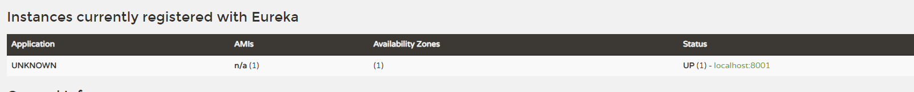
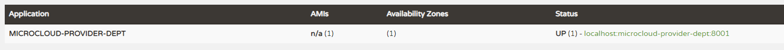

**Eureka服务**

 **1.添加Eureka服务模块**   
microcloud-eureka-7001

**2.搭建框架**

需要在Pom.xml文件中添加Eureka相关模块：

        <dependency>
            <groupId>org.springframework.cloud</groupId>
            <artifactId>spring-cloud-starter-eureka-server</artifactId>
        </dependency>
        <dependency>
            <groupId>org.springframework.cloud</groupId>
            <artifactId>spring-cloud-starter-config</artifactId>
        </dependency>

pom文件为：

	<?xml version="1.0" encoding="UTF-8"?>
	<project xmlns="http://maven.apache.org/POM/4.0.0"
	         xmlns:xsi="http://www.w3.org/2001/XMLSchema-instance"
	         xsi:schemaLocation="http://maven.apache.org/POM/4.0.0 http://maven.apache.org/xsd/maven-4.0.0.xsd">
	    <parent>
	        <artifactId>microcloud</artifactId>
	        <groupId>com.wzy</groupId>
	        <version>1.0-SNAPSHOT</version>
	    </parent>
	    <modelVersion>4.0.0</modelVersion>
	
	    <artifactId>microcloud-eureka-7001</artifactId>
	    <name>microcloud-eureka-7001</name>
	    <url>http://maven.apache.org</url>
	    <properties>
	        <project.build.sourceEncoding>UTF-8</project.build.sourceEncoding>
	    </properties>
	    <dependencies>
	        <dependency>
	            <groupId>org.springframework.cloud</groupId>
	            <artifactId>spring-cloud-starter-eureka-server</artifactId>
	        </dependency>
	        <dependency>
	            <groupId>org.springframework.cloud</groupId>
	            <artifactId>spring-cloud-starter-config</artifactId>
	        </dependency>
	        <dependency>
	            <groupId>org.springframework.boot</groupId>
	            <artifactId>spring-boot-starter-jetty</artifactId>
	        </dependency>
	        <dependency>
	            <groupId>org.springframework.boot</groupId>
	            <artifactId>spring-boot-starter-web</artifactId>
	        </dependency>
	        <dependency>
	            <groupId>org.springframework.boot</groupId>
	            <artifactId>spring-boot-starter-test</artifactId>
	            <scope>test</scope>
	        </dependency>
	        <dependency>
	            <groupId>org.springframework</groupId>
	            <artifactId>springloaded</artifactId>
	        </dependency>
	        <dependency>
	            <groupId>org.springframework.boot</groupId>
	            <artifactId>spring-boot-devtools</artifactId>
	        </dependency>
	    </dependencies>
	</project>

application.yml:   

	server:
	  port: 7001
	eureka: 
	  instance: # eureak实例定义
	    hostname: eureka-7001.com  # 定义Eureka实例所在的主机名称
	  client:
	    fetch-registry: false  # 不注册Eureka自己
	    register-with-eureka: false

Eureka_7001_StartSpringCloudApplication:

	import org.springframework.boot.SpringApplication;
	import org.springframework.boot.autoconfigure.SpringBootApplication;
	import org.springframework.cloud.netflix.eureka.server.EnableEurekaServer;
	@SpringBootApplication
	@EnableEurekaServer
	public class Eureka_7001_StartSpringCloudApplication {
		public static void main(String[] args) {
			SpringApplication.run(Eureka_7001_StartSpringCloudApplication.class, args);
		}
	}

注意：需要增加注解 @EnableEurekaServer

此时的项目结构为：

 **3.在host文件中添加内容：**
   
    C:\Windows\System32\drivers\etc\hosts
    
添加   

    127.0.0.1 eureka-7001.com

 **4.验证**

启动项目，访问

    http://eureka-7001.com:7001/

该网址即为Eureka的控制界面

---

**5.将服务注册到Eureka之中**

以mircocloud-provider-dept-8001为例：

添加下列依赖到pom之中：

		<dependency>
			<groupId>org.springframework.cloud</groupId>
			<artifactId>spring-cloud-starter-eureka</artifactId>
		</dependency>
		<dependency>
			<groupId>org.springframework.cloud</groupId>
			<artifactId>spring-cloud-starter-config</artifactId>
		</dependency>

pom的内容为：

	<?xml version="1.0" encoding="UTF-8"?>
	<project xmlns="http://maven.apache.org/POM/4.0.0"
	         xmlns:xsi="http://www.w3.org/2001/XMLSchema-instance"
	         xsi:schemaLocation="http://maven.apache.org/POM/4.0.0 http://maven.apache.org/xsd/maven-4.0.0.xsd">
	    <parent>
	        <artifactId>microcloud</artifactId>
	        <groupId>com.wzy</groupId>
	        <version>1.0-SNAPSHOT</version>
	    </parent>
	    <modelVersion>4.0.0</modelVersion>
	
	    <artifactId>mircocloud-provider-dept-8001</artifactId>
	
	    <name>mircocloud-provider-dept-8001</name>
	    <url>http://maven.apache.org</url>
	    <properties>
	        <project.build.sourceEncoding>UTF-8</project.build.sourceEncoding>
	    </properties>
	    <dependencies>
	        <dependency>
	            <groupId>junit</groupId>
	            <artifactId>junit</artifactId>
	            <scope>test</scope>
	        </dependency>

		<dependency>
			<groupId>org.springframework.cloud</groupId>
			<artifactId>spring-cloud-starter-eureka</artifactId>
		</dependency>
		<dependency>
			<groupId>org.springframework.cloud</groupId>
			<artifactId>spring-cloud-starter-config</artifactId>
		</dependency>
	
	        <dependency>
	            <groupId>org.springframework.boot</groupId>
	            <artifactId>spring-boot-starter-security</artifactId>
	        </dependency>
	
	        <dependency>
	            <groupId>mysql</groupId>
	            <artifactId>mysql-connector-java</artifactId>
	        </dependency>
	        <dependency>
	            <groupId>com.alibaba</groupId>
	            <artifactId>druid</artifactId>
	        </dependency>
	        <dependency>
	            <groupId>ch.qos.logback</groupId>
	            <artifactId>logback-core</artifactId>
	        </dependency>
	        <dependency>
	            <groupId>org.mybatis.spring.boot</groupId>
	            <artifactId>mybatis-spring-boot-starter</artifactId>
	        </dependency>
	        <dependency>
	            <groupId>org.springframework.boot</groupId>
	            <artifactId>spring-boot-starter-jetty</artifactId>
	        </dependency>
	        <dependency>
	            <groupId>org.springframework.boot</groupId>
	            <artifactId>spring-boot-starter-web</artifactId>
	        </dependency>
	        <dependency>
	            <groupId>org.springframework.boot</groupId>
	            <artifactId>spring-boot-starter-test</artifactId>
	            <scope>test</scope>
	        </dependency>
	        <dependency>
	            <groupId>org.springframework</groupId>
	            <artifactId>springloaded</artifactId>
	        </dependency>
	        <dependency>
	            <groupId>org.springframework.boot</groupId>
	            <artifactId>spring-boot-devtools</artifactId>
	        </dependency>
	        <dependency>
	            <groupId>com.wzy</groupId>
	            <artifactId>mircocloud-api</artifactId>
	            <version>1.0-SNAPSHOT</version>
	            <scope>compile</scope>
	        </dependency>
	        <dependency>
	            <groupId>com.wzy</groupId>
	            <artifactId>microcloud-security</artifactId>
	            <version>1.0-SNAPSHOT</version>
	        </dependency>
	
	    </dependencies>
	</project>

修改mircocloud-provider-dept-8001的application.yml：

增加：

	eureka:
	  client: # 客户端进行Eureka注册的配置
	    service-url:
	      defaultZone: http://eureka-7001.com:7001/eureka  #这里的格式是eureka的ip/eureka

完整的application.yml文件：
	
	server:
	  port: 8001
	
	
	mybatis:
	  config-location: classpath:mybatis/mybatis.cfg.xml    # mybatis配置文件所在路径
	  type-aliases-package: com.wzy.vo            # 定义所有操作类的别名所在包
	  mapper-locations:                                     # 所有的mapper映射文件
	  - classpath:mybatis/mapper/**/*.xml
	spring:
	  datasource:
	    type: com.alibaba.druid.pool.DruidDataSource    # 配置当前要使用的数据源的操作类型
	    driver-class-name: org.gjt.mm.mysql.Driver      # 配置MySQL的驱动程序类
	    url: jdbc:mysql://localhost:3306/mldn8001           # 数据库连接地址
	    username: root                                  # 数据库用户名
	    password: root                            # 数据库连接密码
	    dbcp2:                                          # 进行数据库连接池的配置
	      min-idle: 5                                   # 数据库连接池的最小维持连接数    
	      initial-size: 5                               # 初始化提供的连接数
	      max-total: 5                                  # 最大的连接数
	      max-wait-millis: 200                          # 等待连接获取的最大超时时间
	
	
	eureka:
	  client: # 客户端进行Eureka注册的配置
	    service-url:
	      defaultZone: http://eureka-7001.com:7001/eureka

在启动文件上加上 @EnableEurekaClient  注解

完整的启动类如下：

	import org.springframework.boot.SpringApplication;
	import org.springframework.boot.autoconfigure.SpringBootApplication;
	import org.springframework.cloud.netflix.eureka.EnableEurekaClient;
	
	@SpringBootApplication
	@EnableEurekaClient
	public class Dept_8001_StartSpringCloudApplication {
		public static void main(String[] args) {
			SpringApplication.run(Dept_8001_StartSpringCloudApplication.class, args);
		}
	}

启动Provider及Eureka之后，Eureka中显示：

新增了一个application

为解决Application 名称为Unknown, 在provider的application.yml添加属性

	spring:
	  application:
	    name:  microcloud-provider-dept

重新启动后

点击 localhost:microcloud-provider-dept:8001 需要输入账号密码，输入正确后仍然不能查看信息。

解决方案：

**mircocloud-provider-dept-8001 项目中：**

在appliction.yml添加：

	  instance:
	    instance-id: dept-8001.com                     #在信息列表显示主机名称
	    prefer-ip-address: true                      # 访问路径变为ip地址

以及

	info:
	  app.name: mldn-microcloud
	  company.name: www.mldn.cn
	  build.artifactId: $project.artifactId$
	  build.version: $project.verson$

此时的application.yml的完整信息：

	server:
	  port: 8001
	
	mybatis:
	  config-location: classpath:mybatis/mybatis.cfg.xml    # mybatis配置文件所在路径
	  type-aliases-package: com.wzy.vo            # 定义所有操作类的别名所在包
	  mapper-locations:                                     # 所有的mapper映射文件
	  - classpath:mybatis/mapper/**/*.xml
	spring:
	  datasource:
	    type: com.alibaba.druid.pool.DruidDataSource    # 配置当前要使用的数据源的操作类型
	    driver-class-name: org.gjt.mm.mysql.Driver      # 配置MySQL的驱动程序类
	    url: jdbc:mysql://localhost:3306/mldn8001           # 数据库连接地址
	    username: root                                  # 数据库用户名
	    password: root                            # 数据库连接密码
	    dbcp2:                                          # 进行数据库连接池的配置
	      min-idle: 5                                   # 数据库连接池的最小维持连接数    
	      initial-size: 5                               # 初始化提供的连接数
	      max-total: 5                                  # 最大的连接数
	      max-wait-millis: 200                         # 等待连接获取的最大超时时间
	  application:
	    name:  microcloud-provider-dept
	
	eureka:
	  client: # 客户端进行Eureka注册的配置
	    service-url:
	      defaultZone: http://eureka-7001.com:7001/eureka
	  instance:
	    instance-id: dept-8001.com                     #在信息列表显示主机名称
	    prefer-ip-address: true                      # 访问路径变为ip地址
	
	info:
	  app.name: mldn-microcloud
	  company.name: www.mldn.cn
	  build.artifactId: $project.artifactId$
	  build.version: $project.verson$
	

在pom文件中添加：

        <dependency>
            <groupId>org.springframework.boot</groupId>
            <artifactId>spring-boot-starter-actuator</artifactId>
        </dependency>

重新启动Eureka后，得到：

    {"app":{"name":"mldn-microcloud"},"company":{"name":"www.mldn.cn"},"build":{"artifactId":"$project.artifactId$","version":"$project.verson$"}}
    

**在父项目microcloud 中:**

在pom文件中增加插件：

			<plugin>
				<groupId>org.apache.maven.plugins</groupId>
				<artifactId>maven-resources-plugin</artifactId>
				<configuration>
					<delimiters>
						<delimiter>$</delimiter>
					</delimiters>
				</configuration>
			</plugin>

以及

		<resources>
			<resource>
				<directory>src/main/resources</directory>
				<filtering>true</filtering>
			</resource>
		</resources>

完整的pom文件此时为：

	<?xml version="1.0" encoding="UTF-8"?>
	<project xmlns="http://maven.apache.org/POM/4.0.0"
	         xmlns:xsi="http://www.w3.org/2001/XMLSchema-instance"
	         xsi:schemaLocation="http://maven.apache.org/POM/4.0.0 http://maven.apache.org/xsd/maven-4.0.0.xsd">
	    <modelVersion>4.0.0</modelVersion>
	
	    <groupId>com.wzy</groupId>
	    <artifactId>microcloud</artifactId>
	    <packaging>pom</packaging>
	    <version>1.0-SNAPSHOT</version>
	    <modules>
	        <module>mircocloud-api</module>
	        <module>mircocloud-provider-dept-8001</module>
	        <module>microcloud-consumer-80</module>
	        <module>microcloud-security</module>
	        <module>microcloud-eureka-7001</module>
	    </modules>
	
	    <url>http://maven.apache.org</url>
	    <properties>
	        <jdk.version>1.8</jdk.version>
	        <project.build.sourceEncoding>UTF-8</project.build.sourceEncoding>
	    </properties>
	
	    <dependencyManagement>
	        <dependencies>
	            <dependency>
	                <groupId>com.wzy</groupId>
	                <artifactId>microcloud-api</artifactId>
	                <version>0.0.1</version>
	            </dependency>
	
	
	
	            <dependency>	<!-- 进行SpringCloud依赖包的导入处理 -->
	                <groupId>org.springframework.cloud</groupId>
	                <artifactId>spring-cloud-dependencies</artifactId>
	                <version>Dalston.SR1</version>
	                <type>pom</type>
	                <scope>import</scope>
	            </dependency>
	            <dependency>	<!-- SpringCloud离不开SpringBoot，所以必须要配置此依赖包 -->
	                <groupId>org.springframework.boot</groupId>
	                <artifactId>spring-boot-dependencies</artifactId>
	                <version>1.5.4.RELEASE</version>
	                <type>pom</type>
	                <scope>import</scope>
	            </dependency>
	            <dependency>
	                <groupId>mysql</groupId>
	                <artifactId>mysql-connector-java</artifactId>
	                <version>5.0.4</version>
	            </dependency>
	            <dependency>
	                <groupId>com.alibaba</groupId>
	                <artifactId>druid</artifactId>
	                <version>1.0.31</version>
	            </dependency>
	            <dependency>
	                <groupId>org.mybatis.spring.boot</groupId>
	                <artifactId>mybatis-spring-boot-starter</artifactId>
	                <version>1.3.0</version>
	            </dependency>
	        </dependencies>
	    </dependencyManagement>
	    <build>
	        <finalName>microcloud</finalName>
	        <resources>
	            <resource>
	                <directory>src/main/resources</directory>
	                <filtering>true</filtering>
	            </resource>
	        </resources>
	        <plugins>
	            <plugin>
	                <groupId>org.apache.maven.plugins</groupId>
	                <artifactId>maven-resources-plugin</artifactId>
	                <configuration>
	                    <delimiters>
	                        <delimiter>$</delimiter>
	                    </delimiters>
	                </configuration>
	            </plugin>
	            <plugin>
	                <groupId>org.apache.maven.plugins</groupId>
	                <artifactId>maven-compiler-plugin</artifactId>
	                <configuration>
	                    <source>${jdk.version}</source><!-- 源代码使用的开发版本 -->
	                    <target>${jdk.version}</target><!-- 需要生成的目标class文件的编译版本 -->
	                </configuration>
	            </plugin>
	        </plugins>
	    </build>
	
	</project>

重新启动后可以访问Info.

    {"app":{"name":"mldn-microcloud"},"company":{"name":"www.mldn.cn"},"build":{"artifactId":"mircocloud-provider-dept-8001","version":"$project.verson$"}}

---