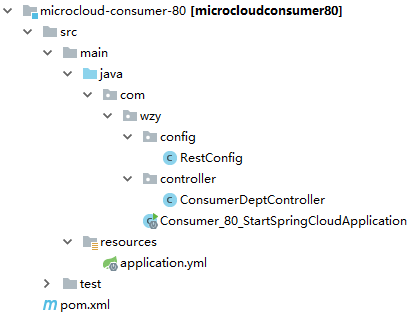

# Springcloud 配置中心Demo

## 准备配置内容

### 创建Git repository

创建一个git的repository, 以micorconfig为名。创建一个文件，名字叫test-dev.properties.

### test-dev.properties

	word = hello dev 

## 创建Maven父项目

## Eureka

父项目右键--> new -->Module

增加eureka Server

### 项目结构

### EurekaApplication

	package com.wzy.eureka;
	
	import org.springframework.boot.SpringApplication;
	import org.springframework.boot.autoconfigure.SpringBootApplication;
	import org.springframework.cloud.netflix.eureka.server.EnableEurekaServer;
	
	@EnableEurekaServer
	@SpringBootApplication
	public class EurekaApplication {
	
	    public static void main(String[] args) {
	        SpringApplication.run(EurekaApplication.class, args);
	    }
	
	}

### application.yml

	server:
	  port: 6001
	
	spring:
	  application:
	    name: eureka6001
	
	eureka:
	  client:
	    fetch-registry: false
	    register-with-eureka: false
	    service-url:
	      defaultZone: http://eureka6001:6001/eureka
	  environment: dev #eureka显示信息，这里的内容不影响eureka读取配置相关内容

### pom.xml

	<?xml version="1.0" encoding="UTF-8"?>
	<project xmlns="http://maven.apache.org/POM/4.0.0" xmlns:xsi="http://www.w3.org/2001/XMLSchema-instance"
	         xsi:schemaLocation="http://maven.apache.org/POM/4.0.0 https://maven.apache.org/xsd/maven-4.0.0.xsd">
	    <modelVersion>4.0.0</modelVersion>
	    <parent>
	        <groupId>org.springframework.boot</groupId>
	        <artifactId>spring-boot-starter-parent</artifactId>
	        <version>2.2.6.RELEASE</version>
	        <relativePath/> <!-- lookup parent from repository -->
	    </parent>
	    <groupId>com.wzy</groupId>
	    <artifactId>eureka</artifactId>
	    <version>0.0.1-SNAPSHOT</version>
	    <name>eureka</name>
	    <description>Demo project for Spring Boot</description>
	
	    <properties>
	        <java.version>1.8</java.version>
	        <spring-cloud.version>Hoxton.SR3</spring-cloud.version>
	    </properties>
	
	    <dependencies>
	        <dependency>
	            <groupId>org.springframework.cloud</groupId>
	            <artifactId>spring-cloud-starter-netflix-eureka-server</artifactId>
	        </dependency>
	
	        <dependency>
	            <groupId>org.springframework.boot</groupId>
	            <artifactId>spring-boot-starter-test</artifactId>
	            <scope>test</scope>
	            <exclusions>
	                <exclusion>
	                    <groupId>org.junit.vintage</groupId>
	                    <artifactId>junit-vintage-engine</artifactId>
	                </exclusion>
	            </exclusions>
	        </dependency>
	    </dependencies>
	
	    <dependencyManagement>
	        <dependencies>
	            <dependency>
	                <groupId>org.springframework.cloud</groupId>
	                <artifactId>spring-cloud-dependencies</artifactId>
	                <version>${spring-cloud.version}</version>
	                <type>pom</type>
	                <scope>import</scope>
	            </dependency>
	        </dependencies>
	    </dependencyManagement>
	
	    <build>
	        <plugins>
	            <plugin>
	                <groupId>org.springframework.boot</groupId>
	                <artifactId>spring-boot-maven-plugin</artifactId>
	            </plugin>
	        </plugins>
	    </build>
	
	</project>

## config_server

父项目右键--> new -->Module

增加eureka discovery client, config server

### 项目结构

### ConfigServerApplication

添加@EnableConfigServer,@EnableDiscoveryClient注解来分别开启eureka客户端以及配置中心的服务端。

	package com.wzy.config_server;
	
	import org.springframework.boot.SpringApplication;
	import org.springframework.boot.autoconfigure.SpringBootApplication;
	import org.springframework.cloud.client.discovery.EnableDiscoveryClient;
	import org.springframework.cloud.config.server.EnableConfigServer;
	
	@SpringBootApplication
	@EnableConfigServer
	@EnableDiscoveryClient
	public class ConfigServerApplication {
	
	    public static void main(String[] args) {
	        SpringApplication.run(ConfigServerApplication.class, args);
	    }
	
	}

### application.yml

	server:
	  port: 4001
	
	spring:
	  application:
	    name: config_server  #配置文件名（当应用名跟配置文件相同时可以不用配置）
	  cloud:
	    config:
	      server:
	        git:
	          uri: https://github.com/chriswangzheyi/microconfig.git
	          username: chriswangzheyi
	          password: Wzy19910921
	          basedir: D:/config  # 设置抓取后本地存储位置
	
	eureka:
	  client:
	    service-url:
	      defaultZone: http://eureka6001:6001/eureka
	  instance:
	    instance-id: config_server   #在信息列表显示主机名称
	    prefer-ip-address: false  # 访问路径变为ip地址

### pom.xml

	<?xml version="1.0" encoding="UTF-8"?>
	<project xmlns="http://maven.apache.org/POM/4.0.0" xmlns:xsi="http://www.w3.org/2001/XMLSchema-instance"
	         xsi:schemaLocation="http://maven.apache.org/POM/4.0.0 https://maven.apache.org/xsd/maven-4.0.0.xsd">
	    <modelVersion>4.0.0</modelVersion>
	    <parent>
	        <groupId>org.springframework.boot</groupId>
	        <artifactId>spring-boot-starter-parent</artifactId>
	        <version>2.2.6.RELEASE</version>
	        <relativePath/> <!-- lookup parent from repository -->
	    </parent>
	    <groupId>com.wzy</groupId>
	    <artifactId>config_server</artifactId>
	    <version>0.0.1-SNAPSHOT</version>
	    <name>config_server</name>
	    <description>Demo project for Spring Boot</description>
	
	    <properties>
	        <java.version>1.8</java.version>
	        <spring-cloud.version>Hoxton.SR3</spring-cloud.version>
	    </properties>
	
	    <dependencies>
	        <dependency>
	            <groupId>org.springframework.cloud</groupId>
	            <artifactId>spring-cloud-config-server</artifactId>
	        </dependency>
	        <dependency>
	            <groupId>org.springframework.cloud</groupId>
	            <artifactId>spring-cloud-starter-netflix-eureka-client</artifactId>
	        </dependency>
	
	        <dependency>
	            <groupId>org.springframework.boot</groupId>
	            <artifactId>spring-boot-starter-test</artifactId>
	            <scope>test</scope>
	            <exclusions>
	                <exclusion>
	                    <groupId>org.junit.vintage</groupId>
	                    <artifactId>junit-vintage-engine</artifactId>
	                </exclusion>
	            </exclusions>
	        </dependency>
	    </dependencies>
	
	    <dependencyManagement>
	        <dependencies>
	            <dependency>
	                <groupId>org.springframework.cloud</groupId>
	                <artifactId>spring-cloud-dependencies</artifactId>
	                <version>${spring-cloud.version}</version>
	                <type>pom</type>
	                <scope>import</scope>
	            </dependency>
	        </dependencies>
	    </dependencyManagement>
	
	    <build>
	        <plugins>
	            <plugin>
	                <groupId>org.springframework.boot</groupId>
	                <artifactId>spring-boot-maven-plugin</artifactId>
	            </plugin>
	        </plugins>
	    </build>
	
	</project>

### 测试

	localhost:4001/test/dev

####　注：仓库中的配置文件会被转换成web接口，访问规则：

	/{application}/{profile}[/{label}]
	/{application}-{profile}.yml
	/{label}/{application}-{profile}.yml
	/{application}-{profile}.properties
	/{label}/{application}-{profile}.properties

## client

父项目右键--> new -->Module

增加下图所示模块：

###项目结构

### ClientController
	
	package com.wzy.client.controller;
	
	import org.springframework.beans.factory.annotation.Value;
	import org.springframework.web.bind.annotation.GetMapping;
	import org.springframework.web.bind.annotation.RestController;
	
	@RestController
	public class ClientController {
	
	    @Value("${word}")
	    private String env;
	
	    @GetMapping("/word")
	    public String getEnv()
	    {
	        return env;
	    }
	
	}

### ClientApplication

	package com.wzy.client;
	
	import org.springframework.boot.SpringApplication;
	import org.springframework.boot.autoconfigure.SpringBootApplication;
	import org.springframework.cloud.client.discovery.EnableDiscoveryClient;
	
	@SpringBootApplication
	@EnableDiscoveryClient
	public class ClientApplication {
	
	    public static void main(String[] args) {
	        SpringApplication.run(ClientApplication.class, args);
	    }
	
	}

### bootstrap.yml

这个文件的加载优先级高于 applicayion.yml

	spring:
	  application:
	    name: test  # 需要跟配置文件的名字一样
	  cloud:
	    config:
	      profile: dev  #文件名中的profile
	      label:
	      discovery:
	        enabled: true
	        service-id: CONFIG_SERVER   #Config Client在Eureka中的注册名字
	
	
	eureka:
	  client:
	    service-url:
	      defaultZone: http://eureka6001:6001/eureka
	  instance:
	    instance-id: client   #在信息列表显示主机名称
	    prefer-ip-address: false  # 访问路径变为ip地址

### application.yml

	server:
	  port: 8001

###pom.xml

	<?xml version="1.0" encoding="UTF-8"?>
	<project xmlns="http://maven.apache.org/POM/4.0.0" xmlns:xsi="http://www.w3.org/2001/XMLSchema-instance"
	         xsi:schemaLocation="http://maven.apache.org/POM/4.0.0 https://maven.apache.org/xsd/maven-4.0.0.xsd">
	    <modelVersion>4.0.0</modelVersion>
	    <parent>
	        <groupId>org.springframework.boot</groupId>
	        <artifactId>spring-boot-starter-parent</artifactId>
	        <version>2.2.6.RELEASE</version>
	        <relativePath/> <!-- lookup parent from repository -->
	    </parent>
	    <groupId>com.wzy</groupId>
	    <artifactId>client</artifactId>
	    <version>0.0.1-SNAPSHOT</version>
	    <name>client</name>
	    <description>Demo project for Spring Boot</description>
	
	    <properties>
	        <java.version>1.8</java.version>
	        <spring-cloud.version>Hoxton.SR3</spring-cloud.version>
	    </properties>
	
	    <dependencies>
	        <dependency>
	            <groupId>org.springframework.boot</groupId>
	            <artifactId>spring-boot-starter-web</artifactId>
	        </dependency>
	        <dependency>
	            <groupId>org.springframework.cloud</groupId>
	            <artifactId>spring-cloud-starter-config</artifactId>
	        </dependency>
	        <dependency>
	            <groupId>org.springframework.cloud</groupId>
	            <artifactId>spring-cloud-starter-netflix-eureka-client</artifactId>
	        </dependency>
	
	        <dependency>
	            <groupId>org.springframework.boot</groupId>
	            <artifactId>spring-boot-starter-test</artifactId>
	            <scope>test</scope>
	            <exclusions>
	                <exclusion>
	                    <groupId>org.junit.vintage</groupId>
	                    <artifactId>junit-vintage-engine</artifactId>
	                </exclusion>
	            </exclusions>
	        </dependency>
	    </dependencies>
	
	    <dependencyManagement>
	        <dependencies>
	            <dependency>
	                <groupId>org.springframework.cloud</groupId>
	                <artifactId>spring-cloud-dependencies</artifactId>
	                <version>${spring-cloud.version}</version>
	                <type>pom</type>
	                <scope>import</scope>
	            </dependency>
	        </dependencies>
	    </dependencyManagement>
	
	    <build>
	        <plugins>
	            <plugin>
	                <groupId>org.springframework.boot</groupId>
	                <artifactId>spring-boot-maven-plugin</artifactId>
	            </plugin>
	        </plugins>
	    </build>
	
	</project>

### 测试

	http://localhost:8001/word

