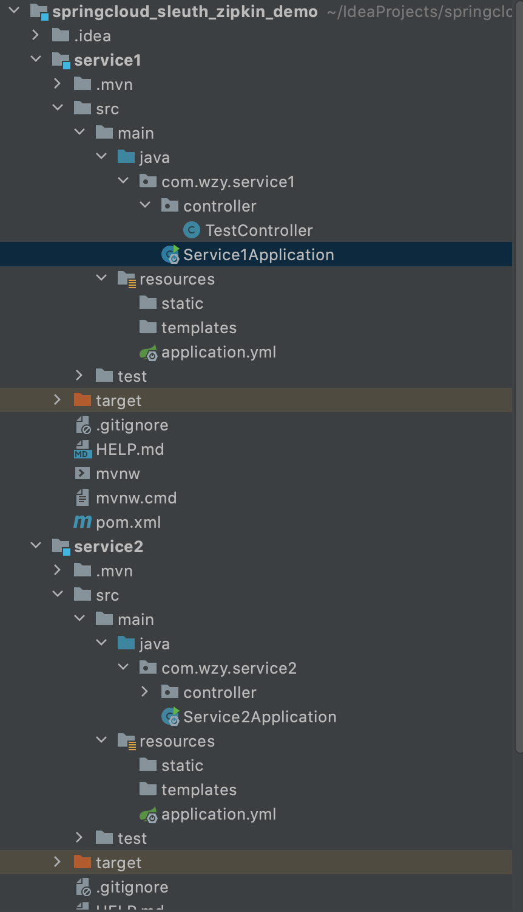
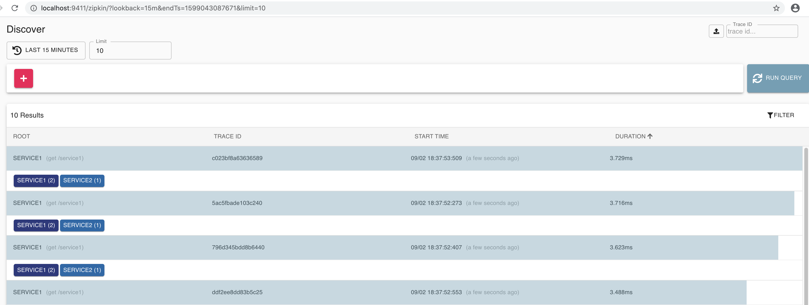
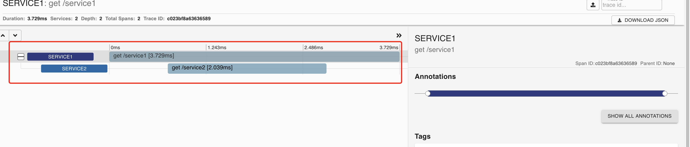

# Springcloud slueth zipkin Demo

## 搭建步骤

## Service1

(1)新建一个Maven, 

(2)父项目右键--> new -->Module --> Spring spring initializer， 勾选spring web,  Sleuth, Zipkin Client

### TestController

	package com.wzy.service1.controller;

	import org.springframework.beans.factory.annotation.Autowired;
	import org.springframework.web.bind.annotation.GetMapping;
	import org.springframework.web.bind.annotation.RestController;
	import org.springframework.web.client.RestTemplate;
	import javax.servlet.http.HttpServletResponse;
	import java.io.IOException;
	
	@RestController
	public class TestController {
	
	    @Autowired
	    private RestTemplate restTemplate;
	
	    @GetMapping("/service1")
	    public String test2(HttpServletResponse response) throws IOException {
	        String rst = restTemplate.getForObject("http://localhost:3002/service2", String.class);
	        return "message " + rst;
	    }
	}
	
### Service1Application

	package com.wzy.service1;
	
	import org.springframework.beans.factory.annotation.Autowired;
	import org.springframework.boot.SpringApplication;
	import org.springframework.boot.autoconfigure.SpringBootApplication;
	import org.springframework.boot.web.client.RestTemplateBuilder;
	import org.springframework.context.annotation.Bean;
	import org.springframework.web.client.RestTemplate;
	
	@SpringBootApplication
	public class Service1Application {
	
	    // 启动的时候要注意，由于我们在controller中注入了RestTemplate，所以启动的时候需要实例化该类的一个实例
	    @Autowired
	    private RestTemplateBuilder builder;
	
	    // 使用RestTemplateBuilder来实例化RestTemplate对象，spring默认已经注入了RestTemplateBuilder实例
	    @Bean
	    public RestTemplate restTemplate() {
	        return builder.build();
	    }
	
	    public static void main(String[] args) {
	        SpringApplication.run(Service1Application.class, args);
	    }
	
	}
	
### application.yml

	server:
	  port: 3001
	spring:
	  zipkin:
	    base-url: http://localhost:9411
	    discovery-client-enabled: false #关闭服务发现，否则springcloud会把zipkin的url当作服务名称
	    sender:
	      type: web #设置使用http的方式传输数据
	  sleuth:
	    sampler:
	      probability: 1 #设置采样数据 1表示 100%,默认是0.1即 10%
	  application:
	    name: service1

### pom.xml

	<?xml version="1.0" encoding="UTF-8"?>
	<project xmlns="http://maven.apache.org/POM/4.0.0" xmlns:xsi="http://www.w3.org/2001/XMLSchema-instance"
	         xsi:schemaLocation="http://maven.apache.org/POM/4.0.0 https://maven.apache.org/xsd/maven-4.0.0.xsd">
	    <modelVersion>4.0.0</modelVersion>
	    <parent>
	        <groupId>org.springframework.boot</groupId>
	        <artifactId>spring-boot-starter-parent</artifactId>
	        <version>2.3.3.RELEASE</version>
	        <relativePath/> <!-- lookup parent from repository -->
	    </parent>
	    <groupId>com.wzy</groupId>
	    <artifactId>service1</artifactId>
	    <version>0.0.1-SNAPSHOT</version>
	    <name>service1</name>
	    <description>Demo project for Spring Boot</description>
	
	    <properties>
	        <java.version>1.8</java.version>
	        <spring-cloud.version>Hoxton.SR8</spring-cloud.version>
	    </properties>
	
	    <dependencies>
	        <dependency>
	            <groupId>org.springframework.boot</groupId>
	            <artifactId>spring-boot-starter-web</artifactId>
	        </dependency>
	        <dependency>
	            <groupId>org.springframework.cloud</groupId>
	            <artifactId>spring-cloud-starter-sleuth</artifactId>
	        </dependency>
	        <dependency>
	            <groupId>org.springframework.cloud</groupId>
	            <artifactId>spring-cloud-starter-zipkin</artifactId>
	        </dependency>
	
	        <dependency>
	            <groupId>org.springframework.boot</groupId>
	            <artifactId>spring-boot-starter-test</artifactId>
	            <scope>test</scope>
	            <exclusions>
	                <exclusion>
	                    <groupId>org.junit.vintage</groupId>
	                    <artifactId>junit-vintage-engine</artifactId>
	                </exclusion>
	            </exclusions>
	        </dependency>
	    </dependencies>
	
	    <dependencyManagement>
	        <dependencies>
	            <dependency>
	                <groupId>org.springframework.cloud</groupId>
	                <artifactId>spring-cloud-dependencies</artifactId>
	                <version>${spring-cloud.version}</version>
	                <type>pom</type>
	                <scope>import</scope>
	            </dependency>
	        </dependencies>
	    </dependencyManagement>
	
	    <build>
	        <plugins>
	            <plugin>
	                <groupId>org.springframework.boot</groupId>
	                <artifactId>spring-boot-maven-plugin</artifactId>
	            </plugin>
	        </plugins>
	    </build>
	
	</project>

## Service2

### TestController

	package com.wzy.service2.controller;
	
	import org.springframework.web.bind.annotation.GetMapping;
	import org.springframework.web.bind.annotation.RestController;
	
	@RestController
	public class TestController {
	
	    @GetMapping("/service2")
	    public String Test(){
	        return "222";
	    }
	}

### Service2Application

	package com.wzy.service2;
	
	import org.springframework.boot.SpringApplication;
	import org.springframework.boot.autoconfigure.SpringBootApplication;
	
	@SpringBootApplication
	public class Service2Application {
	
	    public static void main(String[] args) {
	        SpringApplication.run(Service2Application.class, args);
	    }
	}
	
### application.yml

	server:
	  port: 3002
	spring:
	  zipkin:
	    base-url: http://localhost:9411
	    discovery-client-enabled: false #关闭服务发现，否则springcloud会把zipkin的url当作服务名称
	    sender:
	      type: web #设置使用http的方式传输数据
	  sleuth:
	    sampler:
	      probability: 1 #设置采样数据 1表示 100%,默认是0.1即 10%
	  application:
	    name: service2

## zipkin 服务器

	docker run -d -p 9411:9411 openzipkin/zipkin

在本地启动一个容器

## 测试

访问zipkin服务器

	http://localhost:9411/

启动service1, service2, 请求连接：

	http://localhost:3001/service1
	

可以看到日志记录。点进去以后可以看到依赖关系以及响应时间。

