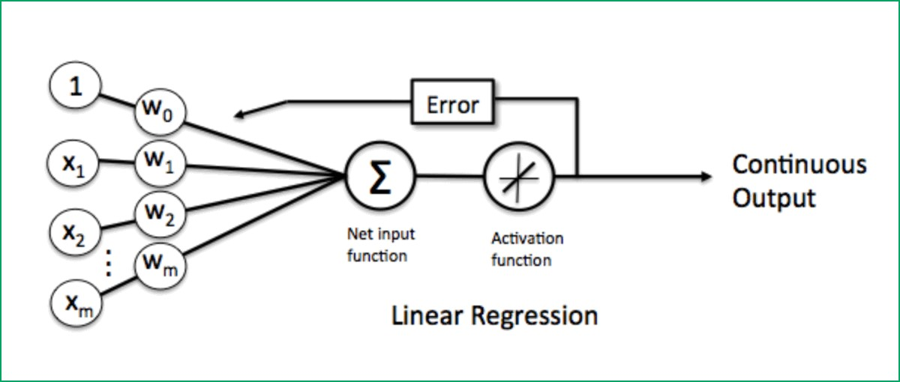

# 感知器

参考：https://blog.csdn.net/lsqzedu/article/details/102215132

## 定义

感知器是人工神经网络中的一种典型结构， 它的主要的特点是结构简单，对所能解决的问题 存在着收敛算法，并能从数学上严格证明，从而对神经网络研究起了重要的推动作用。

1. 感知机是二分类的线性模型，其输入是实例的特征向量，输出的是事例的类别，分别是-1和­1，属于判别模型
1. 感知器是向量机算法，神经网络的鼻祖，我们将要讲的深度神经网络，就是感知器算法的叠加
1. 感知器也是采用线性回归模型算法，运算的过程就是不断求权重与偏置过程 y’ = w1x1 + w2x2 … + b

x1，x2 ....xm 是样本特征

w0,w1.... wm 是权重

w0 * 1 等于 y’ = w1x1 + w2x2 … + b 这里的b

## 线性不可分

### 线性可分类情况

### 线性不可分类情况

### Sigmoid

Sigmoid函数是一个在生物学中常见的S型函数，也称为S型生长曲线。在信息科学中，由于其单增以及反函数单增等性质，Sigmoid函数常被用作神经网络的阈值函数，将变量映射到0,1之间

## Sign激活函数

引入激活函数是为了增加神经网络模型的非线性，没有激活函数的每层都相当于矩阵相乘。就算你叠加了若干层之后,无非还是个矩阵相乘罢了，Sign(x) 是最简单的二分类激活函数。

1. 当x>0，sign(x)=1
1. 当x=0，sign(x)=0
1. 当x<0， sign(x)=-1

通过设定阈值的方式，将一个连续的数值变为离散。

## Sign 和 Sigmoid 代码实现 

	import numpy as np
	import matplotlib.pyplot as plt
	
	# Sign(x) 是最简单的二分类激活函
	x = np.arange(-5.0, 5.0, 0.1)
	y = np.sign(x)
	plt.plot(x,y)
	plt.show()
	
	# sigmoid(x)
	y = 1/(1+np.exp(-x))
	plt.plot(x,y)
	plt.show()
	
	

## 感知器处理二分类问题

