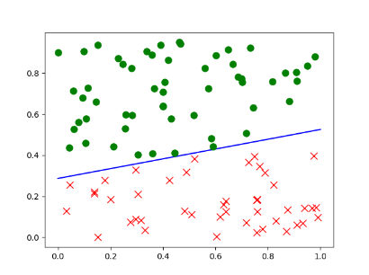

# 样本分类

## 代码

	import numpy as np
	import matplotlib.pyplot as plt
	
	# 创建等差数列。 格式：(start,end, num)， 得到[0. 1.]
	x = np.linspace(0, 1, 2)
print(" x= ", x)
# 生成直线的方程: y = w * x + b
	w = np.random.rand()
	b = np.random.rand()
	print(f'w={w},b={b}')
	fn = lambda x: w * x + b
	
	# 通过可视化来创建直线,以蓝色表示
	plt.plot(x, fn(x), 'b')
	
	# 通过直线把生成的100个点分成两个类别
	N = 100
	xn = np.random.rand(N, 2) #[x轴,y轴]
	
	# 存储每个样本的类别 [1,-1]
	yn = np.zeros([N, 1])   # 类别分别是-1和1，这里默认起始都是0
	
	# 通过之前的直线把样本分成两类
	for i in range(N):
	    if fn(xn[i, 0]) >= xn[i, 1]:
	        # 当前的x[i]的点在直线的下方
	        yn[i] = -1
	        plt.plot(xn[i, 0], xn[i, 1], 'rx', markersize=8)#红叉
	    else:
	        yn[i] = 1
	        plt.plot(xn[i, 0], xn[i, 1], 'go', markersize=8)#绿圈
	plt.show()

## 显示

	x=  [0. 1.]
	w=0.23864188049339763,b=0.28687302226219746
	
