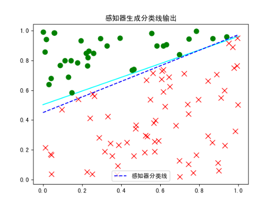

# 采用感知器进行而分类

## 代码

	import numpy as np
	import matplotlib.pyplot as plt
	
	# 创建等差数列。 格式：(start,end, num)， 得到[0. 1.]
	x = np.linspace(0, 1, 2)
	print(" x= ", x)
	# 生成直线的方程: y = w * x + b
	w = np.random.rand()
	b = np.random.rand()
	print(f'w={w},b={b}')
	fn = lambda x: w * x + b
	
	# 通过可视化来创建直线,以蓝色表示
	plt.plot(x, fn(x), 'aqua')
	
	# 通过直线把生成的100个点分成两个类别
	N = 100
	xn = np.random.rand(N, 2)  # [x轴,y轴]
	
	# 存储每个样本的类别 [1,-1]
	yn = np.zeros([N, 1])  # 类别分别是-1和1，这里默认起始都是0
	
	# 通过之前的直线把样本分成两类
	for i in range(N):
	    if fn(xn[i, 0]) >= xn[i, 1]:
	        # 当前的x[i]的点在直线的下方
	        yn[i] = -1
	        plt.plot(xn[i, 0], xn[i, 1], 'rx', markersize=8)  # 红叉
	    else:
	        yn[i] = 1
	        plt.plot(xn[i, 0], xn[i, 1], 'go', markersize=8)  # 绿圈
	
	
	# 对于给定的x,y值,感知器要寻找超平面， xn:样本， yn:目标，a:学习率, w:2个特征+一个偏置，w2x2+w1x1+b
	def perceptron(xn, yn, max_iter=10000, a=0.1, w=np.zeros(3)):
	    N = xn.shape[0]
	    # 函数里面在构造一个函数,对数据样本进行分类
	    # np.sign() 激活函数,可以把结果转化 1 或者 -1
	    # x ==> x[0] x[1]
	    f = lambda x: np.sign(w[0] * 1 + w[1] * x[0] + w[2] * x[1])
	    # 循环反向传播,如果预测值与标准值不等则修改权重和偏置
	    for _ in range(max_iter):
	        # 0-100之间随机获取一个样本作为测试样本
	        i = np.random.randint(N)
	        # yn[i] 是样本的目标值, xn[i,:] 第i个样本的特征值   f(xn[i,:]) 预测值
	        if (yn[i] != f(xn[i, :])):  # 标准答案有1和-1
	            # 固定公式，更新权重最快的方法：更新权重与偏置 权重原值 + 目标值 * 输入值 * 学习率
	            w[0] = w[0] + yn[i] * 1 * a
	            w[1] = w[1] + yn[i] * xn[i, 0] * a
	            w[2] = w[2] + yn[i] * xn[i, 1] * a
	    return w
	
	
	w = perceptron(xn,yn,max_iter=10000)
	print("经过感知器之后：", w) #返回三个值：w0,w1,w2
	
	# 通过w生成预测分类线函数的a,b的值
	bnew = -w[0] / w[2]
	anew = -w[1] / w[2]
	
	# 通过a与b生成预测分类线函数
	y = lambda x: anew * x + bnew
	plt.rcParams['font.sans-serif'] = ['SimHei']
	plt.plot(x, y(x), 'b--', label="感知器分类线")
	plt.legend()
	plt.title('感知器生成分类线输出')
	plt.show()
	
## 显示

x=  [0. 1.]
w=0.4593832471288265,b=0.5029419592737024
经过感知器之后： [-0.4        -0.46481572  0.88861853]

