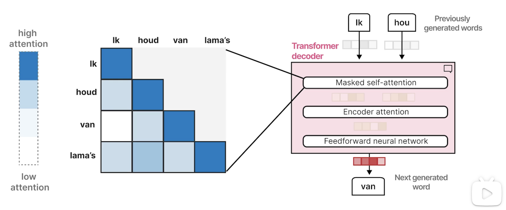
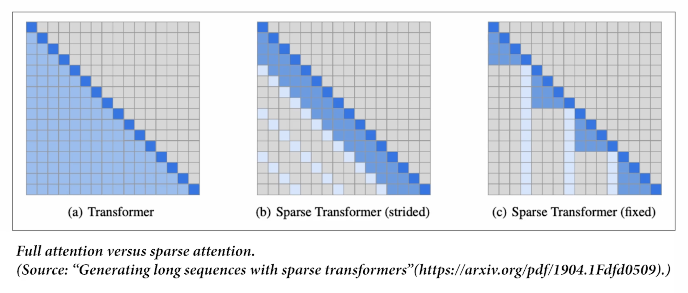

# 吴恩达讲Transformer

参考：https://www.bilibili.com/video/BV1bxRpYdEbT/?spm_id_from=333.1391.0.0&p=6&vd_source=a267912a9cbb36e71ab719af20b7a8cb

## 起源

### 最开始的Transformer

用来翻译英文到德语。 Encoder 提供了输入文本的丰富上下文敏感表示，Decoder执行文本生成任务，如总结文本。

## 发展历史

## Bag-of-Words (语言词带)

一句话被分词到每一个token（绿色或蓝色），然后存在词汇表中(此时叫vocabulary size)。

以 My cat is cute为例，他的表示如红色显示

在更复杂的模型中，向量通常不是那么直观，并且值是0-1之间的数:

## 词嵌入 （Embedding）

词向量， Word2Vec通过在大量文本数据上进行训练来学习单词的语义表示. Word2Vec利用了神经网络。包含权重和节点。

比如，通过神经网络，可以测算cat和cute是相近词的概率：

词向量本质是拆分为n个维度去表示不同属性的表达方式：(cat在animal这个属性上得分高，在fruit这个属性上得分低)

因此相近的词在词向量上会更加近。

此时的分词不是以空格，而是通过分词器变为了token(比如vocalization 分为了vocal 和 ization两个)，通过Representation model, 变为Embedding，每一个词元一个注意（attention），平均这些Embedding，就得到表示整个词的Embedding（绿色）。

同样的技术还可以用在句子的Embedding化上：

但是这个技术(比如Word2Vec只是静态的Embedding)对上下文能力有限。比如英文单词bank，既可以指银行，也可以指河岸，在这种场景下无法被区分。因此需要引入注意力机制。

##  利用注意力机制对上下文进行编码和解码

在最开始只有Encoder和Decoder：

此时的架构是自回归（Autoregressive）的，在每次生成的时候都会生成一个标记（绿色），并应用到下一句话中：

更具体来讲，从上往下，用word2vec Embedding作为Encoder的输入，Encoder是在表示（Reresent）这个Embedding，生成content embedding， Decoder是用来生成语言的。

这些token是一个一个生成的，因此被称为自回归，因为此时是一个单一的embedding代表了整个输入，可能无法捕捉到长而复杂序列的全部上下文，所以使得处理长句子变得更困难，因此引入了**注意力机制**。

注意力机制允许聚焦一部分互相关联的输入，注意到彼此并放大信号。相关性如下图所示：

## Transformer的发展过程

Transformer架构包含了带有Self-attention 和 Forward Neural Network的架构。

其中Masked Self-attention 跟Self-attention类似:

#### Self-Attention（自注意力）

- 在普通的 **self-attention** 里，每个词都能“看到”整个句子里的所有词。
- 就像开会时，大家都能听到彼此在说什么，每个人都能参考所有人的意见再决定自己的发言。

#### Masked Self-Attention（带遮罩的自注意力）

- 在 **masked self-attention** 里，某些词是被“遮住”的，不能看到未来的词。
- 就像写作文的时候，你写到第 3 个字时，不可能提前知道第 5 个字是什么。
- 所以 masked self-attention 会限制你：第 n 个词只能“看到”自己和前面的词，不能偷看后面的词。
- 这主要用于 **语言模型的训练（比如 GPT）**，保证它一步步预测下一个词时不会“作弊”。

#### Feed Forward 的作用

所以，每个 Encoder/Decoder block 里都会在 attention 后加一个 **前馈全连接网络（FFN）**：

- **非线性映射**：FFN 通常是两层线性层 + ReLU/GELU，可以让模型学到更复杂的特征变换。
- **逐位置处理**：FFN 对每个 token 的表示独立处理（不再交互），相当于在“融合了上下文信息之后”，再对每个词单独做一次深度特征提取。
- **增强表达能力**：attention 学关系，FFN 学抽象特征，两者结合才让模型既能“看全局”，又能“深加工”。

打个比方：

- **Self-Attention**：像一个“讨论会”，大家把信息交流一遍。
- **Feed Forward**：像会后每个人自己再消化一遍，把学到的内容进行内化、抽象。
   👉 两步结合，才能既懂“别人说了什么”，又懂“自己该怎么理解和表达”。

Feed Forward Neural Network 在 Transformer 里是 **补足 self-attention 的非线性表达能力**，让模型不仅能建关系，还能做更复杂的特征变换，从而提高整个模型的表现力。

#### 原始Transformer的局限

- 论文《Attention Is All You Need》（2017）设计的 Transformer 是 **Encoder + Decoder** 架构。
- **用途**：机器翻译（MT）。
  - Encoder 把源语言句子编码成上下文向量。
  - Decoder 一边看 Encoder 的结果，一边逐字生成目标语言句子。
- 特点：**输入和输出都需要**，天然是 **seq2seq** 架构。

#### BERT 的诞生（2018）

后来人们发现，很多任务（文本分类、问答、句子相似度等）并不需要“翻译”，而是：

- 输入一句话/几句话 → 输出分类结果、打分或 span。
- 这类任务 **只需要理解输入**，不需要生成输出。

于是，**BERT (Bidirectional Encoder Representations from Transformers)** 出现了，它只保留了 **Encoder** 部分，彻底砍掉了 Decoder。

#### BERT 解决了什么问题？

1. **双向上下文建模**
   - 原始 Transformer Decoder 用 **Masked Self-Attention**，只能看左边上下文（单向），适合生成。
   - 但很多理解类任务，需要左右两边都能看到（比如预测一个词，前后信息都重要）。
   - BERT 通过 **双向自注意力**（全局可见）来建模，效果远好于单向语言模型。
2. **预训练 + 微调范式**
   - BERT 用 **Masked Language Model (MLM)** 和 **Next Sentence Prediction (NSP)** 做大规模预训练。
   - 然后在下游任务（分类/问答/NER）上微调，只需少量数据就能达到 SOTA。
   - 这解决了 NLP 领域“训练数据稀缺”的问题，掀起了 **预训练语言模型热潮**。

##### 总结类比

- **原始 Transformer (Encoder+Decoder)**：像“翻译官”，输入中文，输出英文。
- **BERT (Encoder-only)**：像“读书人”，专注于理解已有的文本。
- **GPT (Decoder-only)**：像“写作者”，专注于根据已有上下文一步步生成新内容。

两者对比：

BERT是一个只有Encoder的结构:

GPT和BERT都有一个共同的特点，都是上下文有限制。以GPT1为例，上下文长度（包括历史和生成的token）有限（如下图的512）：

为什么 context length（上下文长度）只有 512？上下文长度 = 模型一次能看到的 token 数。在最早的 GPT-1 (2018) 里，最大 context length 确实是 512。

原因：

- 计算资源有限 —— Self-Attention 的计算复杂度是 O(n²)，n 是序列长度。n=512 时还能勉强训练，如果扩到几千，2018 年的算力完全顶不住。

- 任务场景需求 —— GPT-1 主要是做语言建模和一些小规模下游任务（分类、蕴含等），大多数任务 512 token 已经够用了。

为什么参数还这么大？

GPT 的参数主要来自于：

- 词向量和输出矩阵：词表很大，embedding 占了不少参数。

- 多层 Transformer 堆叠：GPT-1 有 12 层，每层都包含 attention + feed-forward，大量权重参数。

- 隐藏维度大：GPT-1 的 hidden size = 768，光一层的权重矩阵就有几千万参数。

⚠️ 注意：

- 上下文长度（512） 影响的是计算成本（训练时的序列处理范围），不是参数数量。

- 参数量（117M） 取决于模型结构（层数、隐藏维度、embedding 大小），和 context length 没有直接关系。

## 分词器 （tokenizers）

**Tokenizer 就是把文本切成 token 并转成数字的工具。**
 它的设计决定了：

- 模型一次能处理多少字符（上下文长度）。
- 模型对不同语言和新词的适应能力。
- 模型的效率和内存占用。

## Transformer总体架构

右边放大了模型的内部组成，主要分为三部分：

#### (1) **Tokenizer（分词器）**

- 把输入的自然语言拆分成 **tokens**（最小可处理单元，比如 “Dear” → `["De", "ar"]` 或直接一个 token）。
- 再把 token 转成 **数字 ID**，这样模型才能理解和计算。

#### (2) **Stack of Transformer Blocks（Transformer 堆叠层）**

- 核心计算部分。
- 包含很多个 **Transformer Block**（比如 GPT-3 有 96 层）。
- 每一层里有：
  - **Self-Attention**（捕捉上下文关系）；
  - **Feed Forward 网络**（非线性特征提取）；
  - **残差连接 & LayerNorm**（稳定训练）。
- 一层层堆叠，逐步让 token 表示越来越抽象、越来越接近语义。

#### (3) **LM Head（语言建模头）**

- 最后一层是一个 **全连接层 + Softmax**。
- 把每个位置的隐藏向量转化为 **下一个 token 的概率分布**。
- 比如当前可能的候选词有：`["Dear", "Hello", "Hi", ...]`，模型会打分，选概率最大的那个。

可酌情增加temperature和top_p：

加快计算的方法：

1.并行计算

2.**Cached Calculation**: 在生成文本时，模型是 逐 token 预测 的，比如先预测 "Dear"，再预测下一个 "Sarah"。如果每次生成都要把整个输入句子重新跑一遍 Transformer，计算会很慢。所以 LLM 会在生成过程中，把前面算过的 hidden states 缓存 (cache) 下来。这样在预测下一个词时，只需要增量计算最新的 token，而不用重新计算全部历史 token。

## Transformer 模块

其中FeedForward Neural Network的结构：

而Self-atttion的结构：

几个关键要素

- Other positions in the sequence → 序列中的其他位置（也就是其他 token）。

- Position currently being processed → 当前正在处理的位置（当前 token）。

- Relevance scoring → 计算“相关性打分”，决定当前 token 和其他 token 的关系强弱。

- Combining information → 根据相关性权重，把其他 token 的信息加权组合进来。

- Enriched with context information → 当前 token 的表示，已经融合了上下文信息。

Self-Attention 的逻辑:

**相关性计算 (Relevance scoring)**

- 拿当前 token 的向量（query），去和序列里其他 token（keys）计算相似度。
- 相似度越高，说明这个词对当前 token 越重要。
- 举例：在句子 "The dog chased the cat because it was hungry." 里，"it" 跟 "dog" 的相关性分数可能比 "cat" 高。

**信息融合 (Combining information)**

- 根据上一步的相关性分数，给其他 token 的表示加权平均。
- 当前 token 最终得到一个新的表示，里面融合了上下文中重要的信息。

总结类比

可以把 Self-Attention 想成：

- 当前词就像一个学生（当前 position），

- 它会去“问卷调查”班里其他同学（other positions），

- 根据相关性决定谁的意见更重要（relevance scoring），

- 最后把这些意见整合起来形成自己的新理解（combining information）。

## 自注意机制

下图是Self-Attention 机制中“QKV 投影”的工作过程：

##### 输入

- **Current token**（当前词）和 **Previous tokens**（之前的词） → 一起进入 Self-Attention 模块。
- 每个 token 最初都是一个向量表示（embedding）

##### 三个投影矩阵（Projection Matrices）

在 Self-Attention 里，每个输入向量会通过三个不同的线性变换：

- **Query Projection（Q）**：表示“我想要的信息是什么”。
- **Key Projection（K）**：表示“我能提供什么信息”。
- **Value Projection（V）**：表示“我实际包含的信息内容”。

换句话说：

- **Q = 提问者**
- **K = 回答线索**
- **V = 具体回答**

##### 生成 Q、K、V

- 所有 tokens 通过不同的投影矩阵，得到：
  - Queries (Q)
  - Keys (K)
  - Values (V)

这样，每个 token 就有了对应的 **问（Q）、答（K）、内容（V）** 三份信息。

##### 为什么需要投影？

假设我们不做 Q/K/V 投影，直接用词向量（embedding）算相关性，那么 所有词都用同一份向量来做“提问”“回答”“提供内容”。这就好比：一个人只有一份简历，你只能用这份简历去提问别人、回答别人、表达自己，信息太单一了。结果就是模型只能学习“整体相似度”，很难捕捉更复杂的关系。

比如在句子：

> The dog chased the cat because it was hungry.
>

"it" 想知道谁饿了。如果只有 embedding，模型可能不知道该去关注 "dog" 而不是 "cat"。

##### 投影之后能做什么

我们给每个词 3 种“身份”：

- **Q（Query）= 提问的样子**
- **K（Key）= 我能回答什么**
- **V（Value）= 我具体要提供的内容**

这样：

- "it" 的 Q 向量会倾向于寻找“前文的主语”。
- "dog" 的 K 向量会包含“我是主语”的特征。
- "dog" 的 V 向量会传递“狗的语义信息（动物/可能饿了）”。

结果：

- "it" 通过 Q 去匹配 K，发现和 "dog" 更相关，于是就从 "dog" 的 V 里拿信息。
- 这就解决了歧义

##### 直白的比喻

- **没投影**：你上课时只有一本教材，既要用它来提问，又要用它来回答，还要用它来记笔记，功能单一。
- **有投影**：你有三套工具：问题清单（Q）、知识索引卡（K）、笔记本（V），能分别处理不同任务，交流更高效。

#### 自注意机制第一步：计算Relevance Score

#### 自注意机制第二步：Combining information

##### 一种更有效率的attent：稀疏注意力

## 最近的改进

经典的架构：（左图和右图其实是一样的）

最新的架构：

上图图对比了 **2017 年原始 Transformer Decoder** 和 **2024 年改进版 Transformer Decoder（类似 LLaMA 3 的架构）**：

#### 1. 归一化（Normalization）方式不同

- **2017 (左边)**：采用 **Post-LN（Add & Norm）**，即先加残差，再做 LayerNorm。
  - 问题：在深层网络里可能导致训练不稳定。
- **2024 (右边)**：采用 **Pre-LN 或 RMSNorm**，即在进入 Attention/Feedforward 前就做归一化。
  - 好处：更稳定，允许训练更深的模型；RMSNorm 还比 LayerNorm 计算更轻量。

------

#### 2. 注意力机制升级

- **2017**：普通 Self-Attention。
- **2024**：加入了改进的机制，比如：
  - **Grouped-Query Attention (GQA)**：减少多头注意力里的 Key/Value 冗余，加速推理、降低显存占用。
  - **Rotary Embeddings (RoPE)**：比传统的 Positional Encoding 更灵活，能更好地处理长上下文。

👉 效果：在 **长文本处理** 和 **推理效率** 上明显更强。

------

#### 3. 模块结构优化

- **2017**：
  - 顺序是 Self-Attention → Add & Norm → Feedforward → Add & Norm。
  - 层与层之间，残差和归一化的配合容易导致深度模型训练难度大。
- **2024**：
  - 顺序调整为 **Norm → Self-Attention → 残差 → Norm → Feedforward → 残差**。
  - 这种 **Pre-Norm** 结构配合 RMSNorm，更加稳定高效。

