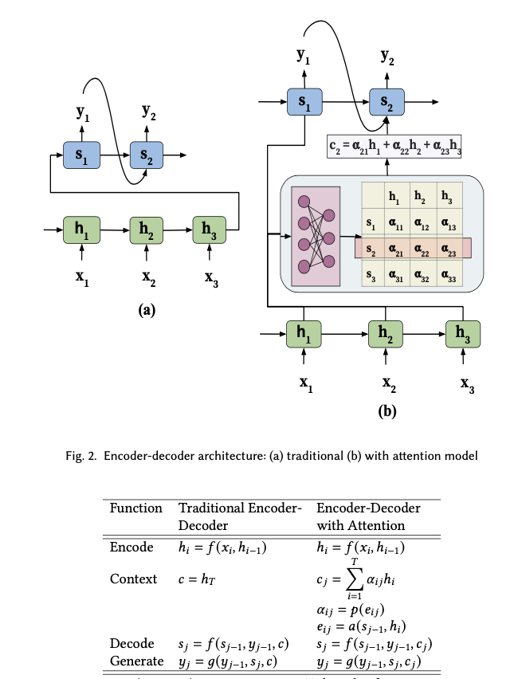

# 注意力机制论文分析

## 论文出处

An attentive survey of attention model

## 解释

左图是没有注意力机制的传统RNN，右图是有注意力机制的架构。区别在于右图有注意力权重

* c: context vector 上下文向量
* a: 注意力权重
* h：输入序列

s的计算方式如上图所示

注意力权重的计算方式如上图所示。捕捉了h和s之间的关联性。

p(eij) 的计算方式如上图所示。 注意力权重组成的矩阵叫alignment function。 

a(s,h) 代表了 a(K,q)， key代表了重点，query代表了输入（例如问题），value代表了完整的输入， A = Attention。注意力权重需要归一化（softmax）。

实际中的分数可能如下所示：

