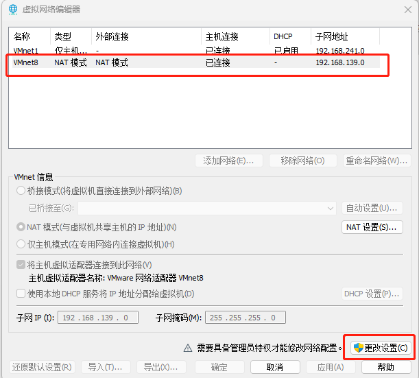
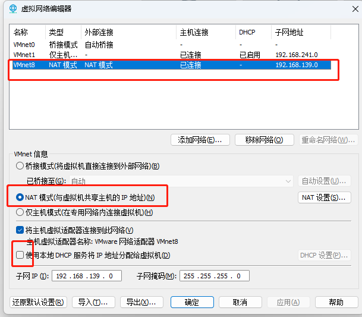
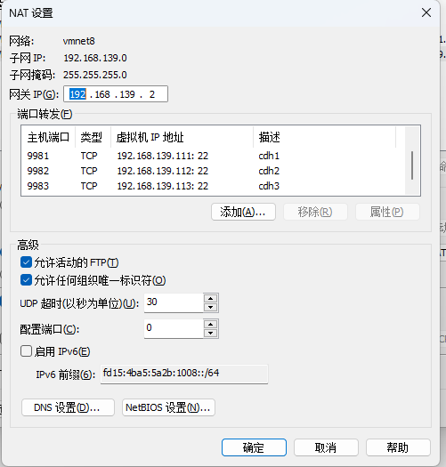
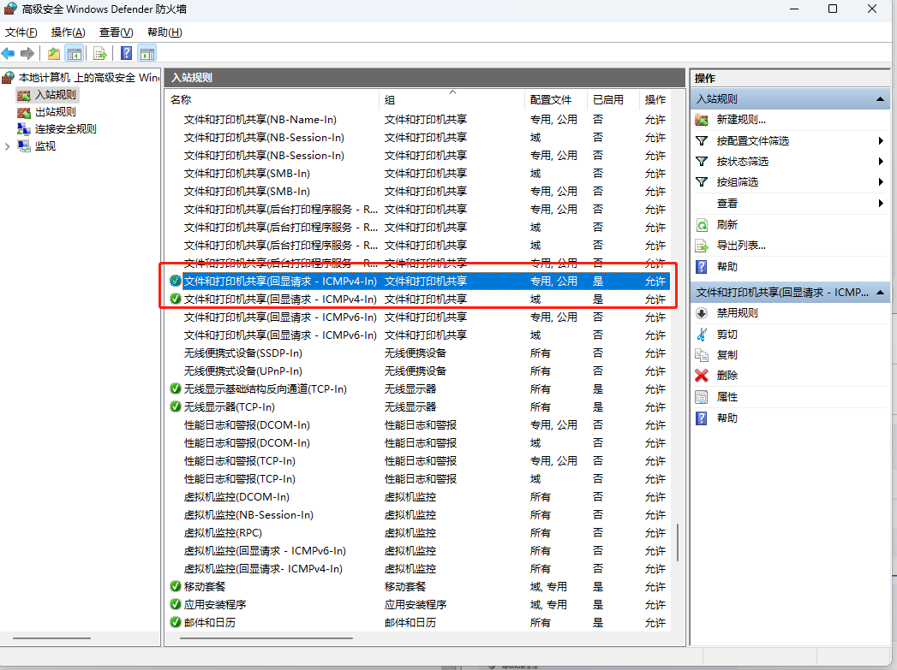
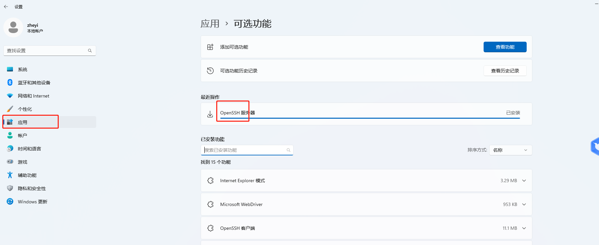

# 同一WiFi下跨服务器连接

## 基础信息

### VM版本

17

### 宿主机IP

- 192.168.2.22
- 192.168.2.12

虚拟机安装在22服务器下

## VM 设置

编辑-》虚拟网络编辑器

## 关闭防火墙

	systemctl stop firewalld.service
	systemctl disable firewalld.service

## 设置出入站规则

同时启动入站和出站

##启动ssh

