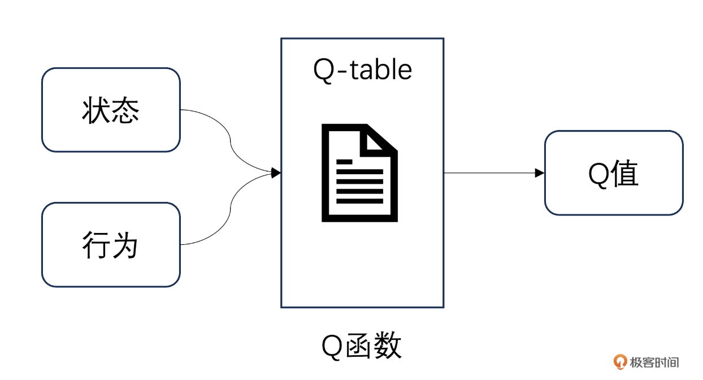

# 基于价值的强化学习：从Q-learning到Deep Q-Network


## 强化学习的价值视角：为什么需要 Q 函数？

在强化学习中，智能体的目标是通过与环境交互最大化累积奖励。但面对复杂环境，我们需要一种工具来评估“在某个状态下采取某个动作是否划算”——这就是价值函数的作用。

智能体处于某状态时，依据当前状态与可选动作，查询  Q-table，就能得到对应的  Q 值。Q-Learning 算法通过不断与环境交互（试错），更新 Q 表中的 Q 值，让智能体逐渐学到：在什么状态下，执行什么动作，能获得更高的长期收益，最终掌握最优决策策略（比如游戏通关、机器人高效导航）。





### 核心概念：奖励、回报与价值函数


##### 🪙 奖励（Reward）
环境对智能体动作的即时反馈，用 $R_t$ 表示。  
例如：在游戏中吃到金币得 10 分，碰到敌人扣 50 分。

---

##### 🎯 回报（Return）
从当前时刻开始的累积折扣奖励，公式为：

$$
G_t = R_t + \gamma \cdot R_{t+1} + \gamma^2 \cdot R_{t+2} + \cdots + \gamma^{n-t} \cdot R_n
$$

其中，$\gamma$ 是折扣因子（$0 \leq \gamma \leq 1$），用于权衡即时奖励和未来奖励的重要性。  

- 当 $\gamma$ 越接近 1，智能体越重视**长期奖励**；  
- 当 $\gamma$ 越接近 0，智能体越关注**即时奖励**。  

简而言之，回报表示“从现在开始，所有未来奖励的加权总和”。

---

##### ⚙️ 动作价值函数（Q 函数）

在状态 $s$ 采取动作 $a$ 后，遵循策略 $\pi$ 能获得的期望回报，定义为：

$$
Q_{\pi}(s_t, a_t) = \mathbb{E}[U_t \mid S_t = s_t, A_t = a_t]
$$

其中，$Q_{\pi}(s,a)$ 表示“在状态 $s$ 下执行动作 $a$ 的好坏程度”。  

一旦找到最优动作价值函数 $Q_*(s,a)$，智能体在任意状态 $s$ 下，只需选择使 Q 值最大的动作 $a$，即：

$$
a = \arg \max_a Q_*(s,a)
$$

此时的策略称为**最优策略（Optimal Policy）**。

---

##### 🧠 最优动作价值函数（Optimal Q Function）

在所有可能的策略中，能获得的最大 Q 值为：

$$
Q_*(s_t, a_t) = \max_{\pi} Q_{\pi}(s_t, a_t), \quad \forall s_i \in S, a_t \in A
$$

即：在状态 $s_t$ 下选择动作 $a_t$，经过最优策略后能获得的最高期望回报。

---

##### Q-table

Q-table算法核心更新公式是：
$$
Q(s,a) \leftarrow Q(s,a) + \alpha \big[ r + \gamma \max_{a'} Q(s',a') - Q(s,a) \big]
$$

- $ \alpha $：学习率 (*learning rate*)  

- $ r $：执行动作后的即时奖励 (*reward*)  

- $ \gamma $：折扣因子 (*discount factor*)  

- $ s' $：执行动作后的新状态 (*next state*)

  


### 从 Q-table 到神经网络：Q 函数的表示方法

Q-table 型强化学习算法是指以表格形式表征价值函数的一类强化学习方法，其核心特点是通过结构化表格存储状态 - 动作对的价值信息，因此更适用于状态与动作空间规模较小且离散的问题场景。


这类算法主要涵盖蒙特卡洛（Monte Carlo, MC）算法、时序差分（Temporal Difference, TD）算法等经典方法，它们均以动态规划（Dynamic Programming, DP）思想为理论基础，并在实际应用中实现了针对性优化。


在强化学习框架中，Q 函数是衡量决策价值的关键概念，其核心定义为“在某一特定状态下执行某一动作后所能获得的期望累积奖励”。


Q-table 方法在状态空间和动作空间都很小时，能够取得很好的效果。但是，当状态空间或动作空间很大，甚至连续时，Q-table 会变得非常庞大，导致存储困难，并且需要大量的计算资源来更新 Q 值，这就是所谓的“维度灾难”。而且，由于表格存储的 Q 值是离散的，无法泛化到未见过的状态，这使得学习效率低下。以围棋游戏为例，棋盘有 361 个交叉点，如果我们把每一种局面都建模成一个状态，那么会有 $3^{361}$种状态，这是一个天文数字，我们不可能用表格来存储。


## 时序差分算法：在线学习的核心


### 贝尔曼方程：Q 值更新的数学基础

贝尔曼方程的含义：一个状态（或动作）的价值 = 当前奖励 + 折扣后的未来价值。


#### 状态价值函数 $V_\pi(s)$


$$
V_\pi(s) = \mathbb{E}_\pi[R_t + \gamma V_\pi(S_{t+1}) \mid S_t = s]
$$


含义解释

> “我现在处在状态 $s$，它的价值 = 我马上能拿到的奖励 + 下一步状态的价值（乘上一个折扣系数）。 ”

- $R_t$：当前立刻能拿到的奖励（Immediate reward）  
- $V_\pi(S_{t+1})$：下一状态的价值  
- $\gamma$：折扣因子，$0 \leq \gamma \leq 1$，表示对未来奖励的重视程度  
- $\mathbb{E}$：期望（Expection）


举个例子：投资类比

假设你今天投资获得了：

- 今天的收益：100 元（即时奖励）  
- 明天可能再赚 200 元（未来收益）  
- 但未来收益要打折，例如 $\gamma = 0.9$

则今天的总价值可以写成：

$$
V = 100 + 0.9 \times 200 = 280
$$
也就是说：  
> **今天的价值 = 今天赚的钱 + 明天收益的折现值。**


#### 动作价值函数 $Q_\pi(s, a)$


$$
Q_\pi(s, a) = \mathbb{E}_\pi[R_{t+1} + \gamma Q_\pi(S_{t+1}, A_{t+1}) \mid S_t = s, A_t = a]
$$


🧩 含义解释

> “我现在在状态 $s$ 下执行动作 $a$，  
> 它的价值 = 我马上能获得的奖励 + 下一步状态下的动作价值（乘上折扣因子 $\gamma$）。”

- $R_{t+1}$：当前执行动作后的即时奖励（*Immediate reward*）  
- $Q_\pi(S_{t+1}, A_{t+1})$：下一状态及动作的价值（*Future action value*）  
- $\gamma$：折扣因子，$0 \leq \gamma \leq 1$，表示对未来回报的重视程度  
- $\mathbb{E}$：期望（*Expectation*），表示取平均值，即考虑环境中的随机性  


价值：

> “如果我现在在状态 $s$ 做了动作 $a$，那么这个动作的价值 = 立刻得到的奖励 + 下一步动作能带来的折扣价值。”

换句话说：

> “这一步做得值不值，要看当前收益 + 未来能赚多少。”


##### 通俗理解

可以把 Q 值想成“投资收益”：

- **即时奖励**：今年的分红；

- **未来价值**：未来几年的潜在收益（折扣后加起来）；

- 贝尔曼方程的含义就是：

  > “现在的价值 = 当前分红 + 未来收益的折现值”


### TD 误差：更新 Q 值的依据

**Temporal Difference（时间差分）方法**让智能体能在“没有完整回合”的情况下，就能边走边学、实时更新 Q 值。


背景：Q 值与 V 值的关系。根据定义，状态价值函数 $v_\pi(s)$ 与动作价值函数 $q_\pi(s, a)$ 的关系为：

$$
v_\pi(s) = \sum_a \pi(a|s) \, q_\pi(s, a)
$$
也就是说：

> **状态的价值 = 各动作价值的加权平均**（权重由策略 $\pi$ 决定）。


#### TD 方法的核心思想

传统的 **蒙特卡洛方法（MC）** 必须等一整回合（episode）结束后，才能计算总回报再更新 Q 值。  而 **时间差分方法（TD, Temporal Difference）** 不需要等待整局结束：

> 它可以在每一步交互后，立刻根据“当前奖励 + 下一步的估计”来更新 Q 值。

这就是 **单步采样（one-step update）** 的思想，让智能体能**边走边学**


##### TD 误差（Temporal Difference Error）：

TD 误差表示“预测”和“实际反馈”之间的差距：

$$
\delta_t = r_t + \gamma \max_{a'} Q(s_{t+1}, a') - Q(s_t, a_t)
$$


- $r_t$：当前即时奖励 (*immediate reward*)  
- $\gamma$：折扣因子，$0 \le \gamma \le 1$，决定未来奖励的重要性  
- $\max_{a'} Q(s_{t+1}, a')$：下一状态中最好的动作价值（未来收益）  
- $Q(s_t, a_t)$：当前状态动作的预测值  
- $\delta_t$：表示“我预测的 Q 值”和“下一步实际反馈”之间的偏差  


#### Q 值的更新公式

用 TD 误差来更新 Q 值：

$$
Q(s_t, a_t) \leftarrow Q(s_t, a_t) + \alpha \, \delta_t
$$

其中：

- $\alpha$：学习率 (*learning rate*)，控制每次更新的步长  
- $\delta_t$：时间差分误差（刚刚计算出来的差距）

📘 **直观解释：**
> 如果预测值比实际值低（低估），就上调一点；  
> 如果预测值比实际值高（高估），就下调一点。  
> ——这就是“边走边修正预测”的思想。


#### TD 方法与 MC 方法的对比

| 方法               | 更新时机                   | 优点                   | 缺点                     |
| ------------------ | -------------------------- | ---------------------- | ------------------------ |
| **TD（时间差分）** | 每一步都能更新（在线学习） | 适合连续任务，学习更快 | 依赖下一步预测，可能带偏 |
| **MC（蒙特卡洛）** | 必须等完整一回合结束       | 基于真实回报，估计无偏 | 学习慢，不能用于持续任务 |


##### 类比理解

你可以把 TD 理解成：
> “每天根据市场行情，实时调整股票估值。”

而 MC 方法则像：
> “等公司一整年财报出来，再重新评估价值。”


### Q-Learning：表格型价值学习算法

Q-learning 是最经典的基于价值（Value-based）的强化学习算法之一。  它的目标是直接学习最优动作价值函数 $Q_*(s, a)$，而不依赖于特定策略。


####  Q-learning 的核心思想

Q-learning 的核心是维护一张 **Q 表（Q-table）**，  表中存储了所有状态–动作对应的 $Q$ 值（即每个状态下做每个动作的“好坏程度”）。  智能体通过不断与环境交互、更新表格，从而学到最优决策策略。

Q-learning 的学习遵循一个「**尝试 → 错误 → 修正**」的循环机制：

1. 在当前状态下，根据 Q 表选择一个动作；  
2. 执行动作，获得奖励 $R_t$，并到达新状态 $S_{t+1}$；  
3. 根据 TD 误差更新 Q 表；  
4. 重复上述过程，直到 Q 表收敛（即学到稳定策略）。


参数解释

- $\alpha$：学习率（*learning rate*），控制每次更新的幅度，$0 < \alpha \le 1$  
- $\gamma$：折扣因子（*discount factor*），$0 \le \gamma \le 1$，表示对未来奖励的重视程度  
- $\max_a Q(s_{t+1}, a)$：在下一个状态 $s_{t+1}$ 中可获得的最大 Q 值（未来最优动作价值）  


##### 💡 通俗理解

> Q-learning 就像一个“试错学习者”：  
> 每次根据经验修正自己对环境的理解，让 Q 表越来越准确。

可以把它看作是：
> “当前估计 = 当前估计 + 学习率 ×（实际反馈 − 当前估计）”

也就是说：
- 如果这次的结果比预期更好（奖励高） → 就调高 Q 值；  
- 如果结果比预期差 → 就调低 Q 值。 


#### Q-learning 的更新公式

Q-learning 使用时间差分（Temporal Difference, TD）方法进行更新，更新公式为：

$$
Q(s_t, a_t) \leftarrow Q(s_t, a_t) + \alpha \Big[ R_t + \gamma \max_a Q(s_{t+1}, a) - Q(s_t, a_t) \Big]
$$

其中：

- $\alpha$：学习率（*learning rate*），$0 < \alpha \le 1$，控制每次更新的幅度；
- $\gamma$：折扣因子（*discount factor*），$0 \le \gamma \le 1$，表示对未来奖励的重视程度；
- $\max_a Q(s_{t+1}, a)$：表示下一状态的最优动作价值


#### Q-learning 算法流程

Q-learning 的整体流程如下：

1. **初始化 Q 表格**：  
   对所有状态–动作对 $(s, a)$，设置初始 Q 值为 0 或随机小数。

2. **对于每个 episode（即一轮游戏 / 一次任务）**：
   - 从初始状态 $s$ 开始；
   - **重复以下步骤，直到到达终止状态：**
     
     1. **动作选择（Action Selection）**  
        使用 $\varepsilon$-greedy 策略选择动作：  
        - 以概率 $1 - \varepsilon$ 选择当前 Q 值最大的动作（利用）；  
        - 以概率 $\varepsilon$ 选择随机动作（探索）。
     
     2. **执行动作（Action Execution）**  
        执行动作 $a$，观察即时奖励 $r$，并转移到新状态 $s'$。

     3. **更新 Q 值（Q Update）**  
        根据 Q-learning 更新公式：
        $$
        Q(s, a) \leftarrow Q(s, a) + \alpha \Big[ r + \gamma \max_{a'} Q(s', a') - Q(s, a) \Big]
        $$

     4. **状态转移（State Transition）**  
        令 $s \leftarrow s'$。

3. **重复多轮 episode**，直到 Q 表收敛或达到最大轮次。


### Q-learning 代码实战：网络世界


```python
import numpy as np

# 1. 定义网格世界环境
class GridWorldEnv:
    def __init__(self):
        self.grid_size = 5  # 5x5网格
        self.start_state = (0, 0)  # 起点
        self.target_state = (4, 4)  # 终点
        self.actions = ['up', 'down', 'left', 'right']  # 四个动作
        
    def step(self, state, action):
        x, y = state
        # 根据动作计算新位置
        if action == 'up':
            x = max(x - 1, 0)
        elif action == 'down':
            x = min(x + 1, self.grid_size - 1)
        elif action == 'left':
            y = max(y - 1, 0)
        elif action == 'right':
            y = min(y + 1, self.grid_size - 1)
            
        next_state = (x, y)
        # 计算奖励：到达终点+10，否则-1
        reward = 10 if next_state == self.target_state else -1
        return next_state, reward

# 2. 初始化Q表格
def init_q_table(env):
    state_count = env.grid_size * env.grid_size  # 状态数量
    action_count = len(env.actions)  # 动作数量
    return np.zeros((state_count, action_count))  # 初始化Q表格为全0

# 3. 状态转换为索引（方便Q表格存储）
def state_to_index(state, env):
    return state[0] * env.grid_size + state[1]

# 4. Q-learning训练过程
def q_learning(env, q_table, num_episodes=1000, alpha=0.1, gamma=0.9, epsilon=0.1):
    for episode in range(num_episodes):
        state = env.start_state  # 每个episode从起点开始
        while state != env.target_state:  # 直到到达终点
            state_idx = state_to_index(state, env)
            
            # ε-greedy策略选择动作：有ε概率随机探索，1-ε概率选最优动作
            if np.random.uniform(0, 1) < epsilon:
                action_idx = np.random.choice(len(env.actions))  # 随机选择动作
            else:
                action_idx = np.argmax(q_table[state_idx, :])  # 选择Q值最大的动作
                
            action = env.actions[action_idx]
            next_state, reward = env.step(state, action)  # 执行动作，获取反馈
            next_state_idx = state_to_index(next_state, env)
            
            # 计算目标Q值和TD误差
            target = reward + gamma * np.max(q_table[next_state_idx, :])
            td_error = q_table[state_idx, action_idx] - target
            
            # 更新Q值
            q_table[state_idx, action_idx] -= alpha * td_error
            
            state = next_state  # 进入下一个状态
    return q_table

# 5. 运行程序
if __name__ == "__main__":
    env = GridWorldEnv()   #5×5 的网格世界；
    q_table = init_q_table(env)
    trained_q_table = q_learning(env, q_table)
    
    print("训练后的Q表（部分）：")
    print(trained_q_table[:5])  # 打印前5个状态的Q值
```

打印：

```python
训练后的Q表（部分）：
[[-1.59604574 -1.8836213  -1.5174602  -0.434062  ]
 [-0.51221212  0.19405235 -1.48644697  0.62882   ]
 [ 0.45340328  1.8098     -0.54060472 -0.98796442]
 [-1.12801184 -1.12703318  0.42700394 -1.11108532]
 [-0.67934652 -0.59210281 -0.72796123 -0.67934652]]
```

解释：

一个完整的 **Q-learning 算法示例**，在一个 5×5 的网格世界（GridWorld）中训练智能体从起点走到终点。


训练后的 Q 表中，每个数值代表对应状态 - 动作对的价值。观察结果你会发现：

- 越靠近终点的状态，Q 值越高（因为离奖励更近）
- 指向终点方向的动作 Q 值更高（算法学会了最优路径）
- 边缘状态的“撞墙动作” Q 值较低（算法学会避免无效动作）


## 从 Q-learning 到 DQN：解决高维状态问题

**一句话解释：**

> **DQN = 用神经网络替代 Q-learning 里的 Q 表，把“看图做决策”这种高维问题也能学会。**

它解决了：

- Q-learning 表太大放不下
- Atari 这种输入是图像（像素 84×84×4），无法用表存


####  为什么需要 DQN？

传统 Q-learning 需要维护一个巨大的 Q 表：

```
Q[s][a]
```

如果 s 是图像，那 Q 表会大到爆炸。
 所以 DQN 用一个神经网络来拟合：

```
Q(s, a) ≈ NeuralNetwork(s)[a]
```

也就是说：
**网络输入是状态（图片），输出是每个动作的 Q 值。**

Q-Table 是“离散存储”，神经网络是“连续逼近”，但它们 **干的是同一件事**：给定状态 s 和动作 a，输出 Q 值。


#### DQN 的关键创新（总结 + 深度解释）

DQN 之所以成功，就是因为它补上了 Q-learning 在神经网络时代的三大致命问题：

1. **训练样本之间强相关 → 学不稳**
2. **训练目标会跟着网络参数乱动 → 发散**
3. **如何定义 Q 网络的训练目标**


##### （1）经验回放（Experience Replay）

- 将交互经验 $(s, a, r, s')$ 存储到回放池；
- 训练时从回放池中随机采样，打破样本之间的时序相关性；
- 提高数据利用率，让每条经验可以被多次使用。


##### （2）目标网络（Target Network）

- 使用两个网络：估计网络 $Q$ 和目标网络 $Q'$；
- 目标网络参数 $\theta'$ 周期性地从估计网络 $\theta$ 复制，而非每步更新；
- 解决 Q 值更新中的“移动目标”问题，提高训练的稳定性。

TD 目标为：

$$
y = r + \gamma \max_{a'} Q'(s', a'; \theta')
$$
如果目标也随着网络每一步更新，目标值会跟着参数一起变化，从而导致不稳定甚至发散。  通过冻结目标网络，可以让训练目标保持稳定，使 Q 网络更容易收敛。


##### （3）损失函数设计（TD Loss）


DQN 的损失函数定义为预测 Q 值与目标 Q 值的平方误差：

$$
L(\theta)
= \mathbb{E}_{(s,a,r,s') \sim D}
\left[
\left(Q(s,a;\theta) - y\right)^2
\right]
$$

其中 TD 目标：

$$
y = r + \gamma \max_{a'} Q'(s', a'; \theta')
$$

- $Q(s,a;\theta)$：估计网络输出的 Q 值  
- $Q'(s',a';\theta')$：目标网络提供的稳定目标  
- 最终通过梯度下降更新参数 $\theta$

这个损失函数来源于 Bellman 最优方程，通过最小化预测值与 TD 目标的差异，使神经网络逐步逼近最优 Q 函数 $Q^\*(s,a)$。
