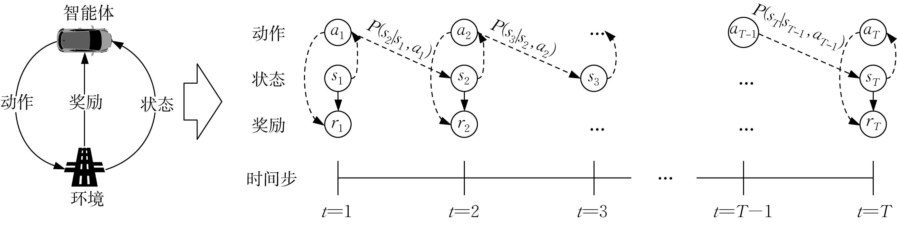
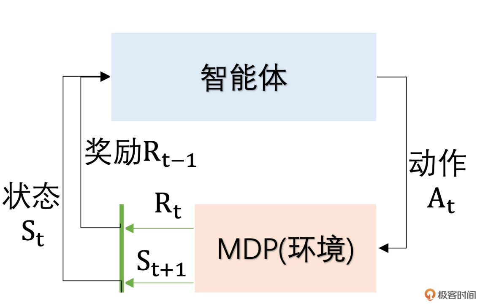
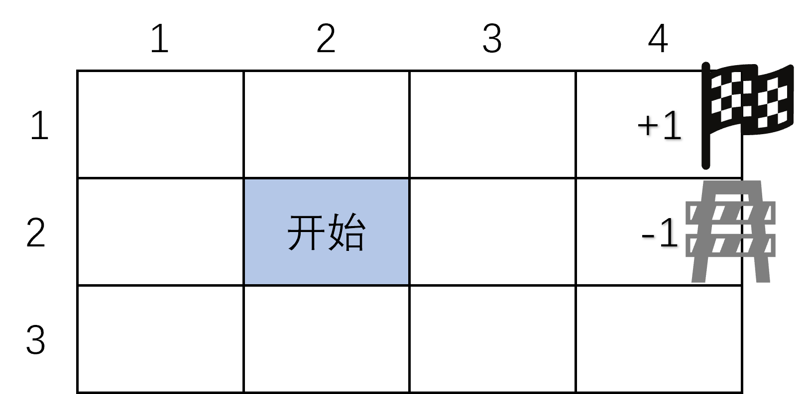

# 强化学习的数学基础：马尔可夫决策过程


强化学习（Reinforcement Learning，RL）是一种植根于试错学习（Trial-and-error learning）思想的智能化方法，其核心逻辑是通过与环境的持续交互不断优化系统决策能力，而这一技术的形成与发展走过了漫长的演进历程。


## 🧍‍♂️ 生活中的例子：你在迷宫里找出口


假设你是一个玩家，被困在一个迷宫中。
 每一时刻你都要选择一个动作，比如：

- 向上走
- 向下走
- 向左走
- 向右走

当你走完一步后：

- 你会进入新的位置（状态）；
- 可能得到奖励（比如找到出口奖励 +10，撞墙 -1）；
- 然后继续做下一步。

这整个过程，就是一个马尔可夫决策过程（Markov Decision Processes，MDP）。


## 🧱 MDP 的五个关键组成部分


| 元素                                      | 含义               | 例子（迷宫游戏）           |
| ----------------------------------------- | ------------------ | -------------------------- |
| **S：状态（State）**                      | 你现在在哪         | 当前你在迷宫的第(3,4)格    |
| **A：动作（Action）**                     | 你可以做什么       | 向上、下、左、右走         |
| **P：转移概率（Transition Probability）** | 做动作后，会到哪里 | 向右走有90%成功、10%滑倒   |
| **R：奖励（Reward）**                     | 每一步的回报       | 找到出口 +10，撞墙 -1      |
| **γ：折扣因子（Discount factor）**        | 未来奖励的重要性   | 0.9 表示“越早拿到奖励越好” |


## 🔁 “马尔可夫”是什么意思？

“马尔可夫”这个词的意思是：

> 未来只取决于**当前状态**，而与**过去经历**无关。

比如：

> 你现在在迷宫第(3,4)格，只要知道这一格在哪，就能决定下一步的策略；
>  不需要知道你之前是怎么走来的。

这就叫做**马尔可夫性质（Markov Property）**


## 决策过程的目标是什么？

智能体的目标是：

> 找到一个策略（Policy），告诉自己在每个状态下该怎么行动，
>  从而**让长期的总奖励最高**。

比如：

> “在空地上尽量往右走，一旦看到墙就绕开”
>  这可能是一种策略（policy）。


## 🧮 数学上怎么写？

一个 MDP 通常写成一个五元组：
$$
\text{MDP} = (S, A, P, R, \gamma)
$$

其中：
- \( S \)：状态集合（State）
- \( A \)：动作集合（Action）
- \( P(s'|s,a) \)：状态转移概率，表示在状态 \( s \) 采取动作 \( a \) 后转移到新状态 \( s' \) 的概率
- \( R(s,a) \)：奖励函数，表示在状态 \( s \) 下执行动作 \( a \) 获得的即时奖励
- \( \gamma \)：折扣因子（Discount Factor），用于平衡“当前奖励”和“未来奖励”的重要性


## 马尔科夫决策过程



##### 🧩 一、交互过程（左图）

- 智能体接收当前状态 $s_t$；
- 按策略 $\pi(a_t|s_t)$ 选择一个动作 $a_t$；
- 环境反馈 **奖励** $r_t$；
- 环境进入 **新状态** $s_{t+1}$。


##### ⏳ 二、时间推演（右图）

$$
s_1 \xRightarrow[a_1,\, r_1]{} 
s_2 \xRightarrow[a_2,\, r_2]{} 
s_3 \xRightarrow[a_3,\, r_3]{} 
\cdots
$$


箭头上的 $P(s_{t+1} \mid s_t, a_t)$ 表示：

> 下一个状态只与**当前状态**和**动作**有关，  
> 与更早的历史无关。

这就是 **马尔可夫性（Markov Property）**。


##### 🎯 三、智能体的目标

智能体希望让未来的 **总奖励（累计折扣回报）** 最大：

$$
G_t = \sum_{k=0}^{\infty} \gamma^k r_{t+k}
$$

其中：

- $r_t$：当前奖励
- $\gamma$：**折扣因子**，取值 $0<\gamma<1$
  - $\gamma$ 越大 → 更重视未来奖励
  - $\gamma$ 越小 → 更关注眼前利益


##### 关键参数解释：折扣因子

如果智能体玩游戏时，

- 现在拿金币 +10+10+10，
- 但继续冒险可能未来拿 +100+100+100，

当折扣因子较大时，它会选择**等待更高的未来奖励**；当折扣因子较小时，它会**立刻拿现在的金币**。

| 应用类型                       | 典型 γ 值 | 说明                       |
| ------------------------------ | --------- | -------------------------- |
| 即时反应类（如自动避障、对战） | 0.8–0.95  | 更关注短期生存或反应速度   |
| 策略规划类（如围棋、路径规划） | 0.95–0.99 | 需要考虑长远收益           |
| 长期稳定控制（如自动驾驶巡航） | 0.99 以上 | 强调长期安全和稳定性       |
| 极端风险任务                   | 0.7–0.9   | 降低对未来不确定奖励的依赖 |


##### **关键参数解释：当前奖励**

奖励**不是模型学出来的**，而是由**任务设计者（你）** 通过规则定义的。奖励的计算方式依赖于任务目标、环境状态和动作结果。举例：

| 场景         | 状态 $s_t$               | 动作 $a_t$       | 奖励 $r_t$ 的计算方式                                        |
| ------------ | ------------------------ | ---------------- | ------------------------------------------------------------ |
| 🏎️ 自动驾驶   | 当前速度、车距、车道偏移 | 转向、加速、刹车 | 如果车在车道中间且平稳行驶 → +1；若偏离或碰撞 → -10          |
| 🎮 游戏AI     | 角色位置、敌人状态       | 移动、攻击       | 打败敌人 +10；受伤 -5；死亡 -100                             |
| 📦 仓储机器人 | 货架坐标、目标点         | 前进、转向、搬运 | 成功送达包裹 +20；碰撞 -10                                   |
| 💬 智能客服   | 当前对话状态             | 回复一句话       | 用户满意度高 +1；用户结束对话 -5                             |
| 💹 投资决策   | 当前资产、市场状态       | 买入、卖出       | 当期收益率作为奖励： $ r_t = \text{profit}(t) - \text{cost}(t) $ |


## 强化学习的基本循环

- 智能体处于某个环境状态中；
- 智能体执行特定动作；
- 环境状态随之改变；
- 环境给予智能体相应奖励；
- 智能体根据奖励调整策略。





## 直观理解




机器人在网格世界中，从任意一点出发，目的地是网格中的 <4,1>，其回报为 +1。在该问题中，马尔可夫决策过程的各元组可以建模如下：

- **S**：状态集合，对应网格中 12 个可能位置。  
- **A**：动作集合，机器人可向东 (E)、南 (S)、西 (W)、北 (N) 移动。  
- **P($S_{t+1} \mid S_t, a$)**：状态转移函数，表示在状态 $S_t$ 执行动作 $a$ 后转移到 $S_{t+1}$ 的概率。  
- **R($s, a$)**：奖励函数，表示在状态 $s$ 下执行动作 $a$ 时环境给予的即时奖励。规则如下：  
  - 目标格 <1,4>：奖励 $r = +1$。  
  - 危险格 <2,4>：惩罚 $r = -1$。  
  - 其他格：$r = -0.02$（模拟能量消耗）。  
  - 蓝色格：障碍物（不可进入）。  
- **γ**：折扣因子，取 $\gamma = 0.9$。


代码实现：

```python
import numpy as np

# 定义网格世界的状态，用坐标 (行, 列) 表示，这里行范围 1-3，列范围 1-4
states = [(i, j) for i in range(1, 4) for j in range(1, 5)]
# 定义动作，上下左右，用字典表示方向变化
actions = {
    'up': (-1, 0),
    'down': (1, 0),
    'left': (0, -1),
    'right': (0, 1)
}
# 定义奖励，根据你给的网格，(1,4) 奖励 +1，(2,4) 奖励 -1，其他位置可先设为 0，后续也可调整
rewards = np.zeros((3, 4))
rewards[0, 3] = 1  # (1,4) 对应数组索引 (0,3)
rewards[1, 3] = -1  # (2,4) 对应数组索引 (1,3)

# 定义障碍物坐标(2, 4)
obstacles = [(2, 4)]

# 状态转移函数，输入当前状态和动作，返回下一个状态（处理边界和障碍物）
def transition(state, action):
    i, j = state
    di, dj = actions[action]
    new_i, new_j = i + di, j + dj
    
    # 检查是否在网格内，行 1-3 对应索引 0-2，列 1-4 对应索引 0-3
    if 1 <= new_i <= 3 and 1 <= new_j <= 4:
        # 检查是否为障碍物
        if (new_i, new_j) not in obstacles:
            return (new_i, new_j)
    # 如果超出边界或遇到障碍物，留在原地
    return (i, j)

# 简单的随机策略，每个状态下随机选择一个动作
def random_policy(state):
    return np.random.choice(list(actions.keys()))

# 模拟智能体在网格中按照策略行动的过程，这里简单跑几步示例
current_state = (2, 2)  # 起始点修改为(2,2)，对应网格中的S位置
num_steps = 5
for _ in range(num_steps):
    action = random_policy(current_state)
    next_state = transition(current_state, action)
    reward = rewards[next_state[0] - 1, next_state[1] - 1]  # 转换为数组索引
    print(f"当前状态: {current_state}, 动作: {action}, 下一个状态: {next_state}, 奖励: {reward}")
    current_state = next_state
```


打印：

```
当前状态: (2, 2), 动作: right, 下一个状态: (2, 3), 奖励: 0.0
当前状态: (2, 3), 动作: up, 下一个状态: (1, 3), 奖励: 0.0
当前状态: (1, 3), 动作: down, 下一个状态: (2, 3), 奖励: 0.0
当前状态: (2, 3), 动作: left, 下一个状态: (2, 2), 奖励: 0.0
当前状态: (2, 2), 动作: up, 下一个状态: (1, 2), 奖励: 0.0
```


##  升级MDP：价值迭代算法


#### 定义网络环境参数：

```python
import numpy as np

# 网格行数和列数
rows = 3
cols = 4

# 定义奖励矩阵，对应网格中每个状态的即时奖励
rewards = np.array([
    [-0.02, -0.02, -0.02, 1],
    [-0.02, -0.02, -0.02, -np.inf],  # 障碍物区域设为负无穷大表示不可达
    [-0.02, -0.02, -0.02, -0.02]
])

# 定义动作，上下左右，分别用 0,1,2,3 表示
actions = [0, 1, 2, 3]  # 0:上, 1:下, 2:左, 3:右
action_symbols = ["↑", "↓", "←", "→"]  # 用于展示策略

# 折扣因子
gamma = 0.9

# 价值函数初始化，初始时所有状态价值为 0
value_function = np.zeros((rows, cols))
```


#### 定义状态转移函数：

```python
def transition(state, action):
    """
    状态转移函数，根据当前状态和动作，返回下一个状态
    :param state: 当前状态 (row, col)
    :param action: 动作
    :return: 下一个状态 (new_row, new_col)
    """
    row, col = state
    if action == 0:  # 上
        new_row = max(row - 1, 0)
        new_col = col
    elif action == 1:  # 下
        new_row = min(row + 1, rows - 1)
        new_col = col
    elif action == 2:  # 左
        new_row = row
        new_col = max(col - 1, 0)
    else:  # 右
        new_row = row
        new_col = min(col + 1, cols - 1)

    # 检查是否是障碍区域（这里简单判断奖励为负无穷的情况，实际可根据需求调整）
    if rewards[new_row, new_col] == -np.inf:
        return (row, col)  # 留在原状态
    return (new_row, new_col)
```


#### 价值迭代算法实现：

```python
# 价值迭代迭代次数，相邻两次迭代的价值函数差值小于某个阈值（如 1e-6)时，可认为收敛
iterations = 100

for _ in range(iterations):  # 进行多次迭代，逐步逼近最优价值函数
    new_value_function = np.copy(value_function)  # 复制当前价值函数，存放本轮更新结果
    for i in range(rows):  # 遍历每一行
        for j in range(cols):  # 遍历每一列（即每个状态）
            if rewards[i, j] == -np.inf:  # 如果该位置是障碍物
                continue  # 跳过障碍区域，不更新
            q_values = []  # 存放当前状态下各动作对应的Q值
            for action in actions:  # 遍历所有可能动作
                next_state = transition((i, j), action)  # 根据动作获取下一个状态
                next_row, next_col = next_state  # 拆解行列坐标
                q_value = rewards[i, j] + gamma * value_function[next_row, next_col]  # Q值 = 当前奖励 + 折扣后的下一状态价值
                q_values.append(q_value)  # 保存每个动作的Q值
            new_value_function[i, j] = max(q_values)  # 当前状态的价值取最大Q值（最优动作对应的回报）
    value_function = new_value_function  # 更新价值函数为本轮结果

```


#### 获取最优策略：

```python
# 提取最优策略
optimal_policy = np.zeros((rows, cols), dtype=int)
for i in range(rows):
    for j in range(cols):
        if rewards[i, j] == -np.inf:
            optimal_policy[i, j] = -1  # 障碍区域标记
            continue
        q_values = []
        for action in actions:
            next_state = transition((i, j), action)
            next_row, next_col = next_state
            q_value = rewards[i, j] + gamma * value_function[next_row, next_col]
            q_values.append(q_value)
        optimal_policy[i, j] = np.argmax(q_values)
```


#### 结果展示：

```python
# 展示价值函数
print("价值函数:")
print(value_function)

# 找到并展示一条最优路径
def find_optimal_path(start_state, goal_state):
    """
    根据最优策略找到从起始状态到目标状态的路径
    :param start_state: 起始状态 (row, col)
    :param goal_state: 目标状态 (row, col)
    :return: 路径列表，每个元素是 (状态, 动作)
    """
    path = []
    current_state = start_state
    
    # 防止无限循环，设置最大步数
    max_steps = rows * cols
    steps = 0
    
    while current_state != goal_state and steps < max_steps:
        row, col = current_state
        action = optimal_policy[row, col]
        
        # 如果是障碍物，跳出循环
        if action == -1:
            break
            
        # 记录当前状态和动作
        path.append((current_state, action_symbols[action]))
        
        # 移动到下一个状态
        current_state = transition(current_state, action)
        steps += 1
    
    # 添加目标状态
    if current_state == goal_state:
        path.append((current_state, "目标"))
    
    return path

# 设置起始点和目标点
start_state = (1, 1)  # (2,2) 对应数组索引 (1,1)
goal_state = (0, 3)   # (1,4) 对应数组索引 (0,3)

# 找到最优路径
optimal_path = find_optimal_path(start_state, goal_state)

# 创建一个空的网格，用于显示最优路径
path_grid = np.full((rows, cols), '.', dtype=str)  # 使用点表示未访问的格子

# 标记障碍物
for i in range(rows):
    for j in range(cols):
        if rewards[i, j] == -np.inf:
            path_grid[i, j] = 'X'  # 障碍物

# 标记路径上的动作
for i in range(len(optimal_path) - 1):
    state, action = optimal_path[i]
    row, col = state
    path_grid[row, col] = action

# 标记起点和终点
if optimal_path:
    start_row, start_col = optimal_path[0][0]
    path_grid[start_row, start_col] = 'S'  # 起点
    
    end_row, end_col = optimal_path[-1][0]
    path_grid[end_row, end_col] = 'G'  # 终点

# 展示价值函数
print("价值函数:")
print(value_function)

# 展示最优路径
print("\n最优路径:")
for i, (state, action) in enumerate(optimal_path):
    if i == 0:
        print(f"起始点 ({state[0]+1},{state[1]+1}) -> {action}")
    elif action == "目标":
        print(f"到达目标 ({state[0]+1},{state[1]+1})")
    else:
        print(f"({optimal_path[i-1][0][0]+1},{optimal_path[i-1][0][1]+1}) -> {action} -> ({state[0]+1},{state[1]+1})")

# 展示最优策略网格
print("\n最优策略网格 (S=起点, G=目标, X=障碍物, .=未访问):")
for row in path_grid:
    print(' '.join(row))

# 最优策略网格 (S=起点, G=目标, X=障碍物, .=未访问):
# . → → G
# . S . X
# . . . .
```


上述代码实现了一个基本的马尔可夫决策过程在给定网格环境中的价值迭代求解。代码中：

- 首先定义了网格的基本参数，如行数、列数、奖励矩阵、动作集合等；
- 状态转移函数用于根据当前状态和动作确定下一个状态；
- 通过价值迭代算法不断更新价值函数，使其收敛到最优价值函数；
- 最后根据最优价值函数提取出每个状态下的最优策略并进行展示。


打印：

```python
价值函数:
[[7.23553439 8.06173439 8.97973439 9.99973439]
 [6.49195439 7.23553439 8.06173439 0.        ]
 [5.82273239 6.49195439 7.23553439 6.49195439]]
价值函数:
[[7.23553439 8.06173439 8.97973439 9.99973439]
 [6.49195439 7.23553439 8.06173439 0.        ]
 [5.82273239 6.49195439 7.23553439 6.49195439]]

最优路径:
起始点 (2,2) -> ↑
(2,2) -> → -> (1,2)
(1,2) -> → -> (1,3)
到达目标 (1,4)

最优策略网格 (S=起点, G=目标, X=障碍物, .=未访问):
. → → G
. S . X
. . . .
```


## 对比

| 对比项           | 方法1：随机策略采样                                  | 方法2：最优策略规划                                          |
| ---------------- | ---------------------------------------------------- | ------------------------------------------------------------ |
| **核心目的**     | 演示智能体与环境交互过程（状态、动作、奖励）         | 根据最优策略展示从起点到目标的最优路径                       |
| **依赖前提**     | 不需要价值函数或策略，只需定义状态、动作、奖励       | 必须已知 `value_function` 和 `optimal_policy`（通常来自值迭代或策略迭代） |
| **策略类型**     | 随机策略（`random_policy`）                          | 最优策略（`optimal_policy`）                                 |
| **动作表示**     | 字符串形式：`'up'`, `'down'`, `'left'`, `'right'`    | 索引形式（整数），通过 `action_symbols` 转换为箭头符号       |
| **坐标体系**     | 1-based（如 (2,2)，访问数组需 -1）                   | 0-based（直接使用数组索引）                                  |
| **障碍与终止**   | `obstacles` 列表控制障碍（原地不动），无明确终止条件 | 通过 `rewards==-np.inf` 标记障碍，`goal_state` 为显式终止状态 |
| **输出内容**     | 打印每一步的 (状态, 动作, 奖励)                      | 打印价值函数、最优路径、网格可视化（S/G/X/箭头）             |
| **用途定位**     | 用于**验证环境交互是否正确**，测试转移逻辑           | 用于**展示最优解与策略效果**，验证算法结果                   |
| **是否为 MDP**   | ✅ 是（确定性转移 + 随机策略）                        | ✅ 是（确定性转移 + 最优策略）                                |
| **典型输出示例** | 当前状态→动作→下个状态→奖励                          | 最优路径序列 + 策略网格（S=起点, G=目标, X=障碍）            |
