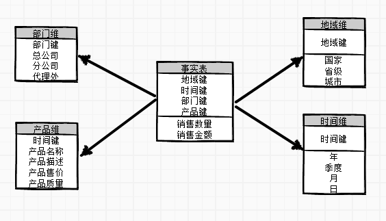
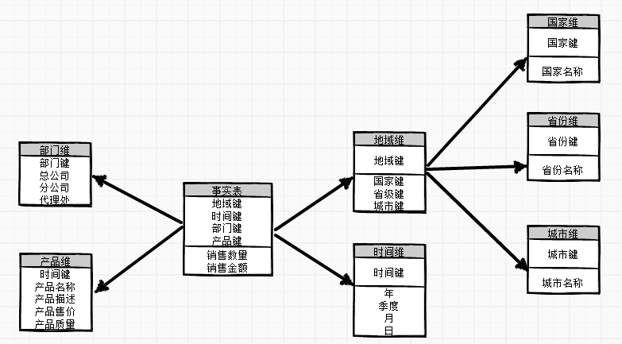
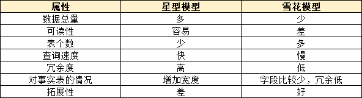

#星型模型和雪花模型的区别

## 星型模型

是一种非正规化的结构，多维数据集的每一个维度都直接与事实表相来连接，不存在渐变维度，所以数据有一定的冗余。

## 雪花模型

当有一个或多个维度表没有直接连接到事实表上，而是通过其他维度表连接到事实表上时，其图解就像多个雪花连接在一起，故称雪花模型。雪花模型去除了数据冗余。

## 比较

1）星型模型因为数据的冗余所以很多统计查询不需要做外部的连接，因此一般情况下效率比雪花模型要高。

2）星型模型不用考虑很多正规化的因素，设计和实现都比较简单。

3）雪花模型由于去除了冗余，有些统计就需要通过表的连接才能产生，所以效率不一定有星型模型高。

4）正规化也是一种比较复杂的过程，相应的数据库结构设计、数据的ETL、以及后期的维护都要复杂一些。因此在冗余可以接受的前提下，实际运用中星型模型使用更多，也更有效率。

