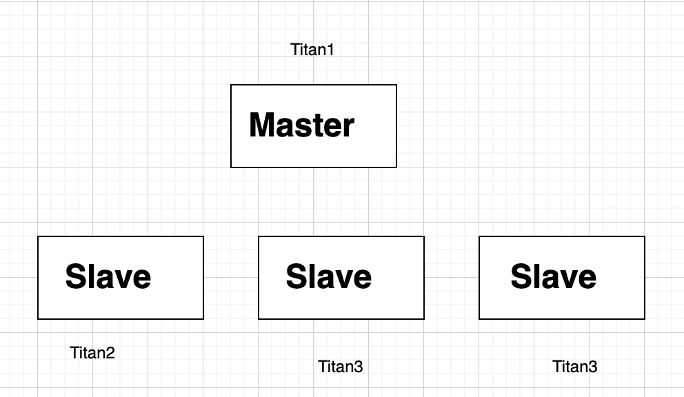
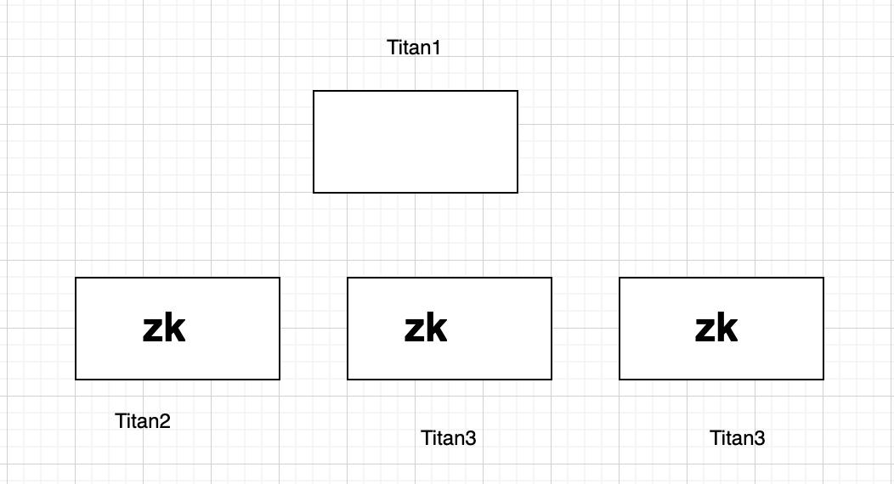
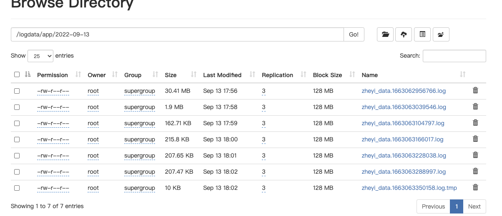

#02. 日志采集

## 安装Flume

登录三台服务器

* titan1: 192.168.2.111  （Main）
* titan2: 192.168.2.112 （HA）
* titan3: 192.168.2.113 （HA）

### 解压

	sudo mkdir -p /opt/apps
	#上次flume文件
	
	sudo tar -zxvf apache-flume-1.9.0-bin.tar.gz
	

## 安装 HDFS

在4台服务器上安装HDFS。

* TItan1：Master
* TItan2-4： Slave

确保环境变量已配置

## 安装 ZK

  
## 架构

###总体架构

### 细节

## 文件配置

### 上游配置文件

	cd /home/zheyi/flume/conf

在titan1中创建 

	vim flume_level_1.properties

插入
	
	a1.sources = r1
	a1.channels = c1
	a1.sinks = k1 k2
	
	a1.sources.r1.channels = c1
	a1.sources.r1.type = TAILDIR
	a1.sources.r1.filegroups = g1 g2
	a1.sources.r1.filegroups.g1 = /opt/data/logdata/app/event.*
	a1.sources.r1.filegroups.g2 = /opt/data/logdata/wx/event.*
	a1.sources.r1.headers.g1.datatype = app
	a1.sources.r1.headers.g2.datatype = wx
	a1.sources.r1.batchSize = 100
	
	
	a1.channels.c1.type = file
	a1.channels.c1.checkpointDir = /opt/data/flumedata/file-channel/checkpoint
	a1.channels.c1.dataDirs = /opt/data/flumedata/file-channel/data
	
	a1.sinks.k1.channel = c1
	a1.sinks.k1.type = avro
	a1.sinks.k1.hostname =  titan2
	a1.sinks.k1.port = 41414
	a1.sinks.k1.batch-size = 100
	
	a1.sinks.k2.channel = c1
	a1.sinks.k2.type = avro
	a1.sinks.k2.hostname = titan3
	a1.sinks.k2.port = 41414
	a1.sinks.k2.batch-size = 100
	
	# 定义sink组及其配套的sink处理器
	a1.sinkgroups = g1
	a1.sinkgroups.g1.sinks = k1 k2
	a1.sinkgroups.g1.processor.type = failover
	a1.sinkgroups.g1.processor.priority.k1 = 5
	a1.sinkgroups.g1.processor.priority.k2 = 1
	a1.sinkgroups.g1.processor.maxpenalty = 10000

### 下游配置文件

	cd /home/zheyi/flume/conf

在titan2和titan3中创建

	vim flume_level_2.properties

插入

	a1.sources = r1
	a1.channels = c1
	a1.sinks = k1
	
	a1.sources.r1.channels = c1
	a1.sources.r1.type = avro
	a1.sources.r1.bind = 0.0.0.0
	a1.sources.r1.port = 41414
	a1.sources.r1.batchSize = 100
	
	a1.channels.c1.type = file
	a1.channels.c1.checkpointDir = /opt/data/flumedata/file-channel/checkpoint
	a1.channels.c1.dataDirs = /opt/data/flumedata/file-channel/data
	
	a1.sinks.k1.channel = c1
	a1.sinks.k1.type = hdfs
	a1.sinks.k1.hdfs.path = hdfs://titan1:9000/logdata/%{datatype}/%Y-%m-%d
	a1.sinks.k1.hdfs.filePrefix = zheyi_data
	a1.sinks.k1.hdfs.fileSuffix = .log
	a1.sinks.k1.hdfs.rollInterval = 60
	a1.sinks.k1.hdfs.rollSize = 268435456
	a1.sinks.k1.hdfs.rollCount = 0
	a1.sinks.k1.hdfs.batchSize = 100
	a1.sinks.k1.hdfs.codeC = gzip
	a1.sinks.k1.hdfs.fileType = CompressedStream
	a1.sinks.k1.hdfs.useLocalTimeStamp = true

## 替换Guava包

	cd /home/zheyi/flume/lib
	rm  guava-11.0.2.jar
	cp /home/zheyi/hadoop/share/hadoop/hdfs/lib/guava-27.0-jre.jar /home/zheyi/flume/lib
	
	
## 增加Hadoop包	

	cp /home/zheyi/hadoop/share/hadoop/common/hadoop-common-3.3.4.jar /home/zheyi/flume/lib
	
	cp /home/zheyi/hadoop/share/hadoop/hdfs/hadoop-hdfs-3.3.4.jar /home/zheyi/flume/lib

	cp /home/zheyi/hadoop/share/hadoop/common/lib/commons-configuration2-2.1.1.jar /home/zheyi/flume/lib

	cp /home/zheyi/hadoop/share/hadoop/common/lib/hadoop-auth-3.3.4.jar /home/zheyi/flume/lib
	
	cp /home/zheyi/hadoop/share/hadoop/common/lib/commons-io-2.8.0.jar /home/zheyi/flume/lib
	
	cp /home/zheyi/hadoop/share/hadoop/yarn/timelineservice/lib/htrace-core-3.1.0-incubating.jar /home/zheyi/flume/lib

	cp /home/zheyi/hadoop/share/hadoop/common/lib/woodstox-core-5.3.0.jar /home/zheyi/flume/lib
	
	cp /home/zheyi/hadoop/share/hadoop/common/lib/stax2-api-4.2.1.jar /home/zheyi/flume/lib

	cp /home/zheyi/hadoop/share/hadoop/common/lib/hadoop-shaded-guava-1.1.1.jar /home/zheyi/flume/lib

	cp /home/zheyi/hadoop/share/hadoop/hdfs/lib/listenablefuture-9999.0-empty-to-avoid-conflict-with-guava.jar /home/zheyi/flume/lib
	
	cp /home/zheyi/hadoop/share/hadoop/client/hadoop-client-api-3.3.4.jar /home/zheyi/flume/lib
	
	cp /home/zheyi/hadoop/share/hadoop/client/hadoop-client-runtime-3.3.4.jar /home/zheyi/flume/lib
	
	cp /home/zheyi/hadoop/share/hadoop/client/hadoop-client-minicluster-3.3.4.jar /home/zheyi/flume/lib

## 给HDFS赋权

非常重要，否则会出现权限问题

在titan1-4中：

	 hadoop fs -chmod -R 777 /

## 启动flume

在titan2 和 titan3：

	cd /home/zheyi/flume/bin/
	sudo sh flume-ng agent -c /home/zheyi/flume/conf -f /home/zheyi/flume/conf/flume_level_2.properties -n a1 -Dflume.root.logger=INFO,console & 
	

在 titan1：

	cd /home/zheyi/flume/bin/
	sudo sh flume-ng agent -c /home/zheyi/flume/conf/ -f /home/zheyi/flume/conf/flume_level_1.properties -n a1 -Dflume.root.logger=INFO,console & 

## 结果

