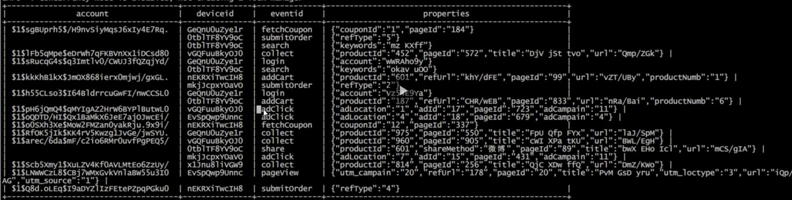

# 04. ODS层日志表数据导入

## 从HDFS中读取app数据

	load data inpath '/logdata/app/2022-09-17' into table ods.mall_app_log_dts partition (dt='2022-09-17');
		

## 从HDFS中读取wx小程序数据

	load data inpath '/logdata/wx/2022-09-17' into table ods.mall_wxapp_log_dts partition (dt='2022-09-17');

## 日志定时任务导入（按需配置）

### app

	vi ods app_dtl.sh

插入

	#!/bin/bash
	
	export HIVE_HOME=/home/zheyi/hive

	dt=$(date --date='1 days ago' +%Y-%m-%d)
	
	if [ $1 ] ; then
	df = $1 
	fi
	
	${HIVE_HOME}/bin/hive -e "load data inpath '/logdata/applog/$(dt)/' into table ods.mall_app_log_dtl partition(dt='$(dt)') "
	
	if [ $? -eq 0 ]; then
	echo "Task successfully completels"
	exit 0
	else
	echo "Task fails"
	exit 1
	fi
	
	
	