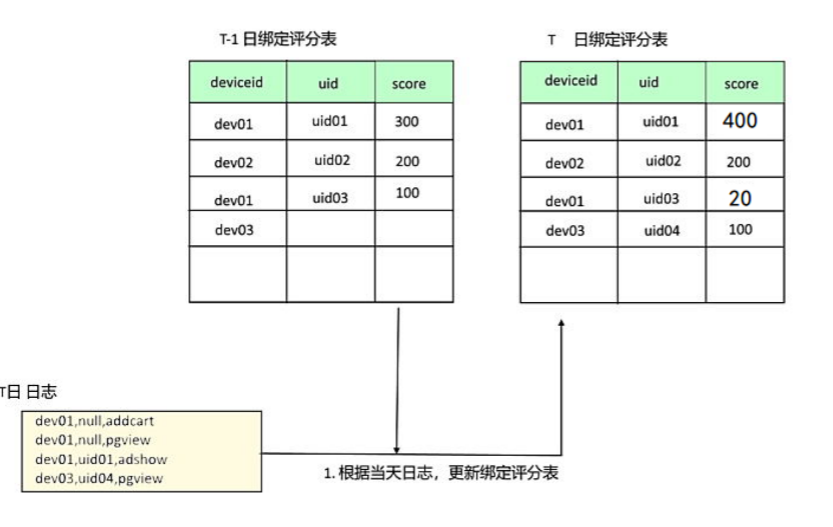
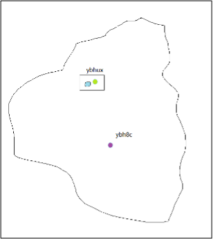

#05. DWD层开发理论

## 储存规划

|  数据类型   | 源表  | 目标表  |
|  ----  | ----  | ----  |
| app端埋点日志  | ods.mall_app_log_dts | dwd.event_mall_app_log_detail |
| wx小程序埋点日志  | ods.mall_wxapp_log_dts | dwd.event_mall_wxapp_log_detail |

## 需求分析

### 清洗过滤

1. 去除json数据体中的废弃字段（前端开发人员在埋点设计方案变更后遗留的无用字段）：
1. 过滤掉json格式不正确的（脏数据）
1. 过滤掉日志中缺少关键字段（deviceid/properties/eventid/sessionid 缺任何一个都不行）的记录！
1. 过滤掉日志中不符合时间段的记录（由于app上报日志可能的延迟，有数据延迟到达）

### 数据解析

将json打平，解析成parquet格式

### SESSION分割

* 对于app日志，由于使用了app会话保持策略，导致app进入后台很长时间后，再恢复前台，依然是同一个session，不符合session分析定义，需要按事件间隔时间切割（业内通用：30分钟）
* 对于wx小程序日志，与app类似，session有效期很长，需要按事件间隔时间切割（业内通用：30分钟）

#### 例子

	点赞,u01,s01,t01 ,ns01
	收藏,u01,s01,t02 ,ns01
	收藏,u01,s01,t08 ,ns02
	收藏,u01,s01,t09 ,ns02
	收藏,u01,s01,t10 ,ns02
	分享,u01,s01,t11 ,ns02

ns:会话id

### 数据规范处理

* Boolean字段，在数据中有使用1/0/-1标识的，也有使用true/false表示的，统一为Y/N/U
* 字符串类型字段，在数据中有空串，有null值，有 \N ，统一为null值
* 日期格式统一, 2020/9/2    2020-9-2   2020-09-02 都统一成 YYYY-MM-dd
* 小数类型，统一成decimal
* 字符串，统一成string
* 时间戳，统一成bigint
* ……

### 数据集成（本质上是做维度退化）
* 将日志中的GPS经纬度坐标解析成省、市、县（区）信息；（为了方便后续的地域维度分析）
* 将日志中的IP地址解析成省、市、县（区）信息；（为了方便后续的地域维度分析）

注：

* app日志和wxapp日志，有采集到的用户事件行为时的所在地gps坐标信息
* web日志则无法收集到用户的gps坐标，但可以收集到ip地址
* gps坐标可以表达精确的地理位置，而ip地址只能表达准确度较低而且精度较低的地理位置

### 生成全局用户标识

本需求的意义：
####（1）只用deviceid来做用户标识的方案

* 一部设备上可能出现A账号和B账号，就会被认成1个人；
* 同一个账号，在不同设备上登录使用，这些行为数据会被认成多个人；

#### （2）只用登录account来做用户标识的方案
* 前一个方案的问题在此方案中都不是问题：
* 一部设备上可能出现A账号和B账号，会正确识别成2个人；
* 同一个账号，在不同设备上登录使用，这些行为数据会被正确识别成1个人

#### 解决方案

有账号看账号，没账号看设备。

看这部设备上最近一段时间内登录次数最多的账号是谁，匿名日志就算给谁！（设备动态地绑定一个账号）

## 关键难点ID_MAPPING

在登录状态下，日志中会采集到用户的登录id（account），可以做到用户身份的精确标识；而在匿名状态下，日志中没有采集到用户的登录id

### 存在的问题

在事件日志中，对用户能产生标识作用的字段有：

	app日志中，有deviceid，account
	wxapp日志中，有openid，account
	
在现实中，一个用户，可能处于如下极其复杂的状态：

* 登录状态访问app
* 匿名状态访问app
* 登录状态访问web
* 匿名状态访问web
* 登录状态访问wx小程序
* 匿名状态访问wx小程序
* 一个用户可能拥有不止一台终端设备
* 一台终端设备上可能有多个用户使用
* 一个用户可能一段时间后更换手机
* ……

### ID-MAPPING概念

为数据中的各种“标识（如account，deviceid，imei码等）”，生成：

**“标识” -->  “GUID（全局用户唯一ID）”的映射关系**

这样一来，任意一条原始日志数据，都可以被打上正确的GUID，归属到正确的用户身份下；

#### 设备-账号动态绑定

## GPS地理位置解析

* gps坐标数据形如：  (130.89892350983459, 38.239879283598)
* 怎样才能解析为地理位置： 河北省，石家庄市，裕华区

### GEOHASH编码介绍

Geohash编码是一种地理位置编码技术，它可将一个gps坐标（含经、纬度）点，转化为一个字符串；

	wx3y5697
	wx3y5694

通过编码后得到的字符串，表达的是：包含被编码gps坐标点的一个矩形范围；

### 高德地图开放API

详见高德API接口文档

### 开源工具包ip2region

引入jar包依赖

	<dependency>
	    <groupId>org.lionsoul</groupId>
	    <artifactId>ip2region</artifactId>
	    <version>1.7.2</version>
	</dependency>

调用demo

	// 初始化配置参数
	val config = new DbConfig
	// 构造搜索器,dbFile是ip地址库字典文件所在路径
	val searcher = new DbSearcher(config, "initdata/ip2region.db")
	// 使用搜索器,调用查找算法获取地理位置信息
	val block = searcher.memorySearch("39.99.177.94")
	println(block)
