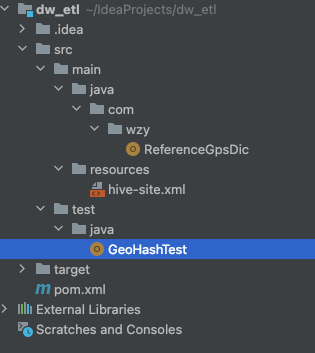

#06 DWD层代码- Goehash dim表

## 环境准备

在titan3上安装spark。操作步骤建《spark环境搭建》

### 版本信息

* spark-3.1.3-bin-hadoop3.2.tgz
* scala-2.12.10.tgz

### 规划

* master: titan3
* worker：titan2，titan3, titan4

### 建hive库

	create database dim;
	
	
	

## dw_etl

维度建模

### ReferenceGpsDic

	package com.wzy
	
	import ch.hsr.geohash.GeoHash
	import org.apache.spark.sql.SparkSession
	
	import java.util.Properties
	
	object ReferenceGpsDic {
	
	  def main(args: Array[String]): Unit = {
	
	    System.setProperty("HADOOP_USER_NAME", "root")
	
	    val spark = SparkSession.builder()
	      .appName("gpsToGeoHash")
	      .config("spark.sql.shuffle.partions","1")
	      .master("spark://192.168.2.113:7077")
	      .enableHiveSupport()
	      //本地测试运行需要加这一句话，部署在生产环境则删除
	      .config("spark.jars","/Users/zheyiwang/IdeaProjects/dw_etl/target/dw_etl-1.0-SNAPSHOT-jar-with-dependencies.jar")
	      .getOrCreate()
	
	    // 建立mysql连接
	    val pros = new Properties();
	    pros.setProperty("user","root");
	    pros.setProperty("password","1qa2ws#ED");
	    val df = spark.read.jdbc("jdbc:mysql://192.168.2.111:3306/realtimedw","t_md_areas",pros);
	
	    df.createTempView("df");
	
	    val gpsToGoeHash = (lng:Double,lat:Double)=>{
	      GeoHash.geoHashStringWithCharacterPrecision(lat,lng,6)
	    }
	
	    spark.udf.register("geohash",gpsToGoeHash)
	
	    //选取里面的3、4级行政单位并找到所属的上级行政单位，把GPS转换为geohash编码
	    val tmp=spark.sql(
	      """
	        |
	        |select
	        | l1.areaname as province,
	        | l2.areaname as city,
	        | l3.areaname as district,
	        | geohash(l4.bd09_lng,l4.bd09_lat) as geohash
	        |
	        |from df l4 join df l3 on l4.parentid=l3.id and l4.level=4
	        |           join df l2 on l3.parentid=l2.id
	        |           join df l1 on l2.parentid=l1.id
	        |
	        |union all
	        |
	        |select
	        | l1.areaname as province,
	        | l2.areaname as city,
	        | l3.areaname as district,
	        | geohash(l3.bd09_lng,l3.bd09_lat) as geohash
	        |
	        | from df l3 join df l2 on l3.parentid=l2.id and l3.level=3
	        |            join df l1 on l2.parentid=l1.id
	        |
	        |""".stripMargin);
	
	    tmp.show(100,false);
	
	    //结果存为hive
	    tmp.write.saveAsTable("dim.geo_area")
	
	    spark.close();
	
	  }
	
	}

### pom.xml

	<?xml version="1.0" encoding="UTF-8"?>
	<project xmlns="http://maven.apache.org/POM/4.0.0"
	         xmlns:xsi="http://www.w3.org/2001/XMLSchema-instance"
	         xsi:schemaLocation="http://maven.apache.org/POM/4.0.0 http://maven.apache.org/xsd/maven-4.0.0.xsd">
	    <modelVersion>4.0.0</modelVersion>
	
	    <groupId>org.example</groupId>
	    <artifactId>dw_etl</artifactId>
	    <version>1.0-SNAPSHOT</version>
	
	    <properties>
	        <maven.compiler.source>8</maven.compiler.source>
	        <maven.compiler.target>8</maven.compiler.target>
	    </properties>
	
	
	    <dependencies>
	
	        <dependency>
	            <groupId>org.apache.spark</groupId>
	            <artifactId>spark-core_2.12</artifactId>
	            <version>3.1.3</version>
	        </dependency>
	
	        <dependency>
	            <groupId>org.scala-lang</groupId>
	            <artifactId>scala-library</artifactId>
	            <version>2.12.10</version>
	        </dependency>
	
	        <dependency>
	            <groupId>org.apache.spark</groupId>
	            <artifactId>spark-sql_2.12</artifactId>
	            <version>3.1.3</version>
	        </dependency>
	
	        <dependency>
	            <groupId>org.apache.spark</groupId>
	            <artifactId>spark-hive_2.12</artifactId>
	            <version>3.1.3</version>
	        </dependency>
	
	        <dependency>
	            <groupId>mysql</groupId>
	            <artifactId>mysql-connector-java</artifactId>
	            <version>8.0.17</version>
	        </dependency>
	
	        <dependency>
	            <groupId>ch.hsr</groupId>
	            <artifactId>geohash</artifactId>
	            <version>1.3.0</version>
	        </dependency>
	
	    </dependencies>
	
	
	    <repositories>
	        <repository>
	            <id>nexus-aliyun</id>
	            <name>Nexus aliyun</name>
	            <layout>default</layout>
	            <url>http://maven.aliyun.com/nexus/content/groups/public</url>
	            <snapshots>
	                <enabled>false</enabled>
	                <updatePolicy>never</updatePolicy>
	            </snapshots>
	            <releases>
	                <enabled>true</enabled>
	                <updatePolicy>never</updatePolicy>
	            </releases>
	        </repository>
	
	    </repositories>
	
	    <pluginRepositories>
	        <pluginRepository>
	            <id>ali-plugin</id>
	            <url>http://maven.aliyun.com/nexus/content/groups/public/</url>
	            <snapshots>
	                <enabled>false</enabled>
	                <updatePolicy>never</updatePolicy>
	            </snapshots>
	            <releases>
	                <enabled>true</enabled>
	                <updatePolicy>never</updatePolicy>
	            </releases>
	        </pluginRepository>
	    </pluginRepositories>
	
	    <build>
	        <plugins>
	            <!-- 指定编译java的插件 -->
	            <plugin>
	                <groupId>org.apache.maven.plugins</groupId>
	                <artifactId>maven-compiler-plugin</artifactId>
	                <version>3.5.1</version>
	                <configuration>
	                    <source>1.8</source>
	                    <target>1.8</target>
	                </configuration>
	            </plugin>
	
	            <!-- 指定编译scala的插件 -->
	            <plugin>
	                <groupId>net.alchim31.maven</groupId>
	                <artifactId>scala-maven-plugin</artifactId>
	                <version>3.2.2</version>
	                <executions>
	                    <execution>
	                        <goals>
	                            <goal>compile</goal>
	                            <goal>testCompile</goal>
	                        </goals>
	                        <configuration>
	                            <args>
	                                <arg>-dependencyfile</arg>
	                                <arg>${project.build.directory}/.scala_dependencies</arg>
	                            </args>
	                        </configuration>
	                    </execution>
	                </executions>
	            </plugin>
	
	
	            <!--  把依赖jar中的用到的类，提取到自己的jar中 -->
	            <plugin>
	                <groupId>org.apache.maven.plugins</groupId>
	                <artifactId>maven-assembly-plugin</artifactId>
	                <version>2.6</version>
	                <configuration>
	                    <archive>
	                        <manifest>
	                            <mainClass></mainClass>
	                        </manifest>
	                    </archive>
	                    <descriptorRefs>
	                        <descriptorRef>jar-with-dependencies</descriptorRef>
	                    </descriptorRefs>
	                </configuration>
	                <!--下面是为了使用 mvn package命令，如果不加则使用mvn assembly-->
	                <executions>
	                    <execution>
	                        <id>make-assemble</id>
	                        <phase>package</phase>
	                        <goals>
	                            <goal>single</goal>
	                        </goals>
	                    </execution>
	                </executions>
	            </plugin>
	        </plugins>
	    </build>
	
	</project>

### hive-site.xml

	<configuration>
	    <property>
	        <name>hive.metastore.uris</name>
	        <value>thrift://192.168.2.114:9083</value>
	    </property>
	
	    <property>
	        <name>hive.metastore.warehouse.dir</name>
	        <value>/user/hive/warehouse</value>
	        <description>location of default database for the warehouse</description>
	    </property>
	</configuration>

## 执行结果

	+--------------+------+--------------+-------+
	|province      |city  |district      |geohash|
	+--------------+------+--------------+-------+
	|广西壮族自治区|北海市|海城区        |w7vd5h |
	|广西壮族自治区|北海市|海城区        |w7vd5r |
	|广西壮族自治区|北海市|海城区        |w7vd5h |
	|广西壮族自治区|北海市|海城区        |w7vd4z |
	|广西壮族自治区|北海市|海城区        |w7vd4r |
	|广西壮族自治区|北海市|海城区        |w7vdk4 |
	|广西壮族自治区|北海市|海城区        |w7vd5t |
	|广西壮族自治区|北海市|海城区        |w7txer |
	|广西壮族自治区|北海市|铁山港区      |w7vffk |
	|广西壮族自治区|北海市|铁山港区      |w7vf63 |
	|广西壮族自治区|北海市|铁山港区      |w7vfu9 |
	|广西壮族自治区|北海市|合浦县        |w7vem0 |
	|广西壮族自治区|北海市|合浦县        |w7ve51 |
	|广西壮族自治区|北海市|合浦县        |w7v7qe |
	|广西壮族自治区|北海市|合浦县        |w7ve2f |
	|广西壮族自治区|北海市|合浦县        |w7vebu |
	|广西壮族自治区|北海市|合浦县        |w7vg74 |
	|广西壮族自治区|北海市|合浦县        |w7vunu |
	|广西壮族自治区|北海市|合浦县        |w7y52p |
	|广西壮族自治区|北海市|合浦县        |w7y4cp |
	|广西壮族自治区|北海市|合浦县        |w7y42j |
	|广西壮族自治区|北海市|合浦县        |w7vsjg |
	|广西壮族自治区|北海市|合浦县        |w7vgb0 |
	|广西壮族自治区|北海市|合浦县        |w7vu1y |
	|广西壮族自治区|北海市|合浦县        |w7veg4 |
	|广西壮族自治区|北海市|合浦县        |w7vuhy |
	|广西壮族自治区|北海市|银海区        |w7vdxt |
	|广西壮族自治区|北海市|银海区        |w7vdj1 |
	|广西壮族自治区|北海市|银海区        |w7vdmk |
	|广西壮族自治区|北海市|银海区        |w7v9gm |
	|广西壮族自治区|来宾市|忻城县        |wkm2by |
	|广西壮族自治区|来宾市|忻城县        |wkm3qn |
	|广西壮族自治区|来宾市|忻城县        |wkm2y2 |
	|广西壮族自治区|来宾市|忻城县        |wkm0pz |
	|广西壮族自治区|来宾市|忻城县        |wkjprx |
	|广西壮族自治区|来宾市|忻城县        |wkjrun |
	|广西壮族自治区|来宾市|忻城县        |wkm3g0 |
	|广西壮族自治区|来宾市|忻城县        |wkm67f |
	|广西壮族自治区|来宾市|忻城县        |wkm88e |
	|广西壮族自治区|来宾市|忻城县        |wkjrcx |
	|广西壮族自治区|来宾市|忻城县        |wkm0j1 |
	|广西壮族自治区|来宾市|忻城县        |wkjpqt |
	|广西壮族自治区|来宾市|兴宾区        |wkjxjc |
	|广西壮族自治区|来宾市|兴宾区        |wkjxjs |
	|广西壮族自治区|来宾市|兴宾区        |wkjwvw |
	|广西壮族自治区|来宾市|兴宾区        |wkm8p5 |
	|广西壮族自治区|来宾市|兴宾区        |wkjxj9 |
	|广西壮族自治区|来宾市|兴宾区        |wkjxy7 |
	|广西壮族自治区|来宾市|兴宾区        |wkjwsc |
	|广西壮族自治区|来宾市|兴宾区        |wkjthq |
	|广西壮族自治区|来宾市|兴宾区        |wkjqpx |
	|广西壮族自治区|来宾市|兴宾区        |wkjmqy |
	|广西壮族自治区|来宾市|兴宾区        |wkjqtx |
	|广西壮族自治区|来宾市|兴宾区        |wkjy3k |
	|广西壮族自治区|来宾市|兴宾区        |wkjz9z |
	|广西壮族自治区|来宾市|兴宾区        |wkjx5h |
	|广西壮族自治区|来宾市|兴宾区        |wkjvc9 |
	|广西壮族自治区|来宾市|兴宾区        |wkjwz6 |
	|广西壮族自治区|来宾市|兴宾区        |wkjtv0 |
	|广西壮族自治区|来宾市|兴宾区        |wkjtjc |
	|广西壮族自治区|来宾市|兴宾区        |wkjt3f |
	|广西壮族自治区|来宾市|兴宾区        |wkjxdx |
	|广西壮族自治区|来宾市|兴宾区        |wkm86w |
	|广西壮族自治区|来宾市|兴宾区        |wkjv6t |
	|广西壮族自治区|来宾市|兴宾区        |wkjykk |
	|广西壮族自治区|来宾市|兴宾区        |wkjzhh |
	|广西壮族自治区|来宾市|兴宾区        |wkjz32 |
	|广西壮族自治区|来宾市|兴宾区        |wkjxhy |
	|广西壮族自治区|来宾市|象州县        |wkmbru |
	|广西壮族自治区|来宾市|象州县        |wkjzgf |
	|广西壮族自治区|来宾市|象州县        |wkq135 |
	|广西壮族自治区|来宾市|象州县        |wkq07j |
	|广西壮族自治区|来宾市|象州县        |wkq0w1 |
	|广西壮族自治区|来宾市|象州县        |wkq1h3 |
	|广西壮族自治区|来宾市|象州县        |wkq1p1 |
	|广西壮族自治区|来宾市|象州县        |wkmbmr |
	|广西壮族自治区|来宾市|象州县        |wknpcc |
	|广西壮族自治区|来宾市|象州县        |wkq0jk |
	|广西壮族自治区|来宾市|象州县        |wkq1sp |
	|广西壮族自治区|来宾市|金秀瑶族自治县|wkq3s9 |
	|广西壮族自治区|来宾市|金秀瑶族自治县|wkq1z2 |
	|广西壮族自治区|来宾市|金秀瑶族自治县|wkq62v |
	|广西壮族自治区|来宾市|金秀瑶族自治县|wkq3fq |
	|广西壮族自治区|来宾市|金秀瑶族自治县|wkq3xd |
	|广西壮族自治区|来宾市|金秀瑶族自治县|wkq2jw |
	|广西壮族自治区|来宾市|金秀瑶族自治县|wkq29z |
	|广西壮族自治区|来宾市|金秀瑶族自治县|wknpvj |
	|广西壮族自治区|来宾市|金秀瑶族自治县|wkq211 |
	|广西壮族自治区|来宾市|金秀瑶族自治县|wkq6dp |
	|广西壮族自治区|来宾市|武宣县        |wkjyph |
	|广西壮族自治区|来宾市|武宣县        |wkjvrt |
	|广西壮族自治区|来宾市|武宣县        |wkjuuw |
	|广西壮族自治区|来宾市|武宣县        |wknn7g |
	|广西壮族自治区|来宾市|武宣县        |wknn40 |
	|广西壮族自治区|来宾市|武宣县        |wknnbd |
	|广西壮族自治区|来宾市|武宣县        |wkjzpq |
	|广西壮族自治区|来宾市|武宣县        |wkjvuk |
	|广西壮族自治区|来宾市|武宣县        |wkjvk5 |
	|广西壮族自治区|来宾市|武宣县        |wkjzwx |
	|广西壮族自治区|来宾市|武宣县        |wknn0d |

## 解决错误

### 错误1

	Permission denied: user=root, access=WRITE, inode="/user/hive/warehouse/dim.db":zheyi:supergroup:drwxr-xr-x
	
解决方案：

	hadoop fs -chmod 777 /user

	
	
## Spark 安装关键文件

### spark-env.sh

	# 配置JAVA_HOME，一般来说，不配置也可以，但是可能会出现问题，还是配上吧
	export JAVA_HOME=/home/zheyi/java
	# 一般来说，spark任务有很大可能性需要去HDFS上读取文件，所以配置上
	# 如果说你的spark就读取本地文件，也不需要yarn管理，不用配
	export HADOOP_CONF_DIR=/home/zheyi/hadoop/etc/hadoop
	# 设置Master的主机名
	export SPARK_MASTER_HOST=titan3
	# 提交Application的端口，默认就是这个，万一要改呢，改这里
	export SPARK_MASTER_PORT=7077
	# 每一个Worker最多可以使用的cpu core的个数，我虚拟机就一个...
	# 真实服务器如果有32个，你可以设置为32个
	export SPARK_WORKER_CORES=1
	# 每一个Worker最多可以使用的内存，我的虚拟机就2g
	# 真实服务器如果有128G，你可以设置为100G
	export SPARK_WORKER_MEMORY=1g
	#设置pid存储位置
	export SPARK_PID_DIR=/home/zheyi/spark/pids	