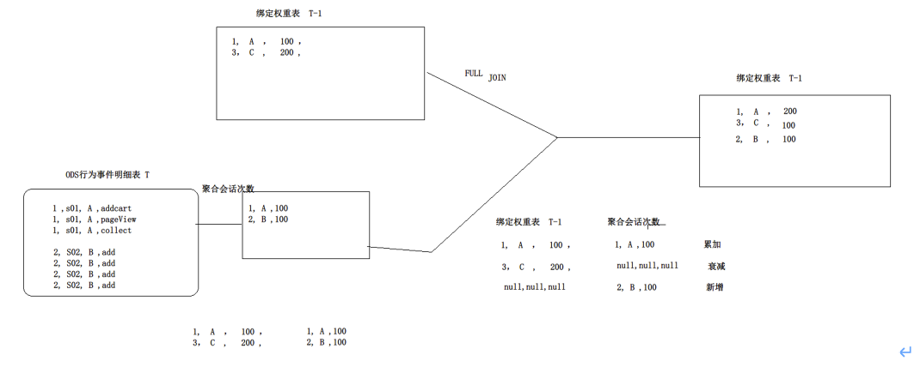

#07. DWD层代码-dws用户绑定关系权重表（设备+用户）

## 适用场景

利用 账号 + 设备 归属用户 

## 账号动态绑定方案

* 设计一张表： 设备+账号 的绑定权重表
* 每日更新逻辑： 

从T日的行为日志中，计算出每一种 “（账号,设备）组合”出现的会话次数
将上面的 [聚合结果]  full join  [ T-1日的绑定权重表分区]，然后对权重值进行追加或衰减

格式： 

	device_id, account_id, weight

## 开发

### 建库

	create database dws;

### 建表

	-- 建表：设备账号绑定关系权重表
	create table dws.mall_app_device_account_bind(
	  `device_id`   string,
	  `account`     string,
	  `weight`      double,
	  `last_login`  bigint
	) 
	partitioned by (dt string)
	stored as orc
	tblproperties(
	  'orc.compress'='snappy'
	)
	;
	
### 计算T日绑定表 并插入dws表中

	-- 计算T日(2022-09-17)的绑定表
	
	-- 首选,对T日的日志进行聚合处理：统计每个（设备，账号）组合出现的会话数

	insert into table dws.mall_app_device_account_bind partition(dt='2022-09-17')

	SELECT
	    nvl(o1.device_id,o2.device_id) as device_id,
	    nvl(o1.account,o2.account) as account,
	    case 
	     when o1.device_id is not null and o2.device_id is not null then o1.weight+o2.weight
	     when o1.device_id is not null and o2.device_id is null then o1.weight
	     else o2.weight * 0.5 
	    end as weight ,
	    if(o1.device_id is not null,'2022-09-17',o2.last_login) as last_login
	    
	
	FROM 
	(
	   SELECT
	     deviceid as device_id,
	     account ,
	     count(distinct sessionid) * 100 as weight
	   FROM ods.mall_app_log_dts
	   WHERE dt='2022-09-17' and trim(account) != '' and account is not null
	   GROUP BY deviceid,account
	) o1
	
	FULL JOIN 
	
	(
	   SELECT
	     device_id,
	     account,
	     weight,
	     last_login
	   FROM dws.mall_app_device_account_bind 
	   WHERE dt='2022-09-16'
	) o2
	ON concat(o1.device_id,o1.account)=concat(o2.device_id,o2.account);
	
注意：

o1 是新统计，o2是历史统计。时间上o2少一天。

## 结果

	hive> select * from dws.mall_app_device_account_bind limit 10;
	
	device_id         account      weight   last_login   dt
	---------------------------------------------------------
	0DSNJ31kg1G8     zZ1Qp9SZ4      200.0   NULL    2022-09-17
	0HuU5bwJ2iUG    wWRAho9y        100.0   NULL    2022-09-17
	0hd02FRUp2pI     e4EDG6  		200.0   NULL    2022-09-17
	1H6AurbpVnKX     B7QH    		400.0   NULL    2022-09-17
	24Y6SIw72rGP     YJTdm7  		300.0   NULL    2022-09-17
	2HuavaaEEGjl      7bib0   		400.0   NULL    2022-09-17
	2KnNBJewVZLP    iylchCu 		400.0   NULL    2022-09-17
	2MLHZ6l6HpEq    OojqS36Vk       100.0   NULL    2022-09-17
	2YU2vD78IpoB     DxL36Dom       100.0   NULL    2022-09-17
	2bXQfNse6Gkk     MtpZ2lV 		200.0   NULL    2022-09-17

## 报错问题修复

问题：

	Caused by: java.lang.ClassNotFoundException: Class org.apache.hive.hcatalog.data.JsonSerDe not found
	
解决方案：

hive版本是3.1.3，

访问

	https://mvnrepository.com/artifact/org.apache.hive.hcatalog/hive-hcatalog-core/3.1.3

下载对应的包  hive-hcatalog-core-3.1.3.jar，放到hive/lib下

HIVE_HOME/conf下，找到hive-env.sh修改HIVE_AUX_JARS_PATH内容，即添加如下使其在MR时生效

	export HIVE_AUX_JARS_PATH=/home/zheyi/hive/lib/hive-hcatalog-core-3.1.3.jar

